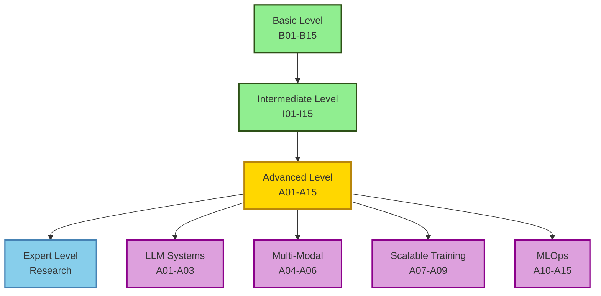

# Advanced Level - Production AI Systems

### Build for scale. Deploy for impact. Monitor for success.

[](https://colab.research.google.com/)
[](https://huggingface.co/spaces/nexageapps)
[](https://nexageapps.com)
[](https://www.linkedin.com/in/karthik-arjun-a5b4a258/)

**Production-ready AI systems aligned with industry best practices and enterprise deployment**

From LLMs to MLOps. From fine-tuning to monitoring. Build AI systems that scale in production.

This folder contains 15 advanced-level lessons focused on building, deploying, and maintaining AI systems in production environments. Each lesson emphasizes real-world applications, scalability, and industry standards.

Designed for university students and AI learners worldwide. Created by a Master of Artificial Intelligence student at the University of Auckland.

---

## Table of Contents

- [Complete Lesson List](#complete-lesson-list)
- [Learning Paths](#learning-paths)
- [Prerequisites](#prerequisites)
- [UoA MAI Alignment](#uoa-mai-alignment)
- [Study Strategies](#study-strategies)
- [Progress Tracking](#progress-tracking)

---

## Complete Lesson List

### Large Language Models (A01-A03)
**Duration:** 10-12 hours | **Goal:** Master LLM fine-tuning and deployment

1. **A01 - Fine-tuning Large Language Models**
   - LoRA and QLoRA for efficient fine-tuning
   - PEFT (Parameter-Efficient Fine-Tuning) techniques
   - Fine-tuning GPT, LLaMA, Mistral, Gemma
   - Instruction tuning and alignment
   - **Why it matters:** Adapt pre-trained models to specific domains

2. **A02 - Prompt Engineering and In-Context Learning**
   - Advanced prompting techniques (Chain-of-Thought, ReAct)
   - Few-shot and zero-shot learning strategies
   - Prompt optimization and testing
   - LangChain and prompt frameworks
   - **Why it matters:** Maximize LLM performance without fine-tuning

3. **A03 - Retrieval-Augmented Generation (RAG)**
   - Vector databases (Pinecone, Weaviate, ChromaDB)
   - Embedding models and semantic search
   - RAG architectures and patterns
   - Hybrid search strategies
   - **Why it matters:** Build knowledge-grounded AI systems

### Multi-Modal AI (A04-A06)
**Duration:** 10-12 hours | **Goal:** Build systems that understand multiple modalities

4. **A04 - Vision-Language Models**
   - CLIP, BLIP, and Flamingo architectures
   - Image captioning and visual question answering
   - Text-to-image generation (Stable Diffusion, DALL-E)
   - Cross-modal retrieval
   - **Why it matters:** Bridge vision and language understanding

5. **A05 - Audio and Speech Processing**
   - Whisper for speech recognition
   - Text-to-speech systems (Bark, Coqui TTS)
   - Audio classification and generation
   - Multi-modal audio-visual models
   - **Why it matters:** Enable voice interfaces and audio AI

6. **A06 - Multi-Modal Fusion and Integration**
   - Early, late, and hybrid fusion strategies
   - Attention-based multi-modal fusion
   - Building unified multi-modal systems
   - Real-world applications
   - **Why it matters:** Create comprehensive AI systems

### Distributed & Scalable Training (A07-A09)
**Duration:** 10-12 hours | **Goal:** Train large models efficiently

7. **A07 - Distributed Training Strategies**
   - Data parallelism and model parallelism
   - Pipeline parallelism and tensor parallelism
   - DeepSpeed and Megatron-LM
   - Multi-GPU and multi-node training
   - **Why it matters:** Scale training to billions of parameters

8. **A08 - Mixed Precision and Optimization**
   - FP16, BF16, and INT8 training
   - Gradient accumulation and checkpointing
   - Memory optimization techniques
   - Training stability and convergence
   - **Why it matters:** Train faster with less memory

9. **A09 - Model Serving and Inference Optimization**
   - TensorRT, ONNX Runtime optimization
   - Batching strategies and caching
   - Model quantization for inference
   - Serving frameworks (TorchServe, TensorFlow Serving)
   - **Why it matters:** Deploy models with low latency

### Production MLOps (A10-A15)
**Duration:** 15-18 hours | **Goal:** Build production ML pipelines

10. **A10 - ML Pipeline Architecture**
    - End-to-end ML pipeline design
    - Feature stores (Feast, Tecton)
    - Model registry and versioning
    - Orchestration (Airflow, Kubeflow, Prefect)
    - **Why it matters:** Automate ML workflows

11. **A11 - Containerization and Deployment**
    - Docker for ML applications
    - Kubernetes for ML workloads
    - Helm charts and deployment strategies
    - Cloud deployment (AWS SageMaker, GCP Vertex AI, Azure ML)
    - **Why it matters:** Deploy models reliably at scale

12. **A12 - Monitoring and Observability**
    - Model performance monitoring
    - Data drift and concept drift detection
    - Logging and alerting systems
    - A/B testing frameworks
    - **Why it matters:** Maintain model quality in production

13. **A13 - CI/CD for Machine Learning**
    - Automated testing for ML models
    - Continuous training pipelines
    - Model validation and staging
    - GitOps for ML
    - **Why it matters:** Iterate and deploy models safely

14. **A14 - Responsible AI and Governance**
    - Bias detection and mitigation at scale
    - Model cards and documentation
    - Privacy-preserving ML (differential privacy)
    - Regulatory compliance (GDPR, AI Act)
    - **Why it matters:** Build ethical and compliant AI systems

15. **A15 - Production Case Studies and Capstone**
    - Real-world production architectures
    - Scaling challenges and solutions
    - Cost optimization strategies
    - Building your production ML system
    - **Why it matters:** Apply all concepts to real projects

**Total Learning Time:** 80-100 hours for complete mastery

---

## Current Status

✅ **All Notebooks Created!**

**Large Language Models (A01-A03):**
- A01 - Fine-tuning Large Language Models ✅
- A02 - Prompt Engineering and In-Context Learning ✅
- A03 - Retrieval-Augmented Generation (RAG) ✅

**Multi-Modal AI (A04-A06):**
- A04 - Vision-Language Models ✅
- A05 - Audio and Speech Processing ✅
- A06 - Multi-Modal Fusion and Integration ✅

**Distributed & Scalable Training (A07-A09):**
- A07 - Distributed Training Strategies ✅
- A08 - Mixed Precision and Optimization ✅
- A09 - Model Serving and Inference Optimization ✅

**Production MLOps (A10-A15):**
- A10 - ML Pipeline Architecture ✅
- A11 - Containerization and Deployment ✅
- A12 - Monitoring and Observability ✅
- A13 - CI-CD for Machine Learning ✅
- A14 - Responsible AI and Governance ✅
- A15 - Production Case Studies and Capstone ✅

🎉 **All tracks complete! Ready for production ML engineering.**

---

## Learning Paths

### Path 1: Complete Advanced (Recommended)
**Timeline:** 12-16 weeks (6-8 hours/week)

```
Week 1-3:   A01 → A02 → A03 (LLMs & RAG)
Week 4-6:   A04 → A05 → A06 (Multi-Modal AI)
Week 7-9:   A07 → A08 → A09 (Distributed Training)
Week 10-12: A10 → A11 → A12 (MLOps Foundation)
Week 13-16: A13 → A14 → A15 (CI/CD & Production)
```

### Path 2: LLM Engineer
**Timeline:** 8-10 weeks

```
Week 1-3:   A01 → A02 → A03 (LLM mastery)
Week 4-5:   A07 → A08 (Distributed training)
Week 6-7:   A09 → A11 (Deployment)
Week 8-10:  A12 → A13 → A15 (Monitoring & Production)
```

### Path 3: MLOps Engineer
**Timeline:** 8-10 weeks

```
Week 1-2:   A01 (Fine-tuning basics)
Week 3-4:   A09 (Inference optimization)
Week 5-6:   A10 → A11 (Pipeline & Deployment)
Week 7-8:   A12 → A13 (Monitoring & CI/CD)
Week 9-10:  A14 → A15 (Governance & Capstone)
```

### Path 4: Multi-Modal AI Specialist
**Timeline:** 8-10 weeks

```
Week 1-2:   A01 → A02 (LLM foundation)
Week 3-5:   A04 → A05 → A06 (Multi-modal deep dive)
Week 6-7:   A09 → A11 (Deployment)
Week 8-10:  A12 → A15 (Production)
```

---

## Prerequisites

### Required Knowledge
- Completion of Basic and Intermediate levels
- Strong understanding of deep learning architectures
- Experience training and evaluating models
- Python proficiency and software engineering basics
- Familiarity with Git and version control

### Recommended Background
- Cloud platforms (AWS, GCP, or Azure)
- Docker and containerization basics
- Linux command line
- SQL and database fundamentals
- REST APIs and web services

### Software Requirements
- Python 3.9+
- PyTorch 2.x or TensorFlow 2.x
- Docker Desktop
- Cloud account (free tier sufficient)
- GPU access (local or cloud)
- 16GB+ RAM recommended

---

## University Course Alignment

This curriculum complements university AI/ML programs worldwide. Example mapping based on the University of Auckland's Master of Artificial Intelligence program (where the author is currently studying):

### Example Course Mapping (University of Auckland MAI)

| Course | Relevant Advanced Lessons | Focus |
|------------|--------------------------|-------|
| COMPSCI 714 (Architecture) | A01-A06, A10 | System design & deployment |
| COMPSCI 703 (General AI) | A01-A03, A04-A06 | Multi-modal & LLMs |
| COMPSYS 721 (Deep Learning) | A07-A09 | Distributed training |
| Dissertation | A15 (Capstone) | Production system |

These mappings serve as examples - adapt them to your own university's curriculum.

### Learning Progression



---

## Study Strategies

### Before Starting
1. Complete all Intermediate lessons
2. Set up cloud development environment
3. Join MLOps and production ML communities
4. Prepare 6-8 hours per week for study

### While Learning
1. Deploy every model to production
2. Build end-to-end pipelines
3. Monitor and iterate on deployments
4. Document architecture decisions
5. Contribute to open-source MLOps tools

### After Completing
1. Build production-grade portfolio projects
2. Obtain cloud certifications (AWS ML, GCP ML)
3. Contribute to production ML frameworks
4. Prepare for Expert level or industry roles

---

## Progress Tracking

### Checklist: LLMs
- [ ] A01: Fine-tune an LLM for specific domain
- [ ] A02: Build advanced prompt engineering system
- [ ] A03: Deploy RAG system with vector DB
- [ ] Can design LLM-powered applications

### Checklist: Multi-Modal AI
- [ ] A04: Build vision-language application
- [ ] A05: Implement speech recognition system
- [ ] A06: Create multi-modal fusion model
- [ ] Can design multi-modal AI systems

### Checklist: Distributed Training
- [ ] A07: Train model across multiple GPUs
- [ ] A08: Implement mixed precision training
- [ ] A09: Optimize model for inference
- [ ] Can scale training to large models

### Checklist: MLOps
- [ ] A10: Build complete ML pipeline
- [ ] A11: Deploy model with Kubernetes
- [ ] A12: Implement monitoring system
- [ ] A13: Set up CI/CD for ML
- [ ] A14: Implement responsible AI practices
- [ ] A15: Deploy production ML system

---

## Next Steps

After completing Advanced level:

1. **Expert Level:** Research and innovation
2. **Industry:** Senior ML Engineer or MLOps roles
3. **Certifications:** AWS ML Specialty, GCP ML Engineer
4. **Open Source:** Contribute to major ML frameworks

---

## Resources

### Books
- "Designing Machine Learning Systems" by Chip Huyen
- "Machine Learning Engineering" by Andriy Burkov
- "Building Machine Learning Powered Applications" by Emmanuel Ameisen

### Platforms
- Hugging Face - Pre-trained models and datasets
- Weights & Biases - Experiment tracking
- MLflow - ML lifecycle management

### Communities
- MLOps Community
- r/MachineLearning
- Hugging Face Forums

---

**Author:** Karthik Arjun  
**Currently:** Master of Artificial Intelligence Student at the University of Auckland  
**LinkedIn:** [karthik-arjun-a5b4a258](https://www.linkedin.com/in/karthik-arjun-a5b4a258/)  
**Hugging Face:** [nexageapps](https://huggingface.co/spaces/nexageapps)

*"Build production AI systems that scale and deliver value"*

---

**Last Updated:** March 2026  
**Version:** 2.0 (Production-Ready Curriculum)
