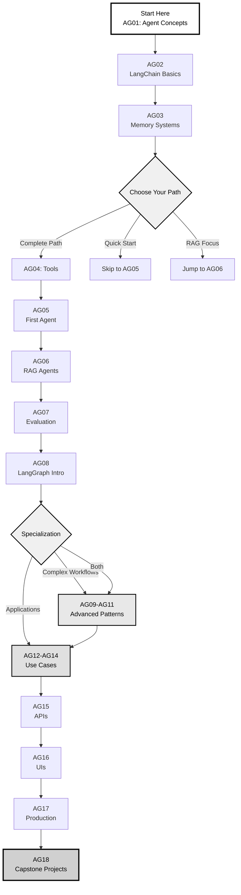
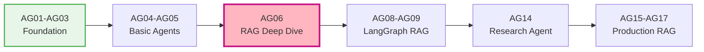
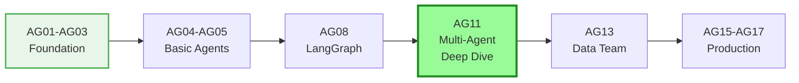
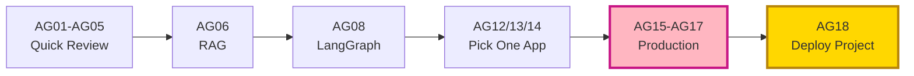
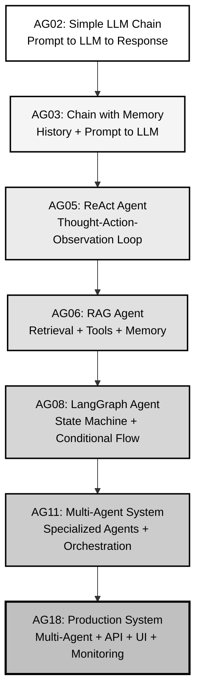
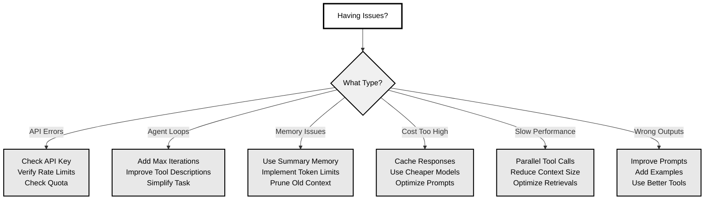

# Agents Level - Building AI Agents with LangChain & LangGraph

### Build intelligent agents. Master orchestration. Create real applications.

[](https://www.python.org/)
[](https://python.langchain.com/)
[](https://langchain-ai.github.io/langgraph/)
[](https://opensource.org/licenses/MIT)
[](https://nexageapps.com)

**Complete foundation in AI Agent development from basics to production-ready applications**

From simple chat to complex multi-agent systems. From theory to deployment. Build intelligent agents that can reason, plan, and act.

This folder contains everything you need to build real-world AI agents using LangChain and LangGraph. Each lesson progresses from basic concepts to advanced application patterns with complete implementations.

Designed for AI practitioners ready to build beyond simple LLM calls. Created by a Master of Artificial Intelligence student at the University of Auckland.

---

## ⚠️ Important Disclaimer

**Educational Resource Notice:**
This is an independent, open-source educational project created by a student for students and AI practitioners worldwide. The content is designed as a practical guide but is NOT official LangChain/LangGraph documentation.

**Key Points:**
- This is NOT official LangChain or LangGraph documentation
- Content and opinions are solely those of the author
- No affiliation with or endorsement by LangChain Inc.
- Use responsibly and follow ethical AI development practices
- For production systems, always refer to official documentation
- API keys and credentials should NEVER be hardcoded

**API Key Safety:** All lessons use environment variables for API keys. Never commit `.env` files to version control.

---

> 💾 **Modern Development Stack:** All notebooks use the latest LangChain and LangGraph patterns. Optimized for Google Colab with automatic dependency installation. Examples use OpenAI by default but show how to swap in other LLM providers.

---

## Table of Contents

- [Complete Lesson List](#complete-lesson-list)
- [Current Progress & Roadmap](#current-progress--roadmap)
- [Learning Paths](#learning-paths)
- [Prerequisites](#prerequisites)
- [How to Use These Lessons](#how-to-use-these-lessons)
- [Agent Architecture Evolution](#agent-architecture-evolution)
- [Study Strategies](#study-strategies)
- [Practice Exercises](#practice-exercises)
- [Additional Resources](#additional-resources)
- [Common Challenges & Solutions](#common-challenges--solutions)
- [Progress Tracking](#progress-tracking)
- [Getting Help](#getting-help)

---

## Current Progress & Roadmap

### Phase 1: Foundation COMPLETE (3/3 lessons)

**Ready to learn now:**
- COMPLETE: AG01 - Introduction to AI Agents (45 min) - Conceptual foundation
- COMPLETE: AG02 - LangChain Basics (1.5 hours) - Complete with 15+ code examples
- COMPLETE: AG03 - Memory Systems (2 hours) - All memory types with code

**What you can build right now:** Basic chatbots, chains with memory, structured output parsers

---

### Phase 2: Core Development (Next Priority)

**Target:** Enable students to build functional agents
**Timeline:** 3-4 weeks

- **AG04 - Tools and Function Calling** [CRITICAL PRIORITY]
  - Custom tools, built-in tools, error handling
  - **Unlocks:** Agent capabilities
  
- **AG05 - Building Your First Agent** [CRITICAL PRIORITY]
  - ReAct agents, agent executors, debugging
  - **Unlocks:** Complete functional agents
  
- **AG06 - RAG Agents** [MOST REQUESTED]
  - Document loading, vector stores, retrieval strategies
  - **Unlocks:** Knowledge-grounded agents
  
- **AG07 - Agent Evaluation** [IMPORTANT]
  - Testing, metrics, cost tracking
  - **Unlocks:** Production readiness

**What you'll be able to build:** Research assistants, Q&A systems, document analyzers

---

### Phase 3: Advanced Orchestration (After Phase 2)

**Target:** Master complex workflows
**Timeline:** 2-3 weeks

- **AG08 - LangGraph** [CRITICAL PRIORITY]
  - State machines, conditional routing
  - **Unlocks:** Complex workflows
  
- **AG09 - Multi-Step Workflows** [IMPORTANT]
  - Plan-and-execute, task decomposition
  
- **AG10 - Human-in-the-Loop** [IMPORTANT]
  - Breakpoints, approvals, safety
  
- **AG11 - Multi-Agent Systems** [HIGH DEMAND]
  - Agent teams, supervisor patterns
  - **Unlocks:** Collaborative agent systems

**What you'll be able to build:** Agent teams, complex workflows, production systems

---

### Phase 4: Applications (After Phase 3)

- **AG12** - Code Generation Agents
- **AG13** - Data Analysis Agents  
- **AG14** - Research & Content Agents

**What you'll be able to build:** Specialized production applications

---

### Phase 5: Production (After Phase 3-4)

- **AG15** - Agent APIs [CRITICAL PRIORITY]
- **AG16** - Agent UIs [IMPORTANT]
- **AG17** - Monitoring & Production [CRITICAL PRIORITY]

**What you'll be able to build:** Deployed, monitored production systems

---

### Phase 6: Capstone

- **AG18** - 5 Portfolio Projects [CRITICAL PRIORITY]

**What you'll have:** Production-ready portfolio showcasing your skills

---

**[View Detailed Roadmap](./ROADMAP.md)** | **[Practice Exercises](./EXERCISES.md)**

---

## Complete Lesson List

### Foundation Stage (AG01-AG03) - Start Here
**Duration:** 4-6 hours | **Goal:** Understand agent fundamentals

**AG01 - Introduction to AI Agents** - What are agents and why do we need them?
- Definition of AI agents (perception, reasoning, action)
- Comparison: LLM calls vs Agents vs Multi-agent systems
- Agent capabilities: memory, tools, planning, self-correction
- ReAct pattern (Reasoning + Acting)
- When to use agents vs simple prompting
- Ethical considerations and limitations
- **Why it matters:** Foundation for understanding modern agentic AI
- **Duration:** 45 minutes

**AG02 - LangChain Basics** - Your first LangChain application
- Installation and setup (langchain, langchain-openai, python-dotenv)
- Environment configuration and API keys
- LLM wrappers and chat models
- Prompt templates and chat prompt templates
- Output parsers (String, JSON, Pydantic)
- Simple chains with LCEL (LangChain Expression Language)
- **Why it matters:** Core building blocks for all LangChain applications
- **Duration:** 1.5 hours

**AG03 - Memory Systems** - Making agents remember
- Conversation buffer memory
- Conversation summary memory
- Entity memory and knowledge graphs
- Vector store memory (semantic search)
- Memory persistence strategies
- When to use which memory type
- **Why it matters:** Agents need context to be useful
- **Duration:** 2 hours

---

### Core Agent Development (AG04-AG07) - Essential Skills
**Duration:** 10-12 hours | **Goal:** Build functional agents

**AG04 - Tools and Function Calling** - Teaching agents to use tools
- What are tools in the agent context
- Creating custom tools with @tool decorator
- Built-in tools (search, calculator, Wikipedia, file system)
- Structured tools with Pydantic schemas
- Tool calling vs function calling
- Error handling and retries
- **Why it matters:** Tools give agents superpowers
- **Duration:** 2.5 hours

**AG05 - Building Your First Agent** - Complete agent from scratch
- Agent types overview (ReAct, OpenAI Functions, Structured Chat)
- Creating an agent with create_react_agent
- Agent executor and configuration
- Agent prompting strategies
- Debugging agent traces
- Simple applications: research assistant, data analyst
- **Why it matters:** Your first working agent
- **Duration:** 3 hours

**AG06 - Retrieval-Augmented Generation (RAG) Agents** - Agents with knowledge
- Document loaders (PDF, TXT, web, databases)
- Text splitters and chunking strategies
- Embedding models and vector stores (Chroma, FAISS, Pinecone)
- Retrieval strategies (similarity, MMR, contextual compression)
- Building a RAG chain
- RAG agent with memory and tools
- **Why it matters:** Give agents access to your data
- **Duration:** 3 hours

**AG07 - Agent Evaluation and Testing** - Ensuring agent quality
- Evaluation metrics for agents (accuracy, latency, cost)
- LangSmith for tracing and debugging
- Creating test datasets
- Automated evaluation with LangChain evaluators
- A/B testing different agent configurations
- Cost tracking and optimization
- **Why it matters:** Build reliable, production-quality agents
- **Duration:** 2.5 hours

---

### Advanced Orchestration (AG08-AG11) - LangGraph Mastery
**Duration:** 12-15 hours | **Goal:** Build complex agentic workflows

**AG08 - Introduction to LangGraph** - State machines for agents
- Why LangGraph? Limitations of simple chains
- Graphs, nodes, and edges
- State management with TypedDict
- Conditional routing
- Creating your first graph
- Compiling and running graphs
- **Why it matters:** Build agents that can handle complex workflows
- **Duration:** 2.5 hours

**AG09 - Multi-Step Agent Workflows** - Planning and execution
- Building plan-and-execute agents
- Multi-stage reasoning patterns
- Hierarchical task decomposition
- Subgraph composition
- Parallel tool execution
- Error recovery and fallback strategies
- **Why it matters:** Handle tasks that require multiple steps
- **Duration:** 3 hours

**AG10 - Human-in-the-Loop Patterns** - Interactive agents
- Breakpoints and interrupts
- User approval nodes
- Dynamic graph modification
- Streaming intermediate results
- Progressive disclosure patterns
- Building interactive agent UIs
- **Why it matters:** Keep humans in control
- **Duration:** 2.5 hours

**AG11 - Multi-Agent Systems** - Agents working together
- Agent roles and specialization
- Agent communication patterns
- Supervisor pattern (one agent manages others)
- Hierarchical agent teams
- Collaborative decision making
- Conflict resolution strategies
- **Why it matters:** Scale beyond single-agent limitations
- **Duration:** 4 hours

---

### Specialized Applications (AG12-AG14) - Real-World Use Cases
**Duration:** 10-12 hours | **Goal:** Build production-ready applications

**AG12 - Code Generation and Analysis Agents** - AI software engineering
- Code understanding and explanation
- Test generation
- Bug detection and fixing
- Code refactoring suggestions
- Repository-level analysis
- Integration with GitHub/GitLab
- **Why it matters:** Automate software development tasks
- **Duration:** 3 hours

**AG13 - Data Analysis and Visualization Agents** - AI data scientist
- Pandas DataFrame agents
- SQL database agents
- Chart and visualization generation
- Statistical analysis automation
- Report generation
- Interactive dashboards
- **Why it matters:** Democratize data analysis
- **Duration:** 3.5 hours

**AG14 - Research and Content Creation Agents** - AI research assistant
- Web search and scraping agents
- Multi-source research synthesis
- Fact checking and citation
- Long-form content generation
- SEO optimization
- Content workflow automation
- **Why it matters:** Automate knowledge work
- **Duration:** 3.5 hours

---

### Production and Deployment (AG15-AG17) - Ship It
**Duration:** 8-10 hours | **Goal:** Deploy production-ready agents

**AG15 - Agent APIs and Backends** - Building agent services
- FastAPI for agent endpoints
- Request validation with Pydantic
- Streaming responses with Server-Sent Events (SSE)
- Authentication and rate limiting
- Background task processing with Celery
- Horizontal scaling strategies
- **Why it matters:** Make agents accessible via API
- **Duration:** 3 hours

**AG16 - Agent UIs and Frontends** - User interfaces for agents
- Streamlit for rapid prototyping
- Gradio interfaces
- React + WebSocket for production UIs
- Chat interface patterns
- Handling streaming and long-running tasks
- Mobile considerations
- **Why it matters:** Users need interfaces to interact with agents
- **Duration:** 2.5 hours

**AG17 - Monitoring, Observability, and Production** - Running agents reliably
- LangSmith production monitoring
- Logging and tracing best practices
- Error tracking with Sentry
- Performance optimization
- Cost management and budgeting
- A/B testing in production
- **Why it matters:** Keep agents running smoothly
- **Duration:** 3 hours

---

### Capstone Projects (AG18) - Portfolio Building
**Duration:** 3-6 weeks | **Goal:** Build showcase projects

**AG18 - Capstone Agent Projects** - Complete applications
- **Project 1:** Personal Research Assistant (RAG + Web Search + Memory)
- **Project 2:** Code Review Agent (Multi-step analysis + GitHub integration)
- **Project 3:** Customer Support System (Multi-agent + Human-in-loop)
- **Project 4:** Automated Data Analyst (SQL + Pandas + Visualization)
- **Project 5:** Content Creation Pipeline (Research + Writing + SEO)
- Portfolio and documentation guide
- Deployment checklists
- **Why it matters:** Demonstrate your skills to employers

**Total Learning Time:** 50-65 hours for complete mastery (18 lessons)

---

## Learning Paths

Choose the path that matches your goals:

### Overall Learning Flow



---

### Path 1: Complete Beginner (Recommended)
**Goal:** Master agent development systematically

**Timeline:** 8-12 weeks (6-8 hours/week)

```
Week 1-2:   AG01 to AG02 to AG03 (Foundation)
Week 3-4:   AG04 to AG05 (Core Agents)
Week 5:     AG06 to AG07 (RAG & Evaluation)
Week 6-7:   AG08 to AG09 (LangGraph Basics)
Week 8-9:   AG10 to AG11 (Advanced Patterns)
Week 10:    AG12 OR AG13 OR AG14 (Choose one application)
Week 11:    AG15 to AG16 to AG17 (Production)
Week 12+:   AG18 (Capstone Projects)
```

**Study Tips:**
- Complete all code examples
- Build variations of each agent
- Start a project journal
- Join LangChain Discord

---

### Path 2: RAG and Knowledge Systems Focus
**Goal:** Become a RAG expert

**Timeline:** 6-8 weeks



```
Week 1-2:   AG01 to AG02 to AG03 (Quick foundation)
Week 3:     AG04 to AG05 (Basic agents)
Week 4-5:   AG06 (RAG deep dive + variations)
Week 6:     AG08 to AG09 (Complex RAG workflows)
Week 7:     AG14 (Research agent application)
Week 8:     AG15 to AG16 to AG17 (Deploy RAG system)
```

---

### Path 3: Multi-Agent Systems Focus
**Goal:** Build agent teams

**Timeline:** 6-8 weeks



```
Week 1-2:   AG01 to AG02 to AG03 (Foundation)
Week 3:     AG04 to AG05 (Basic agents)
Week 4:     AG08 to AG09 (LangGraph patterns)
Week 5-6:   AG11 (Multi-agent deep dive)
Week 7:     AG13 (Build agent team application)
Week 8:     AG15 to AG16 to AG17 (Production deployment)
```

---

### Path 4: Production-Ready Applications
**Goal:** Ship production agents quickly

**Timeline:** 4-6 weeks



```
Week 1:     AG01-AG05 (Skim basics, focus on gaps)
Week 2:     AG06 to AG08 (RAG + LangGraph)
Week 3:     Choose AG12, AG13, or AG14 (Application focus)
Week 4:     AG15 to AG16 (API + UI)
Week 5:     AG17 (Production setup)
Week 6:     AG18 (Complete and deploy capstone)
```

---

## Agent Architecture Evolution



---

## Prerequisites

### Required Knowledge

**Programming:**
- Strong Python fundamentals (classes, decorators, async/await)
- Experience with REST APIs
- Basic understanding of LLMs (GPT, Claude, etc.)
- Familiarity with JSON and data structures

**AI/ML Background:**
- Completed Basic level (B01-B15) OR equivalent knowledge
- Understanding of embeddings and vector similarity
- Familiarity with prompt engineering
- Basic NLP concepts

**Not Required But Helpful:**
- FastAPI or Flask experience
- React or frontend framework knowledge
- Docker and containerization
- Cloud deployment (AWS, GCP, Azure)

### Software Setup

**Option 1: Google Colab (Recommended for Learning)**
```python
# First cell in every notebook
!pip install -qU langchain langchain-openai langchain-community \
    langgraph chromadb faiss-cpu python-dotenv

# Set up environment variables
from google.colab import userdata
import os
os.environ["OPENAI_API_KEY"] = userdata.get('OPENAI_API_KEY')
```

**Option 2: Local Development Setup**
```bash
# Create virtual environment
python -m venv .venv
source .venv/bin/activate  # Windows: .venv\Scripts\activate

# Install dependencies
pip install langchain langchain-openai langchain-community \
    langgraph chromadb faiss-cpu python-dotenv \
    jupyterlab

# Create .env file
echo "OPENAI_API_KEY=your-key-here" > .env

# Start Jupyter
jupyter lab
```

**Option 3: Production Setup**
```bash
# Clone and setup
git clone https://github.com/yourusername/your-agent-project
cd your-agent-project
python -m venv .venv
source .venv/bin/activate

# Install with production dependencies
pip install -r requirements.txt

# Set up environment variables
cp .env.example .env
# Edit .env with your keys

# Run
python app.py
```

---

## How to Use These Lessons

### Learning Process

**Before Starting a Lesson:**
1. Review prerequisites from previous lessons
2. Set up API keys and environment
3. Allocate 2-3 hours of focused time
4. Have a code editor ready for experimentation

**While Learning:**
1. Read explanations thoroughly
2. Run every code cell and understand outputs
3. Modify code - change prompts, tools, parameters
4. Debug intentionally - break things to learn
5. Build variations of examples
6. Keep notes on patterns and best practices

**After Completing a Lesson:**
1. Build a mini-project using the concepts
2. Document what you learned
3. Share your implementation
4. Help others in the community
5. Review and iterate

### Best Practices

**Development Workflow:**
- Always use version control (git)
- Keep API keys in environment variables
- Test with small examples first
- Monitor costs (LLM API usage)
- Log agent traces for debugging
- Start simple, add complexity gradually

**Agent Development:**
- Write clear, specific prompts
- Test edge cases and errors
- Implement proper error handling
- Add timeouts for long-running operations
- Cache when possible to reduce costs
- Monitor and log all agent actions

**Production Readiness:**
- Never hardcode API keys
- Implement rate limiting
- Add monitoring and alerting
- Test with realistic data volumes
- Plan for failure modes
- Document agent capabilities and limitations

---

## Additional Resources

### Official Documentation
- [LangChain Documentation](https://python.langchain.com/) - Complete reference
- [LangGraph Documentation](https://langchain-ai.github.io/langgraph/) - State machine patterns
- [LangSmith](https://smith.langchain.com/) - Tracing and monitoring
- [LangChain Blog](https://blog.langchain.dev/) - Latest updates and patterns

### Community
- [LangChain Discord](https://discord.gg/langchain) - Active community
- [LangChain GitHub](https://github.com/langchain-ai/langchain) - Source code and issues
- [r/LangChain](https://reddit.com/r/LangChain) - Reddit discussions
- [LangChain Twitter](https://twitter.com/LangChainAI) - News and updates

### Video Resources
- LangChain YouTube Channel - Official tutorials
- Sam Witteveen - LangChain tutorials
- Greg Kamradt - Prompt engineering
- AI Jason - Practical agent builds

### Books and Courses
- "Build AI Apps with ChatGPT, DALL-E, and GPT-4" - O'Reilly
- "Generative AI with LangChain" - Packt
- DeepLearning.AI LangChain courses
- Udemy LangChain courses

### Example Projects
- [LangChain Templates](https://github.com/langchain-ai/langchain/tree/master/templates) - Official starter templates
- [LangGraph Examples](https://github.com/langchain-ai/langgraph/tree/main/examples) - Advanced patterns
- [Awesome LangChain](https://github.com/kyrolabs/awesome-langchain) - Curated list

### Tools
- [LangSmith](https://smith.langchain.com/) - Debugging and monitoring
- [LangServe](https://github.com/langchain-ai/langserve) - Deploy agents as APIs
- [Chainlit](https://github.com/Chainlit/chainlit) - Build chat UIs
- [Streamlit](https://streamlit.io/) - Rapid prototyping

---

## Common Challenges & Solutions

### Troubleshooting Decision Tree



### Common Issues

**"Agent keeps looping"**
- Solution: Add `max_iterations` parameter, improve tool descriptions, simplify the task

**"Out of API credits"**
- Solution: Use caching, implement rate limiting, switch to cheaper models for testing

**"Agent gives wrong answers"**
- Solution: Improve prompts with examples, add verification tools, use better retrieval

**"Slow response times"**
- Solution: Reduce context window, optimize vector search, use parallel execution

**"Memory keeps growing"**
- Solution: Use summary memory, implement rolling windows, prune old messages

**"Tools not being called"**
- Solution: Improve tool names/descriptions, add examples, verify tool schemas

---

## Practice Exercises

Master each lesson with hands-on exercises! **[View All Exercises](./EXERCISES.md)**

### Available Now (COMPLETE)

**AG01 Exercises:**
- Identify the right approach (LLM vs Chain vs Agent)
- Design ReAct flows
- Calculate agent costs
- Identify and fix failure modes
- Design your own agent

**AG02 Exercises:**
- Build translation chains
- Extract structured data with Pydantic
- Create parallel chains
- Few-shot prompt engineering
- Build complete applications

**AG03 Exercises:**
- Build preference trackers
- Compare memory types
- Implement semantic search
- Create persistent chat history
- Build session-based chatbots

**Challenge Projects:**
- Multi-memory agent systems
- Memory optimization
- Cross-session knowledge bases

### Coming Soon (PLANNED)

**AG04-AG18:** Exercises will be added as lessons are completed

Each lesson includes:
- 5+ practice exercises
- Complete solutions
- Real-world applications
- Tips for success

**[Start Practicing](./EXERCISES.md)**

---

## Progress Tracking

### Completion Checklist

**Foundation (AG01-AG03)**
- [ ] AG01: Understand agent concepts and ReAct pattern
- [ ] AG02: Build basic LangChain applications
- [ ] AG03: Implement different memory types

**Core Agents (AG04-AG07)**
- [ ] AG04: Create custom tools
- [ ] AG05: Build a ReAct agent
- [ ] AG06: Implement RAG system
- [ ] AG07: Set up evaluation pipeline

**Advanced (AG08-AG11)**
- [ ] AG08: Build LangGraph workflows
- [ ] AG09: Implement multi-step agents
- [ ] AG10: Add human-in-the-loop
- [ ] AG11: Create multi-agent systems

**Applications (AG12-AG14)**
- [ ] AG12: Build code generation agent
- [ ] AG13: Create data analysis agent
- [ ] AG14: Implement research agent

**Production (AG15-AG17)**
- [ ] AG15: Deploy agent API
- [ ] AG16: Build agent UI
- [ ] AG17: Set up monitoring

**Capstone (AG18)**
- [ ] Complete 2-3 capstone projects
- [ ] Deploy to production
- [ ] Build portfolio

---

## Getting Help

### When You're Stuck

1. **Check the documentation** - Most answers are in official docs
2. **Search Discord/GitHub** - Your question has likely been asked
3. **Minimal reproduction** - Create smallest example that shows the issue
4. **Ask in community** - Discord, Reddit, Stack Overflow
5. **File an issue** - If you found a bug, report it

### How to Ask Good Questions

**Bad:** "My agent doesn't work, help!"

**Good:** 
```
I'm building a RAG agent using AG06 patterns. 
When I query "What is X?", it returns irrelevant results.

Setup:
- ChromaDB with 100 documents
- OpenAI embeddings
- Similarity search with k=5

Code: [paste minimal example]
Error: [paste error message]

What I tried:
- Increased k to 10 (no change)
- Changed chunk size (no improvement)

Expected: Relevant documents about X
Actual: Documents about Y and Z
```

---

## What's Next?

After completing Agents, consider:

**Advanced Topics:**
- Multi-modal agents (vision + text)
- Long-running agents with persistent workflows
- Agent benchmarking and safety
- Fine-tuning models for agent tasks

**Production Engineering:**
- Kubernetes deployment
- Agent orchestration at scale
- Cost optimization strategies
- Security hardening

**Research and Cutting Edge:**
- AutoGPT and autonomous agents
- Agent-based reasoning (Tree of Thoughts, Graph of Thoughts)
- Multi-agent simulation environments
- Tool learning and discovery

---

## Contributing

Found an issue? Have a suggestion? Want to add a lesson?

1. Open an issue on GitHub
2. Submit a pull request
3. Share your implementations
4. Help others in discussions

---

## License

MIT License - See [LICENSE](../LICENSE) for details

---

## Acknowledgments

Built with:
- [LangChain](https://langchain.com/) - The amazing agent framework
- [LangGraph](https://langchain-ai.github.io/langgraph/) - Stateful agent workflows
- OpenAI, Anthropic, and other LLM providers
- The vibrant LangChain community

---

## Support This Project

If these lessons helped you:
- Star the repository
- Share with others
- Report issues
- Contribute improvements
- [Buy me a book](https://buymeacoffee.com/fcc4sbsx5f6)

---

**Ready to build agents? Start with AG01!**

*Last updated: December 2024*
*Tested with: LangChain 0.1.x, LangGraph 0.0.x, Python 3.11+*
