# Basic Level - Foundation in AI/ML

### Start simple. Build strong. Code everything.

[](https://www.python.org/)
[](https://opensource.org/licenses/MIT)
[](https://nexageapps.com)
[](https://buymeacoffee.com/fcc4sbsx5f6)

**Complete foundation in Artificial Intelligence and Machine Learning through 15 hands-on lessons**

From tensors to transformers. From theory to code. Build your AI foundation with practical implementations.

This folder contains all fundamental concepts you need to master before advancing to intermediate topics. Each lesson builds progressively on previous concepts with clear explanations, visualizations, and practical implementations.

Designed for university students and AI learners worldwide. Created by a Master of Artificial Intelligence student at the University of Auckland.

---

## ⚠️ Important Disclaimer

**Educational Resource Notice:**
This is an independent, open-source educational project created by a student for students and AI learners worldwide. The content is designed to complement university coursework but is NOT official curriculum material.

**Key Points:**
- This is NOT official university material
- Content and opinions are solely those of the author
- No affiliation with or endorsement by any institution
- Use responsibly and follow your institution's academic integrity policies
- For academic assignments, understand concepts first, then implement independently
- Always cite sources appropriately per your institution's guidelines

**Academic Integrity Warning:** Using code from these notebooks for assignments without understanding constitutes plagiarism. These are learning resources, not solution manuals. See the main repository's [Academic Integrity Policy](../documentation/ACADEMIC_INTEGRITY.md) for detailed guidelines.

---

> 💾 **Cache-Friendly Design:** All notebooks are optimized for fast loading with minimal dependencies. Works seamlessly in Google Colab (recommended) or local Jupyter environments. No large dataset downloads required - all examples use built-in or generated data.

---

## Table of Contents

- [Complete Lesson List](#complete-lesson-list)
- [Learning Paths](#learning-paths)
- [Prerequisites](#prerequisites)
- [How to Use These Lessons](#how-to-use-these-lessons)
- [Study Strategies](#study-strategies)
- [Additional Resources](#additional-resources)
- [Common Challenges & Solutions](#common-challenges--solutions)
- [Progress Tracking](#progress-tracking)
- [Getting Help](#getting-help)

---

## Complete Lesson List

### COMPSCI 714 Course Alignment

This section shows how Basic lessons align with COMPSCI 714 (AI Architecture and Design):

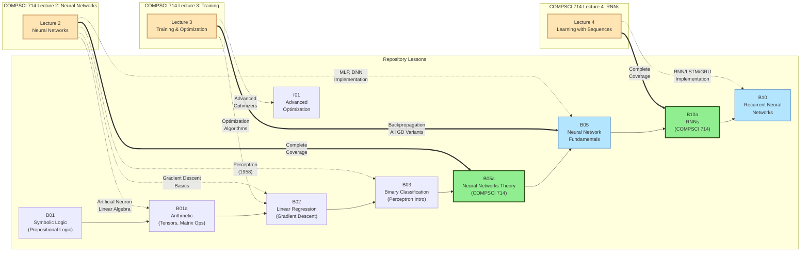

**Legend:**
- 🟡 Orange: COMPSCI 714 Lectures
- 🟢 Green: Dedicated course notebooks (B05a, B10a)
- 🔵 Blue: Core implementation lessons
- Solid arrows (⇒): Primary coverage
- Dashed arrows (⇢): Supporting concepts

**Quick Links:**
- [COMPSCI 714 Complete Guide](../documentation/courses/COMPSCI_714_COMPLETE_GUIDE.md)
- [Lecture 2: Neural Networks](../documentation/courses/COMPSCI_714_LECTURE_2.md)

---

## Complete Lesson List

### Foundation Stage (B01-B03) - Start Here
**Duration:** 3-4 hours | **Goal:** Master the basics

1. **B01 - Symbolic Logic Fundamentals** - Propositional logic and First-Order Logic for AI
   - Propositions and logical connectives (¬, ∧, ∨, →, ↔)
   - Truth tables and logical equivalences
   - Inference rules (Modus Ponens, Modus Tollens)
   - First-Order Logic: predicates, quantifiers (∀, ∃), free/bound variables
   - Satisfaction relation, models, and FOL equivalences
   - Kinship domain: defining Mother, Grandparent, Sibling from Parent
   - Connection to neural networks (perceptrons as logic gates)
   - **Why it matters:** Foundation for knowledge representation, reasoning, and AI agents
   - 🔗 [Interactive App: Symbolic Logic Explorer](https://nexageapps.github.io/AI/symbolic-logic/)
   - 🔗 [Wumpus World: FOL in Action](https://nexageapps.github.io/AI/wumpus/)

1a. **B01a - Arithmetic** - TensorFlow basics and tensor operations
   - Tensor creation and manipulation
   - Basic operations (add, multiply, reshape)
   - Understanding computational graphs
   - **Why it matters:** Foundation for all deep learning

2. **B02 - Linear Regression** - Linear regression fundamentals
   - Gradient descent optimization
   - Loss functions (MSE)
   - Model training and evaluation
   - **Why it matters:** Core ML algorithm, basis for neural networks

3. **B03 - Binary Classification** - Two-class classification problems
   - Sigmoid activation function
   - Binary cross-entropy loss
   - Decision boundaries
   - **Why it matters:** Foundation for all classification tasks

### Core Machine Learning (B04-B07) - Essential Skills
**Duration:** 8-10 hours | **Goal:** Build strong ML fundamentals

4. **B04 - Multi-Class Classification** - Multiple category classification
   - Softmax activation
   - Categorical cross-entropy
   - One-hot encoding
   - **Why it matters:** Real-world problems have multiple classes

5. **B05 - Neural Network Fundamentals** - Deep dive into NN architecture
   - Multi-layer perceptrons (MLPs)
   - Activation functions (ReLU, tanh, sigmoid)
   - Backpropagation explained
   - **Why it matters:** Core of all deep learning models

5a. **B05a - Neural Networks Theory (COMPSCI 714)** - Theoretical foundations
   - Artificial neuron anatomy (inputs, weights, bias, pre-activation, activation)
   - Linear algebra representation (y = g(wᵀx + b))
   - The Perceptron (Rosenblatt, 1958) and its limitations
   - Universal Function Approximation Theorem
   - Gradient descent and steepest descent mathematics
   - **Why it matters:** Deep theoretical understanding for advanced study
   - **Course Alignment:** COMPSCI 714 Lecture 2

5b. **B05b - Training and Optimization (COMPSCI 714)** - Training deep networks
   - Learning as optimization (loss functions, objective functions)
   - Gradient descent algorithm and learning rate selection
   - Gradient descent variants (batch, mini-batch, stochastic)
   - Backpropagation and automatic differentiation
   - **Why it matters:** Core training techniques for all neural networks
   - **Course Alignment:** COMPSCI 714 Lecture 3

6. **B06 - Data Preprocessing and Feature Engineering** - Data preparation techniques
   - Handling missing values
   - Feature scaling and normalization
   - Categorical encoding
   - Feature selection
   - **Why it matters:** 80% of ML work is data preparation

7. **B07 - Model Evaluation and Performance Metrics** - Measuring model performance
   - Classification metrics (Precision, Recall, F1, ROC-AUC)
   - Regression metrics (MAE, MSE, R²)
   - Cross-validation
   - Handling imbalanced data
   - **Why it matters:** Accuracy alone is not enough

8. **B08 - Regularization and Overfitting** - Preventing overfitting
   - Understanding overfitting vs underfitting
   - L1 and L2 regularization
   - Dropout techniques
   - Early stopping
   - **Why it matters:** Models must generalize to new data

### Deep Learning (B09-B11) - Advanced Neural Networks
**Duration:** 10-12 hours | **Goal:** Master modern architectures

9. **B09 - Convolutional Neural Networks** - CNNs for image processing
   - Convolution operations
   - Pooling layers
   - Feature maps
   - Transfer learning basics
   - **Why it matters:** State-of-the-art for computer vision

10. **B10 - Recurrent Neural Networks** - RNNs for sequential data
    - RNN architecture
    - LSTM and GRU cells
    - Sequence modeling
    - **Why it matters:** Essential for time series and NLP

10a. **B10a - Recurrent Neural Networks (COMPSCI 714)** - Lecture 4 aligned
    - Sequential data, various sequence tasks, dealing with sequences
    - Typical RNN architecture and RNN process (step-by-step)
    - Several types of RNNs: Vanilla, LSTM, GRU
    - Character-level language model (worked example)
    - Backpropagation Through Time (BPTT) and vanishing/exploding gradients
    - Deep RNNs: stacking several layers
    - Visualising RNNs: hidden state trajectories, gate activations, character selectivity
    - **Course Alignment:** COMPSCI 714 Lecture 4
    - **Why it matters:** Directly maps to Week 4 lecture content

11. **B11 - Attention and Transformers** - Modern attention mechanisms
    - Self-attention mechanism
    - Multi-head attention
    - Positional encoding
    - Transformer architecture
    - **Why it matters:** Powers GPT, BERT, and modern AI

### NLP Specialization (B12-B13) - Build Language Models
**Duration:** 6-8 hours | **Goal:** Create your own language model

12. **B12 - Byte Pair Encoding (BPE)** - Tokenization for NLP
    - BPE algorithm step-by-step
    - Vocabulary construction
    - Subword tokenization
    - **Why it matters:** How GPT and modern LLMs process text

13. **B13 - Building a Mini Language Model** - Create your own GPT-style model
    - Complete GPT architecture
    - Causal attention
    - Text generation
    - Temperature sampling
    - **Why it matters:** Understand how ChatGPT works

### Practice & Portfolio (B14-B15) - Apply Your Skills
**Duration:** 2-6 weeks | **Goal:** Build real projects

14. **B14 - Practical Projects and Assignments** - Hands-on assignments
    - 10 progressive assignments
    - Covers all concepts from B01-B13
    - Starter code provided
    - **Why it matters:** Practice makes perfect

15. **B15 - Capstone Projects and Portfolio Building** - Portfolio-worthy projects
    - 5 comprehensive capstone projects
    - Portfolio building guide
    - Deployment strategies
    - **Why it matters:** Showcase your skills to employers

**Total Learning Time:** 40-60 hours for complete mastery

---

## Learning Paths

Choose the path that matches your goals:

### Overall Learning Flow

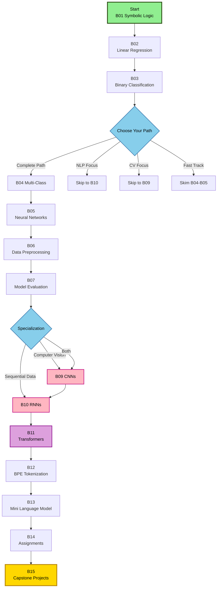

### Path 1: Complete Beginner (Recommended)
**Goal:** Master all fundamentals systematically

**Timeline:** 8-12 weeks (5-7 hours/week)

```
Week 1-2:   B01 → B01a → B02 → B03 (Foundation)
Week 3-4:   B04 → B05 (Core ML)
Week 5-6:   B06 → B07 (Data & Evaluation)
Week 7-8:   B09 → B10 (Deep Learning)
Week 9-10:  B11 → B12 (Transformers & Tokenization)
Week 11:    B13 (Language Model)
Week 12+:   B14 → B15 (Projects)
```

**Study Tips:**
- Don't skip lessons
- Complete all code cells
- Take notes in your own words
- Review previous lessons weekly

### Path 2: NLP Focus
**Goal:** Specialize in Natural Language Processing

**Timeline:** 6-8 weeks

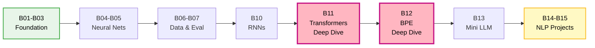

```
Week 1:     B01 → B01a → B02 → B03 (Quick foundation)
Week 2:     B04 → B05 (Neural networks)
Week 3:     B06 → B07 (Data handling)
Week 4-5:   B10 → B11 (RNNs & Transformers)
Week 6:     B12 → B13 (Tokenization & LLMs)
Week 7-8:   B14 (Assignments 7-10) → B15 (NLP projects)
```

**Additional Focus:**
- Deep dive into B11 (Transformers)
- Spend extra time on B12 (Tokenization)
- Build text generation projects

### Path 3: Computer Vision Focus
**Goal:** Specialize in Image Processing

**Timeline:** 6-8 weeks

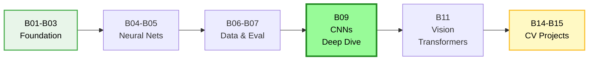

```
Week 1:     B01 → B01a → B02 → B03 (Quick foundation)
Week 2:     B04 → B05 (Neural networks)
Week 3:     B06 → B07 (Data handling)
Week 4-5:   B09 (CNNs - deep dive)
Week 6:     B11 (Vision Transformers)
Week 7-8:   B14 (Assignment 6) → B15 (CV projects)
```

**Additional Focus:**
- Deep dive into B09 (CNNs)
- Study transfer learning
- Build image classification projects

### Path 4: Fast Track (With ML Background)
**Goal:** Quick review and fill gaps

**Timeline:** 3-4 weeks

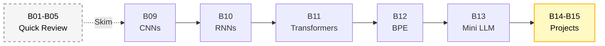

```
Week 1:     Skim B01-B05 (Review basics)
Week 2:     B09 → B10 → B11 (Deep learning)
Week 3:     B12 → B13 (NLP & LLMs)
Week 4:     B14 → B15 (Projects)
```

**Study Tips:**
- Focus on new concepts
- Skip familiar topics
- Jump to advanced assignments

---

### Neural Network Architecture Evolution

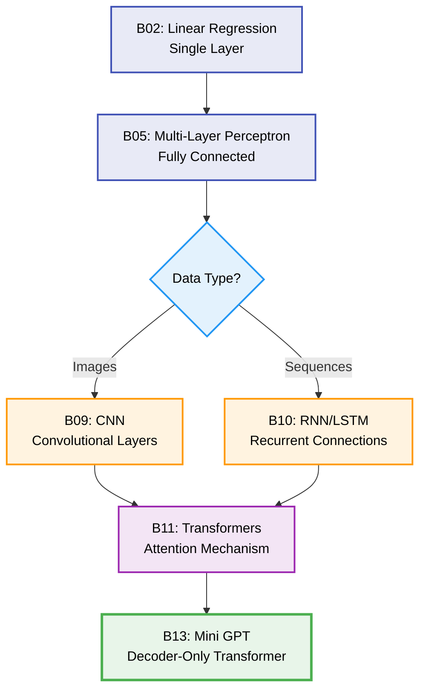

---

### Machine Learning Workflow

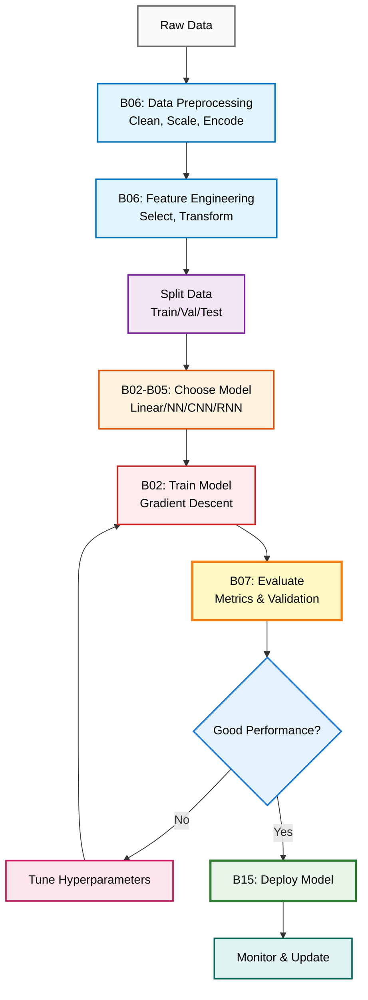

---

## Prerequisites

### Required Knowledge

**Programming:**
- Python fundamentals (variables, functions, loops, conditionals)
- Basic understanding of object-oriented programming
- Familiarity with Jupyter notebooks

**Mathematics:**
- Algebra (equations, functions)
- Basic calculus (derivatives, chain rule)
- Basic statistics (mean, variance, probability)

**Not Required But Helpful:**
- Linear algebra (vectors, matrices)
- NumPy basics
- Pandas for data manipulation

### Software Setup

**Option 1: Google Colab (Recommended - Zero Setup)**
- No installation needed
- Free GPU access
- All dependencies pre-installed
- Click "Open in Colab" badge in any notebook

**Option 2: Local Setup**
```bash
# Create virtual environment
python -m venv .venv
source .venv/bin/activate  # Windows: .venv\Scripts\activate

# Install dependencies
pip install tensorflow torch numpy pandas matplotlib seaborn scikit-learn tiktoken

# Start Jupyter
jupyter lab
```

---

## How to Use These Lessons

### Learning Process Flow

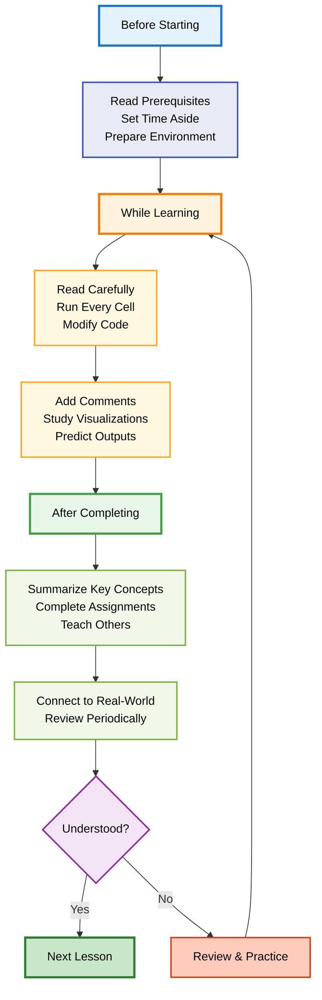

### Before Starting a Lesson

1. **Review Prerequisites:** Check if you understand previous concepts
2. **Set Time Aside:** Allocate 1-2 hours of focused time
3. **Prepare Environment:** Open notebook in Colab or local Jupyter
4. **Have Notebook Ready:** Keep a physical/digital notebook for notes

### While Learning

1. **Read Carefully:** Don't rush through explanations
2. **Run Every Cell:** Execute code and observe outputs
3. **Modify Code:** Change parameters and see what happens
4. **Add Comments:** Write your own explanations
5. **Visualize:** Study all plots and diagrams carefully
6. **Predict Outputs:** Try to guess results before running cells

### After Completing a Lesson

1. **Summarize:** Write key concepts in your own words
2. **Practice:** Complete related assignments from B14
3. **Teach:** Explain the concept to someone else
4. **Connect:** Link to real-world applications
5. **Review:** Revisit after 1 day, 1 week, 1 month (spaced repetition)

### Best Practices

- **Consistency > Intensity:** 1 hour daily beats 7 hours on Sunday
- **Active Learning:** Implement variations, don't just run code
- **Document Everything:** Keep a learning journal
- **Build Projects:** Apply concepts to personal projects
- **Join Communities:** Discuss with other learners
- **Teach Others:** Best way to solidify understanding

---

## Study Strategies

### For Visual Learners
- Focus on all visualizations and plots
- Draw your own diagrams
- Use tools like TensorBoard
- Watch supplementary videos
- Create mind maps

### For Hands-On Learners
- Modify every code example
- Build mini-projects after each lesson
- Experiment with different parameters
- Break things and fix them
- Type code instead of copy-paste

### For Reading/Writing Learners
- Take detailed notes
- Write summaries after each lesson
- Create flashcards for key concepts
- Write blog posts about what you learned
- Explain concepts in writing

### For Auditory Learners
- Read explanations aloud
- Discuss with study partners
- Record yourself explaining concepts
- Listen to ML podcasts
- Join study groups

---

## Additional Resources

### Books (Free Online)
- "Artificial Intelligence: A Modern Approach" by Stuart Russell and Peter Norvig - [aima.cs.berkeley.edu](http://aima.cs.berkeley.edu/)
- "Deep Learning" by Goodfellow, Bengio, Courville - [deeplearningbook.org](http://www.deeplearningbook.org/)
- "Neural Networks and Deep Learning" by Michael Nielsen - [neuralnetworksanddeeplearning.com](http://neuralnetworksanddeeplearning.com/)
- "Dive into Deep Learning" - [d2l.ai](https://d2l.ai/)

### Online Courses (Complement This Repo)
- Fast.ai - Practical Deep Learning
- Stanford CS231n - Computer Vision
- Stanford CS224n - NLP
- DeepLearning.AI - Coursera Specializations

### YouTube Channels
- 3Blue1Brown - Visual explanations
- StatQuest - Statistics and ML
- Andrej Karpathy - Neural Networks
- Two Minute Papers - Latest research

### Practice Platforms
- Kaggle - Competitions and datasets
- LeetCode - Coding practice
- Papers with Code - Research implementations
- Google Colab - Free GPU notebooks

### Communities
- r/MachineLearning - Reddit community
- r/learnmachinelearning - Beginner-friendly
- Kaggle Forums - Dataset discussions
- Discord servers - Real-time chat

### Tools & Libraries
- TensorFlow Playground - Visualize neural networks
- Netron - Visualize model architectures
- TensorBoard - Training visualization
- Weights & Biases - Experiment tracking

---

## Common Challenges & Solutions

### Troubleshooting Decision Tree

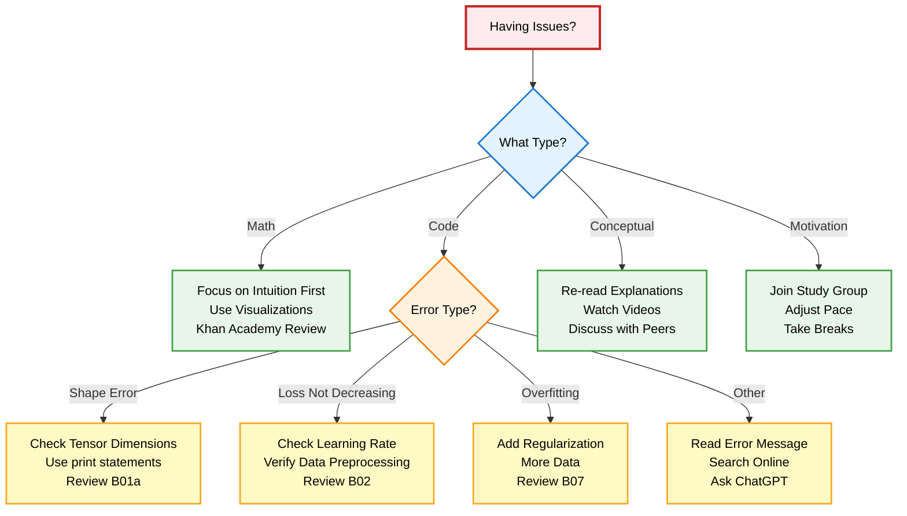

### Challenge 1: "The math is overwhelming"
**Solution:**
- Focus on intuition first (this repo emphasizes understanding)
- Implement before diving deep into proofs
- Use visualizations (all notebooks include plots)
- Review linear algebra/calculus as needed
- Khan Academy for math refreshers

### Challenge 2: "I don't know where to start"
**Solution:**
- Follow the sequential order: B01 → B01a → B02 → ... → B15
- Don't skip fundamentals (B01-B04)
- Each lesson builds on previous ones
- Use the learning paths above
- Start with Path 1 if completely new

### Challenge 3: "My code doesn't work"
**Solution:**
- Compare with notebook implementations
- Use print statements to debug
- Check tensor shapes (most common issue)
- Read error messages carefully
- Ask on course forums or Discord
- Use ChatGPT for debugging help

### Challenge 4: "I'm falling behind"
**Solution:**
- Adjust your pace (it's not a race)
- Focus on understanding, not completion
- Skip optional sections if needed
- Join study groups for motivation
- Take breaks when needed

### Challenge 5: "I forget what I learned"
**Solution:**
- Use spaced repetition (review after 1 day, 1 week, 1 month)
- Build projects to apply knowledge
- Teach concepts to others
- Create flashcards for key concepts
- Keep a learning journal

### Challenge 6: "Concepts seem abstract"
**Solution:**
- Connect to real-world applications
- Build toy projects
- Visualize everything
- Use analogies and metaphors
- Discuss with peers

---

## Progress Tracking

### Learning Journey Map

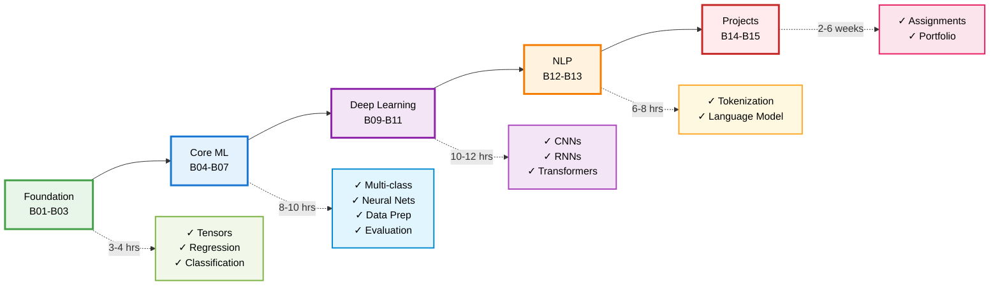

### Checklist: Foundation Stage
- [ ] B01: Understand propositions, connectives, and truth tables
- [ ] B01a: Understand tensors and basic operations
- [ ] B02: Implement linear regression from scratch
- [ ] B03: Build a binary classifier
- [ ] Can explain gradient descent to someone else
- [ ] Completed B14 Assignments 1-2

### Checklist: Core ML Stage
- [ ] B04: Build multi-class classifier
- [ ] B05: Understand backpropagation
- [ ] B06: Clean and preprocess real dataset
- [ ] B07: Evaluate model with multiple metrics
- [ ] Completed B14 Assignments 3-5

### Checklist: Deep Learning Stage
- [ ] B09: Build CNN for image classification
- [ ] B10: Implement LSTM for sequences
- [ ] B11: Understand attention mechanism
- [ ] Can explain transformers to someone else
- [ ] Completed B14 Assignments 6-8

### Checklist: NLP Stage
- [ ] B12: Implement BPE tokenizer
- [ ] B13: Build mini language model
- [ ] Generate coherent text
- [ ] Understand GPT architecture
- [ ] Completed B14 Assignments 9-10

### Checklist: Projects Stage
- [ ] Completed 5+ assignments from B14
- [ ] Started 1 capstone project from B15
- [ ] Created GitHub portfolio
- [ ] Deployed 1 model
- [ ] Shared work on LinkedIn

### Self-Assessment Questions

After each stage, ask yourself:
1. Can I explain this concept to a beginner?
2. Can I implement this from scratch?
3. Do I understand when to use this technique?
4. Can I debug issues in this code?
5. Have I applied this to a real problem?

If you answer "no" to any question, review that section.

### Skill Development Timeline

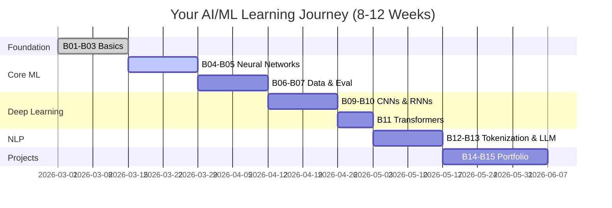

---

## Getting Help

### When You're Stuck

1. **Read Error Messages:** They usually tell you what's wrong
2. **Check Documentation:** TensorFlow/PyTorch docs are excellent
3. **Search Online:** Someone likely had the same issue
4. **Ask ChatGPT:** Great for debugging and explanations
5. **Post on Forums:** Kaggle, Reddit, Stack Overflow
6. **Connect on LinkedIn:** Reach out to the author

### How to Ask Good Questions

**Bad Question:**
"My code doesn't work. Help!"

**Good Question:**
"I'm trying to implement a CNN in B09, but I'm getting a shape mismatch error on line 45. I expected shape (32, 28, 28, 1) but got (32, 784). Here's my code: [code snippet]. What am I doing wrong?"

**Include:**
- What you're trying to do
- What you expected
- What actually happened
- Error messages
- Code snippet (minimal reproducible example)
- What you've already tried

---

## Tips for Success

### Daily Habits
- Code for at least 30 minutes daily
- Review previous concepts for 10 minutes
- Read one ML article or paper
- Participate in one online discussion
- Track your progress

### Weekly Goals
- Complete 1-2 lessons
- Finish 1-2 assignments from B14
- Build one mini-project
- Write one blog post or summary
- Review all previous lessons

### Monthly Milestones
- Complete one full stage
- Build one portfolio project
- Contribute to open source
- Present your work
- Help other learners

---

## Next Steps

After completing all Basic lessons:

1. **Build Portfolio:** Complete 2-3 projects from B15
2. **Share Work:** Post on GitHub and LinkedIn
3. **Get Feedback:** Join communities and ask for reviews
4. **Move Forward:** Start [Intermediate level](../Intermediate/)
5. **Keep Learning:** Follow latest research and trends

---

## Feedback & Contributions

Found an error? Have a suggestion? Want to contribute?

- Open an issue on GitHub
- Submit a pull request
- Connect on LinkedIn
- Share your success story

---

**Remember:** Learning AI/ML is a marathon, not a sprint. Take your time, understand deeply, and enjoy the journey!

**Author:** Karthik Arjun  
**Currently:** Master of Artificial Intelligence Student at the University of Auckland  
**LinkedIn:** [karthik-arjun-a5b4a258](https://www.linkedin.com/in/karthik-arjun-a5b4a258/)  
**Hugging Face:** [nexageapps](https://huggingface.co/spaces/nexageapps)

*"The best way to learn is to build. Start your AI journey today!"*

---

**Last Updated:** March 2026  
**Version:** 2.0 (Enhanced with learning strategies)
