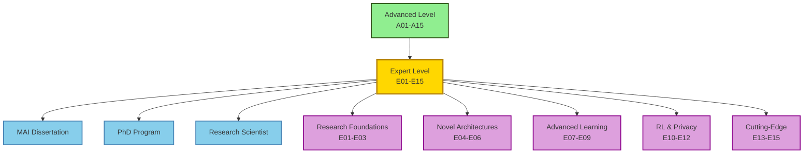

# Expert Level - Research & Innovation

### Read papers. Write code. Publish results. Advance the field.

[](https://colab.research.google.com/)
[](https://huggingface.co/spaces/nexageapps)
[](https://nexageapps.com)
[](https://www.linkedin.com/in/karthik-arjun-a5b4a258/)

**Research-oriented topics and cutting-edge techniques for advancing the field of AI**

From paper to code. From experiments to publications. Master research methods and create novel AI.

This folder contains 15 expert-level lessons focused on research, innovation, and contributing to the state-of-the-art in AI. Each lesson emphasizes novel techniques, research paper implementation, and pushing the boundaries of what's possible.

Designed for university students and AI learners worldwide. Created by a Master of Artificial Intelligence student at the University of Auckland.

---

## ⚠️ Important Disclaimer

**Educational & Research Resource Notice:**
This is an independent, open-source educational project created by a student for students and AI researchers worldwide. The content focuses on research methodologies and cutting-edge techniques but is NOT official curriculum material or research guidance from any institution.

**Key Points:**
- This is NOT official university material or research supervision
- Content and opinions are solely those of the author
- No affiliation with or endorsement by any institution
- Requires completion of Basic (B01-B15), Intermediate (I01-I15), and Advanced (A01-A15) levels
- Research examples are educational - always follow your institution's research ethics policies
- Paper implementations are for learning - cite original authors when using ideas
- Computational resources may be significant (use institutional or cloud resources)
- Use responsibly and follow your institution's academic integrity and research policies
- Always cite sources appropriately and follow publication ethics

**Research Ethics:** When conducting research, follow ethical guidelines, obtain necessary approvals (IRB/ethics committees), respect intellectual property, cite all sources, and consider societal impact. These notebooks provide educational examples - actual research requires institutional oversight and ethical review.

**Publication Notice:** If you use concepts or code from these notebooks in research publications, cite this repository and the original papers referenced within. Follow your target venue's citation guidelines.

---

> 💾 **Research-Optimized & Reproducible:** Notebooks emphasize reproducibility with fixed random seeds, version pinning, and detailed experimental setups. Examples demonstrate research best practices including ablation studies, statistical testing, and result visualization. Designed for high-performance computing environments with GPU/TPU support.

---

## Table of Contents

- [Complete Lesson List](#complete-lesson-list)
- [Learning Paths](#learning-paths)
- [Prerequisites](#prerequisites)
- [UoA MAI Alignment](#uoa-mai-alignment)
- [Research Strategies](#research-strategies)
- [Progress Tracking](#progress-tracking)

---

## Complete Lesson List

### Research Foundations (E01-E03)
**Duration:** 12-15 hours | **Goal:** Master research methodology

1. **E01 - Reading and Implementing Research Papers**
   - How to read ML research papers effectively
   - Reproducing paper results
   - Implementing from scratch vs adapting code
   - Benchmarking and validation
   - **Why it matters:** Foundation for all research work

2. **E02 - Experimental Design and Ablation Studies**
   - Designing rigorous experiments
   - Ablation studies and component analysis
   - Statistical significance testing
   - Reproducibility and random seeds
   - **Why it matters:** Validate research contributions

3. **E03 - Writing and Publishing Research**
   - Research paper structure (NeurIPS, ICML, ICLR)
   - Writing clear and compelling papers
   - Creating effective visualizations
   - Peer review process and responding to reviewers
   - **Why it matters:** Share your contributions with the world

### Novel Architectures (E04-E06)
**Duration:** 15-18 hours | **Goal:** Design new neural architectures

4. **E04 - Neural Architecture Search (NAS)**
   - Search spaces and search strategies
   - DARTS, ENAS, and modern NAS methods
   - Hardware-aware NAS
   - AutoML for architecture design
   - **Why it matters:** Automate architecture discovery

5. **E05 - Custom Layer and Operation Design**
   - Designing novel neural network layers
   - Custom CUDA kernels for efficiency
   - Gradient computation and backpropagation
   - Integration with PyTorch/TensorFlow
   - **Why it matters:** Create building blocks for new architectures

6. **E06 - Attention Mechanism Innovations**
   - Beyond standard attention (sparse, linear, efficient)
   - Flash Attention and memory-efficient attention
   - Novel attention patterns and architectures
   - Attention visualization and analysis
   - **Why it matters:** Improve transformer efficiency and capability

### Advanced Learning Paradigms (E07-E09)
**Duration:** 15-18 hours | **Goal:** Master cutting-edge learning methods

7. **E07 - Meta-Learning and Few-Shot Learning**
   - MAML, Reptile, and Prototypical Networks
   - Learning to learn frameworks
   - Task distribution and meta-training
   - Applications and benchmarks
   - **Why it matters:** Enable rapid adaptation to new tasks

8. **E08 - Continual and Lifelong Learning**
   - Catastrophic forgetting and mitigation
   - Elastic Weight Consolidation (EWC)
   - Progressive neural networks
   - Memory-based continual learning
   - **Why it matters:** Build systems that learn continuously

9. **E09 - Self-Supervised and Contrastive Learning**
   - SimCLR, MoCo, and BYOL
   - Contrastive loss functions
   - Pretext tasks and augmentation strategies
   - Applications beyond vision
   - **Why it matters:** Learn from unlabeled data

### Reinforcement Learning & Advanced Topics (E10-E12)
**Duration:** 15-18 hours | **Goal:** Master RL and advanced techniques

10. **E10 - Deep Reinforcement Learning**
    - DQN, A3C, PPO, and SAC algorithms
    - Policy gradient methods
    - Model-based vs model-free RL
    - Multi-agent reinforcement learning
    - **Why it matters:** Enable decision-making AI

11. **E11 - Reinforcement Learning from Human Feedback (RLHF)**
    - Reward modeling from human preferences
    - PPO for language model alignment
    - InstructGPT and ChatGPT methodology
    - Constitutional AI and safety
    - **Why it matters:** Align AI with human values

12. **E12 - Federated and Privacy-Preserving Learning**
    - Federated learning algorithms (FedAvg, FedProx)
    - Differential privacy in ML
    - Secure multi-party computation
    - Privacy-utility tradeoffs
    - **Why it matters:** Enable privacy-preserving AI

### Cutting-Edge Research (E13-E15)
**Duration:** 18-24 hours | **Goal:** Contribute to state-of-the-art

13. **E13 - Multimodal Foundation Models**
    - Building unified vision-language-audio models
    - Cross-modal alignment and grounding
    - Scaling laws for multimodal models
    - Emergent capabilities
    - **Why it matters:** Next generation of AI systems

14. **E14 - Efficient and Green AI**
    - Carbon footprint of ML training
    - Efficient architecture design
    - Lottery ticket hypothesis and pruning
    - Knowledge distillation at scale
    - **Why it matters:** Sustainable AI development

15. **E15 - Research Project and Contribution**
    - Identifying research gaps
    - Designing novel solutions
    - Implementing and evaluating
    - Contributing to open-source research
    - Publishing your work
    - **Why it matters:** Make your mark on the field

**Total Learning Time:** 100-120 hours for complete mastery

---

## Learning Paths

### Path 1: Complete Expert (Recommended for PhD Track)
**Timeline:** 16-20 weeks (6-8 hours/week)

```
Week 1-3:   E01 → E02 → E03 (Research foundations)
Week 4-6:   E04 → E05 → E06 (Novel architectures)
Week 7-9:   E07 → E08 → E09 (Advanced learning)
Week 10-12: E10 → E11 → E12 (RL & privacy)
Week 13-20: E13 → E14 → E15 (Cutting-edge & project)
```

### Path 2: Architecture Researcher
**Timeline:** 10-12 weeks

```
Week 1-2:   E01 → E02 (Research basics)
Week 3-5:   E04 → E05 → E06 (Architecture design)
Week 6-7:   E09 (Self-supervised learning)
Week 8-9:   E14 (Efficient AI)
Week 10-12: E15 (Research project)
```

### Path 3: Learning Theory Researcher
**Timeline:** 10-12 weeks

```
Week 1-2:   E01 → E02 (Research basics)
Week 3-5:   E07 → E08 → E09 (Advanced learning)
Week 6-7:   E10 (Deep RL)
Week 8-9:   E12 (Privacy-preserving)
Week 10-12: E15 (Research project)
```

### Path 4: Applied AI Researcher
**Timeline:** 10-12 weeks

```
Week 1-2:   E01 → E02 (Research basics)
Week 3-4:   E06 (Attention innovations)
Week 5-6:   E09 (Self-supervised)
Week 7-8:   E11 (RLHF)
Week 9-10:  E13 (Multimodal)
Week 11-12: E15 (Research project)
```

---

## Prerequisites

### Required Knowledge
- Completion of Basic, Intermediate, and Advanced levels
- Strong mathematical foundations (linear algebra, calculus, probability)
- Experience implementing complex models from scratch
- Proficiency in PyTorch or TensorFlow
- Understanding of research methodology

### Recommended Background
- Published research paper or technical report
- Experience with multiple ML frameworks
- Strong software engineering skills
- Familiarity with academic writing
- Active participation in ML research community

### Software Requirements
- Python 3.9+
- PyTorch 2.x (preferred for research)
- CUDA and GPU programming basics
- LaTeX for paper writing
- Git and version control
- High-performance computing access

---

## University Research Alignment

This curriculum is designed for university students worldwide pursuing AI/ML research. Example mapping based on the University of Auckland's MAI program (where the author is currently studying):

### Example Research/Dissertation Alignment

| Research Phase | Relevant Expert Lessons | Focus |
|-------------------|------------------------|-------|
| Literature Review | E01 (Reading papers) | Understanding state-of-the-art |
| Research Design | E02 (Experimental design) | Methodology |
| Implementation | E04-E14 (Specialized topics) | Novel contributions |
| Writing | E03 (Writing research) | Thesis/dissertation writing |
| Publication | E15 (Research project) | Conference/journal papers |

These mappings serve as examples - adapt them to your own university's research requirements.

### Research Progression



---

## Research Strategies

### Before Starting
1. Complete all previous levels
2. Join research communities (Twitter/X, Discord, Slack)
3. Set up paper reading workflow (Zotero, Notion)
4. Identify research interests and potential advisors

### While Learning
1. Read 2-3 papers per week minimum
2. Implement key papers from scratch
3. Maintain research journal
4. Present work at lab meetings
5. Collaborate with other researchers

### After Completing
1. Publish research papers
2. Contribute to major open-source projects
3. Apply for PhD programs or research positions
4. Build research portfolio and online presence

### Research Best Practices
- **Reproducibility:** Always share code and data
- **Documentation:** Maintain detailed experiment logs
- **Collaboration:** Work with diverse research teams
- **Communication:** Present at conferences and workshops
- **Ethics:** Consider societal impact of research

---

## Progress Tracking

### Checklist: Research Foundations
- [ ] E01: Implement 5+ research papers
- [ ] E02: Design and run rigorous experiments
- [ ] E03: Write technical report or paper
- [ ] Can critically evaluate research

### Checklist: Novel Architectures
- [ ] E04: Implement NAS algorithm
- [ ] E05: Design custom neural layer
- [ ] E06: Create novel attention mechanism
- [ ] Can design new architectures

### Checklist: Advanced Learning
- [ ] E07: Implement meta-learning algorithm
- [ ] E08: Build continual learning system
- [ ] E09: Apply self-supervised learning
- [ ] Can design learning paradigms

### Checklist: RL & Privacy
- [ ] E10: Implement deep RL algorithm
- [ ] E11: Build RLHF system
- [ ] E12: Implement federated learning
- [ ] Can design privacy-preserving systems

### Checklist: Cutting-Edge
- [ ] E13: Build multimodal foundation model
- [ ] E14: Optimize for efficiency
- [ ] E15: Complete original research project
- [ ] Published or submitted paper

---

## Career Paths

After completing Expert level:

### Academia
- **PhD Programs:** Top-tier universities worldwide
- **Research Assistant:** University research labs
- **Postdoctoral Researcher:** Advanced research positions

### Industry Research
- **Research Scientist:** Google DeepMind, OpenAI, Meta AI
- **Applied Scientist:** Amazon, Microsoft Research
- **ML Research Engineer:** Anthropic, Cohere, Stability AI

### Entrepreneurship
- **AI Startup Founder:** Build novel AI products
- **Research Consultant:** Advise companies on AI strategy
- **Open Source Maintainer:** Lead major ML projects

---

## Resources

### Research Venues
- **Conferences:** NeurIPS, ICML, ICLR, CVPR, ACL, EMNLP
- **Journals:** JMLR, PAMI, Nature Machine Intelligence
- **Workshops:** Specialized tracks at major conferences

### Paper Repositories
- arXiv.org - Preprints
- Papers with Code - Implementations
- OpenReview - Peer review platform
- Semantic Scholar - Paper search

### Research Tools
- **Writing:** LaTeX, Overleaf
- **Experiments:** Weights & Biases, MLflow
- **Visualization:** Matplotlib, Seaborn, Plotly
- **Collaboration:** GitHub, Notion, Slack

### Communities
- **Twitter/X:** Follow top researchers
- **Discord:** ML research servers
- **Reddit:** r/MachineLearning
- **Conferences:** Attend and network

### Books
- "Deep Learning" by Goodfellow, Bengio, Courville
- "Reinforcement Learning" by Sutton and Barto
- "Pattern Recognition and Machine Learning" by Bishop
- "The Hundred-Page Machine Learning Book" by Burkov

---

## Contributing to Research

### Open Source Contributions
- Implement papers in popular frameworks
- Contribute to PyTorch, TensorFlow, Hugging Face
- Create research reproducibility repositories
- Build tools for researchers

### Publishing
- Write clear and reproducible papers
- Share code and datasets
- Engage with reviewers constructively
- Present at conferences

### Mentorship
- Help junior researchers
- Review papers for conferences
- Teach workshops and tutorials
- Build research communities

---

**Author:** Karthik Arjun  
**Currently:** Master of Artificial Intelligence Student at the University of Auckland  
**LinkedIn:** [karthik-arjun-a5b4a258](https://www.linkedin.com/in/karthik-arjun-a5b4a258/)  
**Hugging Face:** [nexageapps](https://huggingface.co/spaces/nexageapps)

*"Push the boundaries of AI and contribute to the future"*

---

**Last Updated:** March 2026  
**Version:** 2.0 (Research-Oriented Curriculum)
