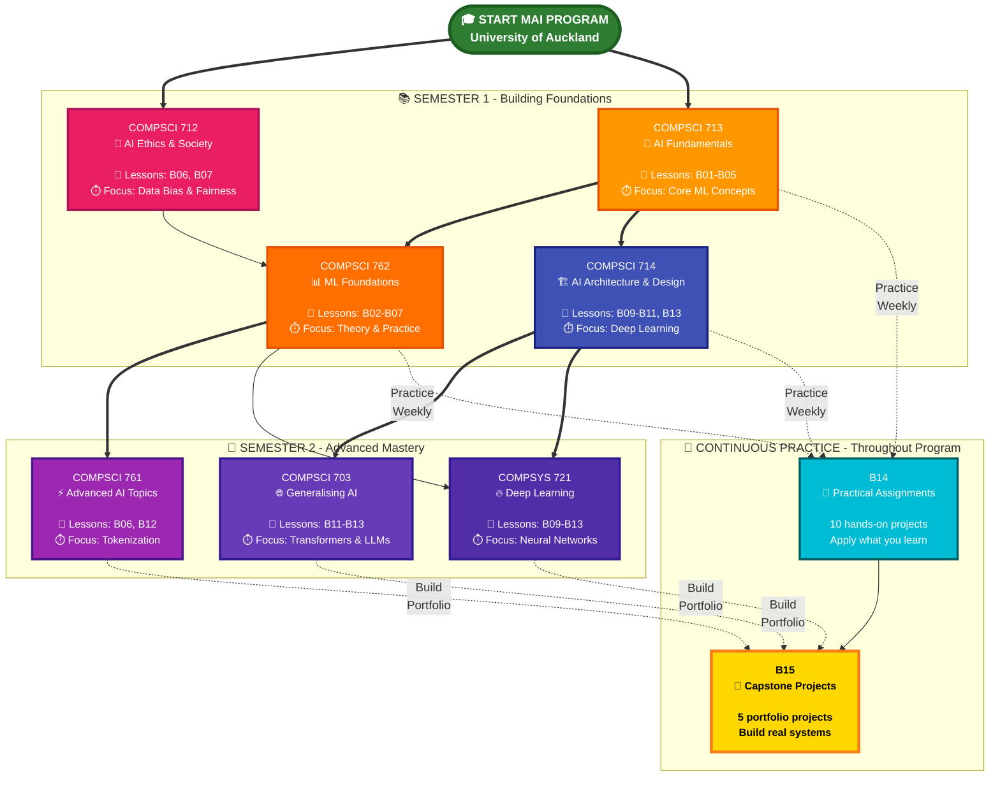
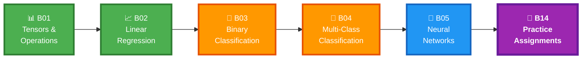
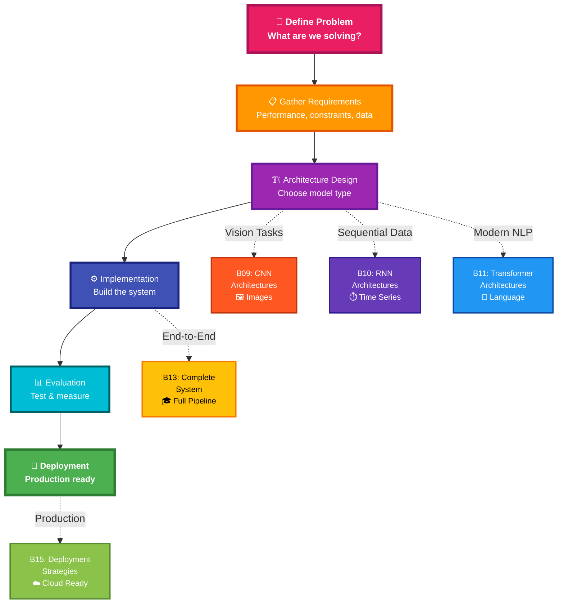
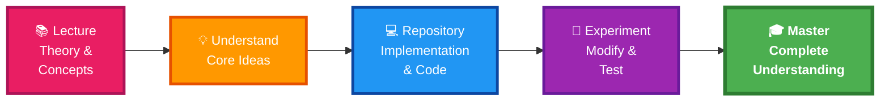
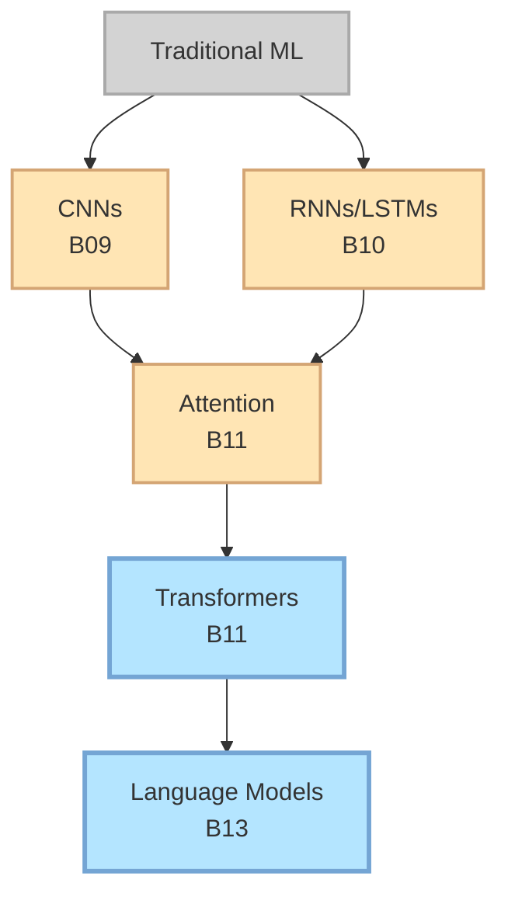
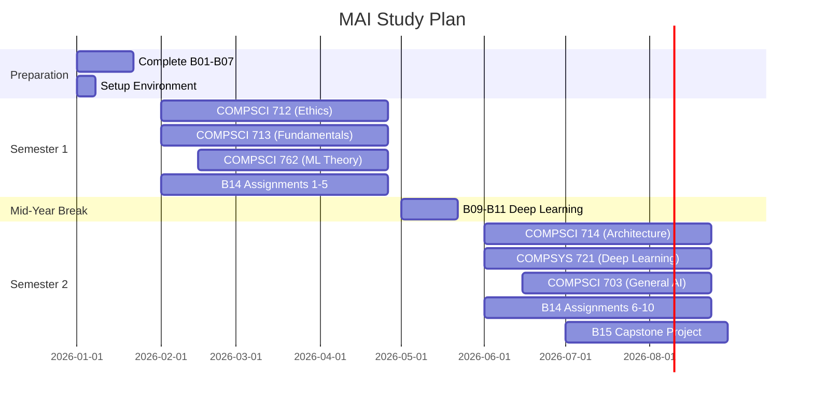

# Guide for University of Auckland MAI Students

**How This Repository Complements Your MAI Journey**

---

**DISCLAIMER:** This guide is created by an independent student and is not officially affiliated with, endorsed by, or sponsored by the University of Auckland. This is a personal learning resource created by a current MAI student to share study strategies and materials with fellow students. Use of the University of Auckland name is solely to provide context about the author's academic program. Course references and study strategies are provided based on personal experience to help fellow students. Always refer to official course materials and consult with your professors for authoritative guidance. The content and opinions expressed here are solely those of the author and do not represent the views or policies of the University of Auckland.

---

## Table of Contents

- [Overview](#overview)
- [Quick Reference: Course Mapping](#quick-reference-course-mapping)
- [Learning Path Flowchart](#learning-path-flowchart)
- [Course-by-Course Guide](#course-by-course-guide)
- [Study Strategies](#study-strategies)
- [Integration with Assessments](#integration-with-assessments)
- [Common Challenges & Solutions](#common-challenges--solutions)
- [Resources](#resources)
- [FAQ](#frequently-asked-questions)

---

## Overview

This repository is designed by a fellow MAI student at the University of Auckland to complement your coursework and provide hands-on practice for the concepts you're learning in class. Think of it as your practical companion to the theoretical foundations taught in your courses.

**Key Benefits:**
- Practical implementations of lecture concepts
- Hands-on practice before assignments
- Reference code for projects and dissertation
- Portfolio-worthy capstone projects
- Exam preparation materials

---

## Quick Reference: Course Mapping

Use this table to quickly find which lessons support each course:

| Course Code | Course Name | Relevant Lessons | Focus Area | Semester |
|-------------|-------------|------------------|------------|----------|
| COMPSCI 712 | AI Agency, Ethics and Society | B06, B07, B14, B15 | Ethics & Bias | 1 |
| COMPSCI 713 | AI Fundamentals | B01-B05, B14 | Core Algorithms | 1 |
| COMPSCI 714 | AI Architecture and Design | B09-B11, B13-B15 | System Design | 1/2 |
| COMPSCI 761 | Advanced AI Topics | B06, B12, B14, B15 | Knowledge Rep | 1/2 |
| COMPSCI 762 | Foundations of ML | B02-B05, B07, B14 | ML Theory | 1 |
| COMPSCI 703 | Generalising AI | B11-B13, B14, B15 | General AI | 2 |
| COMPSYS 721 | Machine Intelligence | B09-B11, B13, B14 | Deep Learning | 2 |

**Recommended Study Order:**
1. COMPSCI 712 (Ethics) - Understand responsible AI first
2. COMPSCI 713 (Fundamentals) - Build strong foundations
3. Parallel: COMPSCI 762 (ML Theory) + COMPSCI 714 (Architecture)
4. Advanced: COMPSCI 761, 703, COMPSYS 721

---

## Learning Path Flowchart

**Your Complete MAI Journey Visualized**



**🎨 Color Legend:**
- 🟢 **Green**: Your starting point - MAI Program begins here
- 🔴 **Pink/Red**: Ethics & Society - Foundation for responsible AI
- 🟠 **Orange**: Core Fundamentals - Essential ML concepts
- 🔵 **Blue**: Architecture & Design - Deep learning systems
- 🟣 **Purple**: Advanced Topics - Cutting-edge AI techniques
- 🔷 **Cyan**: Practice Assignments - Weekly hands-on work
- 🟡 **Gold**: Capstone Projects - Portfolio-worthy final projects

**📊 Connection Types:**
- **Solid thick arrows (==>)**: Primary learning path - follow these first
- **Solid thin arrows (-->)**: Secondary connections - important relationships
- **Dotted lines (-..->)**: Practice opportunities - apply your knowledge continuously

**⏱️ Time Commitment:**
- **Semester 1**: 4 courses + Weekly practice from B14
- **Semester 2**: 3 courses + Build capstone projects from B15
- **Throughout**: Continuous practice with assignments and projects

---

## Course-by-Course Guide

### COMPSCI 712: AI Agency, Ethics and Society

**Course Focus:** Philosophical and ethical foundations of AI

**Repository Coverage:**
- B06 - Data Preprocessing (Understanding bias in data)
- B07 - Model Evaluation (Fairness metrics)
- B14 - Practical Projects (Bias detection assignments)
- B15 - Capstone Projects (Ethical AI system design)

**Weekly Study Plan:**

| Week | Lecture Topics | Repository Work | Deliverables |
|------|---------------|-----------------|--------------|
| 1-3 | AI Ethics Foundations | Review B06 (Data Bias) | Bias analysis report |
| 4-6 | Fairness & Accountability | Complete B07 (Fairness Metrics) | Fairness evaluation |
| 7-9 | Privacy & Consent | B14 Assignment (Bias Detection) | Implementation |
| 10-12 | Societal Impact | B15 Project Planning | Project proposal |

**How to Use:**
1. Before lectures: Read relevant sections in B06/B07
2. During semester: Apply concepts to detect bias in datasets
3. For assignments: Use B14 ethical AI assignments as practice
4. For projects: Build responsible AI systems using B15 guidelines

**What to Add for Assignments:**
- Ethical analysis frameworks
- Case studies of AI failures
- Regulatory compliance (GDPR, AI Act)
- Stakeholder impact assessments

---

### COMPSCI 713: AI Fundamentals

**Course Focus:** Core AI/ML algorithms and foundations

**Repository Coverage:**
- B01 - Arithmetic (TensorFlow fundamentals)
- B02 - Linear Regression (Gradient descent)
- B03 - Binary Classification (Classification basics)
- B04 - Multi-Class Classification (Softmax)
- B05 - Neural Networks (MLPs, backpropagation)
- B14 - Assignments 1-5 (Fundamentals practice)

**Learning Progression:**



**🎨 Progression Colors:**
- 🟢 **Green**: Foundation - Start here (B01-B02)
- 🟠 **Orange**: Intermediate - Building skills (B03-B04)
- 🔵 **Blue**: Advanced - Deep concepts (B05)
- 🟣 **Purple**: Practice - Apply everything (B14)

**Weekly Study Plan:**

| Week | Topics | Repository Work | Practice |
|------|--------|-----------------|----------|
| 1-2 | Tensors & Linear Models | B01-B02 | B14 Assignment 1 |
| 3-4 | Classification Basics | B03-B04 | B14 Assignment 2-3 |
| 5-6 | Neural Networks | B05 | B14 Assignment 4-5 |
| 7-8 | Review & Practice | All lessons | Complete all B14 |

**How to Use:**
1. Complete B01-B05 sequentially before lectures
2. Implement algorithms from scratch (no high-level APIs)
3. Use B14 assignments for practice before course assignments
4. Focus on understanding, not just running code

**What to Add for Assignments:**
- Mathematical derivations
- Complexity analysis (Big O notation)
- Comparison with theoretical bounds
- Algorithm variations

---

### COMPSCI 714: AI Architecture and Design

**Course Focus:** Designing and implementing AI system architectures

**Repository Coverage:**
- B09 - CNNs (Computer vision architectures)
- B10 - RNNs (Sequential architectures)
- B11 - Transformers (Modern architectures)
- B13 - Language Model (End-to-end system)
- B14 - Assignments 6-10 (Architecture practice)
- B15 - Capstone Projects (System design)

**Architecture Design Process:**



**🎨 Process Flow Colors:**
- 🔴 **Pink**: Problem definition - Start here
- 🟠 **Orange**: Requirements gathering
- 🟣 **Purple**: Design phase - Critical decisions
- 🔵 **Blue**: Implementation - Build it
- 🔷 **Cyan**: Evaluation - Test it
- 🟢 **Green**: Deployment - Ship it

**📚 Architecture References:**
- **CNN (Red)**: For image/vision tasks
- **RNN (Purple)**: For sequential/time-series data
- **Transformer (Blue)**: For modern NLP tasks
- **Complete System (Yellow)**: End-to-end implementation
- **Production (Green)**: Deployment strategies

**Weekly Study Plan:**

| Week | Topics | Repository Work | Deliverables |
|------|--------|-----------------|--------------|
| 1-3 | CNN Architectures | B09 Deep Dive | Architecture analysis |
| 4-6 | RNN & Transformers | B10-B11 | Comparison report |
| 7-9 | System Design | B13 Implementation | Working system |
| 10-12 | Deployment | B15 Project | Deployed model |

**How to Use:**
1. Study architecture choices in each notebook
2. Understand trade-offs (accuracy vs speed, memory vs performance)
3. Use B15 projects as templates for course projects
4. Document design decisions

**What to Add for Assignments:**
- Architecture justification
- Design trade-off analysis
- Scalability considerations
- Performance benchmarking
- Alternative architecture comparisons

---

### COMPSCI 761: Advanced Topics in Artificial Intelligence

**Course Focus:** Knowledge representation, search, and advanced AI

**Repository Coverage:**
- B06 - Data Preprocessing (Feature representation)
- B12 - Byte Pair Encoding (Text representation)
- B14 - Assignment 9 (Custom tokenizer)
- B15 - Capstone Projects (Advanced applications)

**Weekly Study Plan:**

| Week | Topics | Repository Work | Focus |
|------|--------|-----------------|-------|
| 1-3 | Feature Representation | B06 | Feature engineering |
| 4-6 | Text Representation | B12 | Tokenization |
| 7-9 | Custom Implementation | B14 Assignment 9 | BPE from scratch |
| 10-12 | Advanced Topics | Lectures + B15 | Research project |

**How to Use:**
1. Focus on representation techniques
2. Understand how knowledge is encoded
3. Build custom representations for your domain
4. Connect to search and planning algorithms from lectures

**What to Add for Assignments:**
- Search algorithm implementations
- Knowledge base design
- Heuristic function development
- Planning and reasoning systems

---

### COMPSCI 762: Foundations of Machine Learning

**Course Focus:** Theoretical foundations and core ML algorithms

**Repository Coverage:**
- B02 - Linear Regression (Regression theory)
- B03 - Binary Classification (Classification theory)
- B04 - Multi-Class Classification (Multi-class methods)
- B05 - Neural Networks (Deep learning foundations)
- B07 - Model Evaluation (Metrics and validation)
- B14 - Assignments 1-5 (ML fundamentals)

**Theory to Practice Bridge:**



**🎨 Learning Cycle:**
- 🔴 **Pink**: Theory from lectures - Learn concepts
- 🟠 **Orange**: Understanding - Process information
- 🔵 **Blue**: Implementation - Code it yourself
- 🟣 **Purple**: Experimentation - Modify and explore
- 🟢 **Green**: Mastery - Complete understanding achieved

**Weekly Study Plan:**

| Week | Theory (Lectures) | Practice (Repository) | Integration |
|------|-------------------|----------------------|-------------|
| 1-2 | Linear Models | B02 Implementation | Compare theory vs code |
| 3-4 | Classification | B03-B04 | Derive loss functions |
| 5-7 | Neural Networks | B05 | Backprop derivation |
| 8-10 | Evaluation | B07 | Metric analysis |
| 11-12 | Review | B14 All Assignments | Exam prep |

**How to Use:**
1. Attend lectures for theory
2. Implement concepts using repository code
3. Derive mathematical foundations
4. Use B14 for exam preparation

**What to Add for Assignments:**
- Theoretical analysis and proofs
- Comparison with research papers
- Novel variations or improvements
- Computational learning theory connections

---

### COMPSCI 703: Generalising Artificial Intelligence

**Course Focus:** Building general AI systems, NLP, and reasoning

**Repository Coverage:**
- B11 - Transformers (NLP foundations)
- B12 - BPE (Tokenization)
- B13 - Language Model (General AI system)
- B14 - Assignments 8-10 (NLP practice)
- B15 - Capstone Projects (Research projects)

**Weekly Study Plan:**

| Week | Topics | Repository Work | Output |
|------|--------|-----------------|--------|
| 1-3 | Attention Mechanisms | B11 | Attention implementation |
| 4-6 | Tokenization | B12 | Custom tokenizer |
| 7-9 | Language Models | B13 | Mini GPT |
| 10-12 | Research Project | B15 | Dissertation proposal |

**How to Use:**
1. Understand how specialized systems contribute to general AI
2. Build complete language model (B13)
3. Extend for multi-task learning
4. Use as foundation for dissertation

**What to Add for Assignments:**
- Planning and reasoning implementations
- Natural language understanding systems
- Knowledge acquisition methods
- Multi-task learning approaches

---

### COMPSYS 721: Machine Intelligence and Deep Learning

**Course Focus:** Deep neural networks and cutting-edge architectures

**Repository Coverage:**
- B09 - CNNs (Computer vision)
- B10 - RNNs (Sequential data)
- B11 - Transformers (Modern NLP)
- B13 - Language Model (Complete implementation)
- B14 - Assignments 6-10 (Deep learning practice)

**Deep Learning Architecture Evolution:**



**Weekly Study Plan:**

| Week | Architecture | Repository Work | Project |
|------|-------------|-----------------|---------|
| 1-3 | CNNs | B09 + Experiments | Image classifier |
| 4-6 | RNNs | B10 + Experiments | Sequence model |
| 7-9 | Transformers | B11 + Experiments | Attention model |
| 10-12 | Complete System | B13 | Language model |

**How to Use:**
1. Implement each architecture from scratch
2. Experiment with hyperparameters
3. Compare architectures on same task
4. Use B14 assignments for practice

**What to Add for Assignments:**
- Literature review of recent papers
- Ablation studies
- Performance optimization
- Novel architecture variations
- Research contribution

---

## Study Strategies

### Semester Planning



### Time Management

**Weekly Schedule (Example):**

| Day | Morning (9-12) | Afternoon (1-4) | Evening (7-9) |
|-----|---------------|-----------------|---------------|
| Mon | Lectures | Repository Practice | Review & Notes |
| Tue | Lectures | Assignment Work | B14 Practice |
| Wed | Lectures | Repository Practice | Study Group |
| Thu | Lectures | Project Work | Review & Notes |
| Fri | Lectures | Repository Practice | B14 Practice |
| Sat | Project Work | B15 Capstone | Free Time |
| Sun | Review Week | Prepare Next Week | Free Time |

**Daily Habits:**
- 30 min: Code practice (repository)
- 10 min: Review previous concepts
- 20 min: Read ML articles/papers
- 10 min: Participate in discussions

---

## Integration with Assessments

### Assignment Workflow

```mermaid
graph TD
    Receive[Receive Assignment]:::start
    Review[Review Related<br/>Repository Lessons]:::step
    Understand[Understand<br/>Requirements]:::step
    Reference[Use Code as<br/>Reference]:::step
    Implement[Implement Your<br/>Solution]:::step
    Test[Test & Debug]:::step
    Document[Document<br/>Approach]:::step
    Submit[Submit]:::end
    
    Receive --> Review
    Review --> Understand
    Understand --> Reference
    Reference --> Implement
    Implement --> Test
    Test --> Document
    Document --> Submit
    
    classDef start fill:#4A90E2,stroke:#2E5C8A,stroke-width:3px,color:#fff
    classDef step fill:#FFE5B4,stroke:#D4A574,stroke-width:2px
    classDef end fill:#D4FFB4,stroke:#74D474,stroke-width:3px
```

### Dissertation Planning

**Timeline:**

| Phase | Duration | Repository Support | Deliverables |
|-------|----------|-------------------|--------------|
| Topic Selection | Week 1-2 | Browse B15 projects | Topic proposal |
| Literature Review | Week 3-6 | Review related lessons | Literature survey |
| Implementation | Week 7-14 | Use B13/B15 as templates | Working system |
| Experiments | Week 15-18 | Apply B07 evaluation | Results |
| Writing | Week 19-24 | Document approach | Thesis draft |
| Revision | Week 25-26 | Final improvements | Final thesis |

---

## Common Challenges & Solutions

### Challenge Matrix

| Challenge | Symptoms | Repository Solution | Additional Help |
|-----------|----------|-------------------|-----------------|
| Math overwhelming | Can't follow derivations | Focus on B01-B05 intuition first | Khan Academy |
| Code not working | Errors, wrong outputs | Compare with notebooks | Office hours |
| Falling behind | Missing deadlines | Use notebooks for quick review | Study groups |
| Concepts abstract | Can't visualize | Study all plots in notebooks | Draw diagrams |
| Forgetting material | Poor exam performance | Spaced repetition with B14 | Flashcards |

---

## Resources

### University of Auckland Resources

- **Course Forums**: Canvas discussion boards
- **Office Hours**: Check course outlines
- **Study Spaces**: Kate Edger Information Commons, Science Library
- **HPC Cluster**: Apply for access for large model training
- **Writing Support**: Student Learning Services

### Online Communities

- **r/MachineLearning**: Latest research discussions
- **Papers with Code**: Research implementations
- **Kaggle**: Competitions and datasets
- **GitHub**: Open-source projects

### Recommended Reading

**Books:**
- "Deep Learning" by Goodfellow, Bengio, Courville
- "Pattern Recognition and Machine Learning" by Bishop
- Course-specific readings from syllabi

**Papers:**
- Attention Is All You Need (Transformers)
- BERT, GPT series
- Recent NeurIPS, ICML, ICLR papers

---

## Frequently Asked Questions

### Q: Should I complete this repo before starting MAI?
**A:** Not necessary, but B01-B07 will give you a strong foundation. Focus on B01-B04 if you're new to ML.

### Q: Can I use code from this repo in my assignments?
**A:** Use it as reference and learning material, but write your own implementations. Understand the concepts, don't copy-paste. Always cite sources.

### Q: How much time should I spend on this repo?
**A:** 3-5 hours per week alongside your coursework. Prioritize your course assignments first.

### Q: What if the repo content differs from lectures?
**A:** Always prioritize your course materials. This repo is supplementary. Discuss differences with your professors.

### Q: Can I share my course materials here?
**A:** No, respect copyright. Only share your own implementations and projects.

### Q: How do I contribute?
**A:** Fork the repo, make improvements, and submit a pull request. See contribution guidelines in main README.

---

## Contributing

As a fellow MAI student, contributions are welcome:

**Ways to Contribute:**
1. Fix errors or bugs
2. Add implementation examples
3. Improve explanations
4. Share capstone projects (with permission)
5. Update course mappings

**Guidelines:**
- Follow existing code style
- Add clear comments
- Test your code
- Reference sources

---

## Stay Connected

**Repository Updates:**
- Star the repo for notifications
- Watch releases for new content
- Check issues for discussions

**Author:**
- Karthik Arjun
- MAI Student, University of Auckland
- LinkedIn: [karthik-arjun-a5b4a258](https://www.linkedin.com/in/karthik-arjun-a5b4a258/)

**Note:** This is an independent student project, not officially affiliated with the University of Auckland.

**Community:**
- Form study groups with fellow MAI students
- Help each other with code reviews
- Collaborate on B15 projects

---

## Final Thoughts

This repository grows alongside my MAI journey. As I learn new concepts in class, I add practical implementations here. Use it as your companion throughout the program.

**Remember:**
- Theory + Practice = Mastery
- Consistency beats intensity
- Collaboration accelerates learning
- Building projects solidifies understanding

**Let's learn together and make the most of our MAI experience!**

---

*Last Updated: March 2026*  
*Aligned with: University of Auckland MAI 2026 Curriculum*

---

**Good luck with your MAI studies!**
