<div align="center">

# AI & Machine Learning Roadmap: From Basics to LLMs

### Learn by doing. Build by understanding. Master by creating.

**Open-source AI education built by a student, for students and learners worldwide.**

Basic to Expert. Zero to Language Models. 60+ lessons. 100% hands-on.

[Student Guide](./documentation/MAI_STUDENT_GUIDE.md) • [Exam Prep Guide](./documentation/EXAM_PREPARATION_GUIDE.md) • [Quick Start](#getting-started) • [LinkedIn](https://www.linkedin.com/in/karthik-arjun-a5b4a258/)

[](https://www.python.org/)
[](./LICENSE)
[](./Basic/)
[](https://nexageapps.com)

</div>

---

## ⚠️ Important Disclaimer

**Educational Resource Notice:**
This is an independent, open-source educational project created by a student for students and AI learners worldwide. The author is currently pursuing a Master of Artificial Intelligence at the University of Auckland.

**Key Points:**
- This is NOT official university material or curriculum
- Content and opinions are solely those of the author
- Course references (COMPSCI 713, 714, 761, 762, 703, COMPSYS 721) are examples only
- No affiliation with or endorsement by any institution
- Use responsibly and follow your institution's academic integrity policies
- For academic use, always cite sources and follow your university's guidelines

**Academic Integrity:** This repository is a learning tool, not a solution manual. Submitting code from this repository as your own work without understanding or proper attribution constitutes plagiarism. See [Academic Integrity Policy](./documentation/ACADEMIC_INTEGRITY.md) for detailed guidelines.

---

> **Cache-Friendly Learning:** All notebooks are designed for efficient loading and execution. Content is optimized for both online (Colab) and offline use with minimal dependencies.

---

## About This Project

This is an open-source AI learning journey created for university students and AI learners worldwide. The author is currently pursuing a Master of Artificial Intelligence at the University of Auckland, and this repository documents the learning process to help students, researchers, and AI enthusiasts everywhere.

**Why this exists:**
- Student perspective on AI concepts from scratch
- Practical implementations, not just theory
- Quality AI education accessible to everyone
- Every concept comes with runnable code
- Complements university coursework with hands-on practice

**This is a learning companion for everyone.** Whether you're a university student, self-learner, or professional upskilling, you're welcome here.

### For University Students

Every lesson provides:
- Practical implementations of theoretical concepts
- Hands-on practice before assignments and exams
- Reference code for projects and research
- Portfolio projects to showcase your skills

[Complete Student Guide](./documentation/MAI_STUDENT_GUIDE.md) includes:
- Example course mappings (based on University of Auckland's MAI program)
- Week-by-week study strategies
- Assignment preparation tips
- Research project ideas
- Exam preparation strategies

How this helps:
- Before lectures: Build intuition with examples
- During semester: Reinforce concepts with code
- For assignments: Reference implementations
- For exams: Review all concepts
- For research: Project starting points

Whether you're at a university or learning independently, this content is designed to support your AI/ML journey.

## Mission

Provide a structured, hands-on learning path from basic arithmetic to complete language models. Each lesson builds progressively with clear explanations, visualizations, and runnable implementations.

Designed to help university students and AI learners worldwide succeed by complementing theoretical knowledge with practical code. Content examples are aligned with courses from the University of Auckland's MAI program (COMPSCI 713, 714, 761, 762, 703, and COMPSYS 721) but are applicable to any AI/ML curriculum.

---

## Documentation Overview

This repository includes comprehensive documentation to support your learning journey. For a complete overview of all documentation, see the [Documentation Index](./documentation/DOCUMENTATION_INDEX.md).

### Core Documentation

| Document | Purpose | Best For |
|----------|---------|----------|
| [README.md](./README.md) | Repository overview, learning paths, progress tracker | Getting started, understanding structure |
| [Student Guide](./documentation/MAI_STUDENT_GUIDE.md) | Course mapping examples, semester planning, study strategies | University students, course alignment |
| [Exam Preparation Guide](./documentation/EXAM_PREPARATION_GUIDE.md) | Exam strategies, practice problems, study tips | Exam preparation, concept review |
| [Progress Tracker Guide](./documentation/PROGRESS_TRACKER_GUIDE.md) | How to track learning, spaced repetition | Organizing study, tracking progress |
| [Updates Summary](./documentation/UPDATES_SUMMARY.md) | Recent enhancements, new features | Understanding new additions |
| [Documentation Index](./documentation/DOCUMENTATION_INDEX.md) | Complete guide to all documentation | Finding specific information |

### Policy Documentation

| Document | Purpose |
|----------|---------|
| [Academic Integrity](./documentation/ACADEMIC_INTEGRITY.md) | Responsible use guidelines |
| [Contributing](./documentation/CONTRIBUTING.md) | How to contribute to the project |
| [Security](./documentation/SECURITY.md) | Security policies and reporting |

### Quick Navigation

- New to this repository? Start with [Getting Started](#getting-started)
- University student? Read the [Student Guide](./documentation/MAI_STUDENT_GUIDE.md)
- Preparing for exams? Check the [Exam Preparation Guide](./documentation/EXAM_PREPARATION_GUIDE.md)
- Want to track progress? See [Progress Tracker Guide](./documentation/PROGRESS_TRACKER_GUIDE.md)
- Looking for specific lessons? Jump to [Repository Structure](#repository-structure)

---

## Table of Contents

- [Documentation Overview](#documentation-overview)
- [About This Project](#about-this-project)
- [What Makes This Different](#what-makes-this-different)
- [Learning Path Diagram](#learning-path-diagram)
- [Repository Structure](#repository-structure)
- [Getting Started](#getting-started)
- [Usage & Learning Tips](#usage--learning-tips)
- [Academic Integrity](#academic-integrity)
- [Project Ideas for Students](#project-ideas-for-students)
- [For University Students](#for-university-students)
- [Contributing](#contributing)
- [Community & Support](#community--support)
- [Learning Progress Tracker](#learning-progress-tracker)
- [Author](#author)
- [License](#license)

## What Makes This Different

- Student perspective: Written by someone currently learning
- Progressive structure: From fundamentals to advanced, no gaps
- 100% hands-on: Every concept with runnable code
- Visual learning: Comprehensive visualizations
- Real-world focus: Practical applications, not toy examples
- Academic rigor: Meets top university standards
- Completely free: Quality education for everyone
- Active development: Regular updates

**What You'll Build:**
Linear regression • Binary/multi-class classifiers • Deep neural networks • CNNs for images • RNNs/LSTMs for sequences • Transformers with attention • BPE tokenizer • Mini GPT-style language model • Portfolio capstone projects

## Learning Path Diagram

```mermaid
graph TB
    Start([START YOUR AI JOURNEY]):::startNode
    
    subgraph Foundation["FOUNDATION (B01-B03)"]
        B01["B01: Arithmetic Operations<br/>Master tensor operations & TensorFlow basics"]:::basic
        B02["B02: Linear Regression<br/>Learn gradient descent & loss functions"]:::basic
        B03["B03: Binary Classification<br/>Understand decision boundaries & sigmoid"]:::basic
        
        B01 --> B02 --> B03
    end
    
    subgraph CoreML["CORE MACHINE LEARNING (B04-B08)"]
        B04["B04: Multi-Class Classification<br/>Softmax & categorical cross-entropy"]:::basic
        B05["B05: Neural Network Fundamentals<br/>MLPs, activation functions, backpropagation"]:::basic
        B06["B06: Data Preprocessing<br/>Feature engineering, scaling, encoding"]:::basic
        B07["B07: Model Evaluation<br/>Metrics, cross-validation, imbalanced data"]:::basic
        B08["B08: Regularization & Overfitting<br/>L1/L2, dropout, early stopping"]:::basic
        
        B04 --> B05 --> B06 --> B07 --> B08
    end
    
    subgraph DeepLearning["DEEP LEARNING (B09-B11)"]
        B09["B09: Convolutional Neural Networks<br/>CNNs for computer vision & image processing"]:::basic
        B10["B10: Recurrent Neural Networks<br/>RNNs, LSTMs, GRUs for sequential data"]:::basic
        B11["B11: Attention & Transformers<br/>Self-attention mechanism & modern NLP"]:::basic
        
        B09 --> B11
        B10 --> B11
    end
    
    subgraph NLP["NLP SPECIALIZATION (B12-B13)"]
        B12["B12: Byte Pair Encoding<br/>Tokenization techniques for language models"]:::basic
        B13["B13: Build Mini Language Model<br/>Create your own GPT-style model from scratch"]:::basic
        
        B12 --> B13
    end
    
    subgraph IntermediateOpt["INTERMEDIATE: OPTIMIZATION (I01-I03)"]
        I01["I01: Advanced Optimization<br/>Adam, RMSprop, learning rate scheduling"]:::intermediate
        I02["I02: Regularization<br/>L1/L2, dropout, data augmentation"]:::intermediate
        I03["I03: Normalization<br/>Batch & layer normalization"]:::intermediate
        
        I01 --> I02 --> I03
    end
    
    subgraph IntermediateCV["INTERMEDIATE: COMPUTER VISION (I04-I06)"]
        I04["I04: Advanced CNNs<br/>ResNet, VGG, EfficientNet"]:::intermediate
        I05["I05: Transfer Learning<br/>Pre-trained models & fine-tuning"]:::intermediate
        I06["I06: Detection & Segmentation<br/>YOLO, R-CNN, U-Net"]:::intermediate
        
        I04 --> I05 --> I06
    end
    
    subgraph IntermediateNLP["INTERMEDIATE: NLP (I07-I09)"]
        I07["I07: Advanced RNNs<br/>Bidirectional & stacked LSTMs"]:::intermediate
        I08["I08: Seq2Seq Models<br/>Encoder-decoder architecture"]:::intermediate
        I09["I09: Advanced Transformers<br/>BERT, GPT variants, T5"]:::intermediate
        
        I07 --> I08 --> I09
    end
    
    subgraph IntermediateProd["INTERMEDIATE: PRODUCTION (I10-I15)"]
        I10["I10: Hyperparameter Tuning<br/>Bayesian optimization, AutoML"]:::intermediate
        I11["I11: Model Compression<br/>Pruning, quantization"]:::intermediate
        I12["I12: Generative Models<br/>VAEs, GANs, diffusion"]:::intermediate
        I13["I13: Meta-Learning<br/>Few-shot, MAML"]:::intermediate
        I14["I14: Explainable AI<br/>SHAP, LIME, fairness"]:::intermediate
        I15["I15: MLOps<br/>Deployment & monitoring"]:::intermediate
        
        I10 --> I11
        I12 --> I13
        I11 --> I14
        I13 --> I14
        I14 --> I15
    end
    
    subgraph AdvancedLLM["ADVANCED: LLMs (A01-A03)"]
        A01["A01: Fine-tuning LLMs<br/>LoRA, QLoRA, PEFT"]:::advanced
        A02["A02: Prompt Engineering<br/>Chain-of-Thought, ReAct"]:::advanced
        A03["A03: RAG Systems<br/>Vector DBs, embeddings"]:::advanced
        
        A01 --> A02 --> A03
    end
    
    subgraph AdvancedMulti["ADVANCED: MULTI-MODAL (A04-A06)"]
        A04["A04: Vision-Language<br/>CLIP, BLIP, Stable Diffusion"]:::advanced
        A05["A05: Audio & Speech<br/>Whisper, TTS"]:::advanced
        A06["A06: Multi-Modal Fusion<br/>Unified systems"]:::advanced
        
        A04 --> A05 --> A06
    end
    
    subgraph AdvancedScale["ADVANCED: SCALING (A07-A09)"]
        A07["A07: Distributed Training<br/>Data/model parallelism"]:::advanced
        A08["A08: Mixed Precision<br/>FP16, BF16 training"]:::advanced
        A09["A09: Inference Optimization<br/>TensorRT, ONNX"]:::advanced
        
        A07 --> A08 --> A09
    end
    
    subgraph AdvancedOps["ADVANCED: MLOps (A10-A15)"]
        A10["A10: ML Pipelines<br/>Feature stores, orchestration"]:::advanced
        A11["A11: Deployment<br/>Docker, Kubernetes"]:::advanced
        A12["A12: Monitoring<br/>Drift detection, A/B testing"]:::advanced
        A13["A13: CI/CD for ML<br/>Automated testing"]:::advanced
        A14["A14: Responsible AI<br/>Bias, privacy, compliance"]:::advanced
        A15["A15: Production Capstone<br/>Real-world systems"]:::advanced
        
        A10 --> A11 --> A12
        A12 --> A13 --> A14 --> A15
    end
    
    subgraph ExpertResearch["EXPERT: RESEARCH (E01-E03)"]
        E01["E01: Reading Papers<br/>Implementation & reproduction"]:::expert
        E02["E02: Experimental Design<br/>Ablation studies"]:::expert
        E03["E03: Writing & Publishing<br/>Research papers"]:::expert
        
        E01 --> E02 --> E03
    end
    
    subgraph ExpertArch["EXPERT: ARCHITECTURES (E04-E06)"]
        E04["E04: Neural Architecture Search<br/>DARTS, ENAS"]:::expert
        E05["E05: Custom Layers<br/>CUDA kernels"]:::expert
        E06["E06: Attention Innovations<br/>Flash Attention"]:::expert
        
        E04 --> E05 --> E06
    end
    
    subgraph ExpertLearn["EXPERT: LEARNING (E07-E09)"]
        E07["E07: Meta-Learning<br/>MAML, few-shot"]:::expert
        E08["E08: Continual Learning<br/>Lifelong learning"]:::expert
        E09["E09: Self-Supervised<br/>SimCLR, MoCo"]:::expert
        
        E07 --> E08 --> E09
    end
    
    subgraph ExpertRL["EXPERT: RL & PRIVACY (E10-E12)"]
        E10["E10: Deep RL<br/>DQN, PPO, SAC"]:::expert
        E11["E11: RLHF<br/>Alignment & safety"]:::expert
        E12["E12: Federated Learning<br/>Privacy-preserving"]:::expert
        
        E10 --> E11 --> E12
    end
    
    subgraph ExpertEdge["EXPERT: CUTTING-EDGE (E13-E15)"]
        E13["E13: Multimodal Foundation<br/>Unified models"]:::expert
        E14["E14: Efficient AI<br/>Green & sustainable"]:::expert
        E15["E15: Research Project<br/>Original contribution"]:::expert
        
        E13 --> E14 --> E15
    end
    
    Start --> B01
    B03 --> B04
    B08 --> B09
    B08 --> B10
    B11 --> B12
    B13 --> I01
    
    I03 --> I04
    I03 --> I07
    I06 --> I10
    I09 --> I10
    I09 --> I12
    
    I15 --> A01
    A03 --> A04
    A06 --> A07
    A09 --> A10
    
    A15 --> E01
    E03 --> E04
    E03 --> E07
    E03 --> E10
    E06 --> E13
    E09 --> E13
    E12 --> E13
    
    classDef startNode fill:#4A90E2,stroke:#2E5C8A,stroke-width:4px,color:#fff,font-size:16px
    classDef basic fill:#FFE5B4,stroke:#D4A574,stroke-width:3px,color:#000,font-size:14px
    classDef intermediate fill:#B4E5FF,stroke:#74A5D4,stroke-width:3px,color:#000,font-size:14px
    classDef advanced fill:#D4B4FF,stroke:#9474D4,stroke-width:3px,color:#000,font-size:14px
    classDef expert fill:#FFD700,stroke:#B8860B,stroke-width:4px,color:#000,font-size:14px
```



### Learning Path Explanation

**How to Navigate:**

The diagram flows from top to bottom, organized into clear stages. Each stage builds upon the previous one, ensuring you have the necessary foundation before advancing.

**Stage Breakdown:**

**1. Foundation (B01-B03)** - Start Here
- Master the absolute basics: tensors, linear models, and binary classification
- Duration: ~2-3 hours
- Prerequisites: Basic Python knowledge

**2. Core Machine Learning (B04-B08)** - Essential Skills
- Build strong ML fundamentals with multi-class problems, neural networks, data preprocessing, evaluation, and regularization
- Duration: ~8-10 hours
- Prerequisites: Complete Foundation stage

**3. Deep Learning (B09-B11)** - Advanced Neural Networks
- Dive into CNNs for images, RNNs for sequences, and Transformers for modern AI
- Note: B09 and B10 can be learned in parallel, both converge at B11
- Duration: ~8-10 hours
- Prerequisites: Complete Core ML stage

**4. NLP Specialization (B12-B13)** - Build Language Models
- Learn tokenization techniques and build your own GPT-style language model
- Duration: ~4-6 hours
- Prerequisites: Complete Deep Learning stage

**5. Practice & Portfolio (B14-B15)** - Apply Your Skills
- Complete practical assignments and build capstone projects
- Create portfolio-worthy projects for job applications
- Duration: ~2-6 weeks (depending on project scope)
- Prerequisites: Complete all previous stages

**6. Intermediate Level (I01-I15)** - Advanced Techniques
- **Optimization (I01-I03)**: Master advanced training techniques
- **Computer Vision (I04-I06)**: State-of-the-art CV architectures
- **NLP (I07-I09)**: Advanced sequential models and transformers
- **Production ML (I10-I15)**: Tuning, compression, generative models, and deployment
- Duration: ~60-80 hours
- Prerequisites: Complete all Basic level lessons

**7. Advanced Level (A01-A15)** - Production Systems
- **LLMs (A01-A03)**: Fine-tuning, prompt engineering, RAG systems
- **Multi-Modal (A04-A06)**: Vision-language, audio, multi-modal fusion
- **Scaling (A07-A09)**: Distributed training, mixed precision, inference optimization
- **MLOps (A10-A15)**: Pipelines, deployment, monitoring, CI/CD, responsible AI
- Duration: ~80-100 hours
- Prerequisites: Complete Intermediate level

**8. Expert Level (E01-E15)** - Research & Innovation
- **Research (E01-E03)**: Reading papers, experimental design, publishing
- **Architectures (E04-E06)**: NAS, custom layers, attention innovations
- **Learning (E07-E09)**: Meta-learning, continual learning, self-supervised
- **RL & Privacy (E10-E12)**: Deep RL, RLHF, federated learning
- **Cutting-Edge (E13-E15)**: Multimodal foundations, efficient AI, research projects
- Duration: ~100-120 hours
- Prerequisites: Complete Advanced level

**Color Guide:**
- Blue: Your starting point
- Peach: Basic Level - Foundation concepts (B01-B15)
- Light Blue: Intermediate Level - Advanced techniques (I01-I15)
- Purple: Advanced Level - Production systems (A01-A15)
- Gold: Expert Level - Research and innovation (E01-E15)

**Learning Flow:**
- **Basic → Intermediate**: Focus on mastering fundamentals before advancing
- **Intermediate → Advanced**: Build production-ready skills after mastering techniques
- **Advanced → Expert**: Transition to research after production experience
- **Parallel Tracks**: Within each level, some tracks can be studied in parallel based on interests

**Total Journey:**
- Complete path: ~280-380 hours (6-9 months at 10-15 hours/week)
- Basic to Intermediate: ~100-140 hours (2-3 months)
- Intermediate to Advanced: ~140-180 hours (3-4 months)
- Advanced to Expert: ~180-220 hours (4-5 months)

## Repository Structure

Progressive learning path organized into four levels:

```
AI/
├── Basic/              # 15 Lessons (B01-B15) - COMPLETE ✅
├── Intermediate/       # 15 Lessons (I01-I15) - COMPLETE ✅
├── Advanced/           # 15 Lessons (A01-A15) - COMPLETE ✅
├── Expert/             # 15 Lessons (E01-E15) - COMPLETE ✅
└── documentation/      # Comprehensive guides and documentation
```

### Basic Level (15 Lessons - Available Now)

**Foundation (B01-B03)**
1. B01 - Arithmetic
2. B02 - Linear Regression
3. B03 - Binary Classification

**Core Machine Learning (B04-B08)**
4. B04 - Multi-Class Classification
5. B05 - Neural Network Fundamentals
6. B06 - Data Preprocessing
7. B07 - Model Evaluation
8. B08 - Regularization

**Deep Learning (B09-B11)**
9. B09 - CNNs
10. B10 - RNNs
11. B11 - Attention & Transformers

**NLP Specialization (B12-B13)**
12. B12 - Byte Pair Encoding
13. B13 - Mini Language Model

**Practice & Portfolio (B14-B15)**
14. B14 - Practical Projects
15. B15 - Capstone Projects

---

### Intermediate Level (15 Lessons)

**Advanced Optimization (I01-I03)**
1. I01 - Advanced Optimization
2. I02 - Regularization Techniques
3. I03 - Batch and Layer Normalization

**Advanced Computer Vision (I04-I06)**
4. I04 - Advanced CNNs
5. I05 - Transfer Learning
6. I06 - Object Detection & Segmentation

**Advanced NLP (I07-I09)**
7. I07 - Advanced RNNs
8. I08 - Seq2Seq Models
9. I09 - Advanced Transformers

**Production ML (I10-I15)**
10. I10 - Hyperparameter Tuning
11. I11 - Model Compression
12. I12 - Generative Models
13. I13 - Multi-Task Learning
14. I14 - Explainable AI
15. I15 - MLOps

---

### Advanced Level (15 Lessons)

**Large Language Models (A01-A03)**
1. A01 - Fine-tuning LLMs
2. A02 - Prompt Engineering
3. A03 - RAG Systems

**Multi-Modal AI (A04-A06)**
4. A04 - Vision-Language Models
5. A05 - Audio & Speech
6. A06 - Multi-Modal Fusion

**Distributed Training (A07-A09)**
7. A07 - Distributed Training
8. A08 - Mixed Precision
9. A09 - Inference Optimization

**Production MLOps (A10-A15)**
10. A10 - ML Pipelines
11. A11 - Deployment
12. A12 - Monitoring
13. A13 - CI/CD for ML
14. A14 - Responsible AI
15. A15 - Production Capstone

---

### Expert Level (15 Lessons)

**Research Foundations (E01-E03)**
1. E01 - Reading Papers
2. E02 - Experimental Design
3. E03 - Writing & Publishing

**Novel Architectures (E04-E06)**
4. E04 - Neural Architecture Search
5. E05 - Custom Layers
6. E06 - Attention Innovations

**Advanced Learning (E07-E09)**
7. E07 - Meta-Learning
8. E08 - Continual Learning
9. E09 - Self-Supervised Learning

**RL & Advanced Topics (E10-E12)**
10. E10 - Deep RL
11. E11 - RLHF
12. E12 - Federated Learning

**Cutting-Edge Research (E13-E15)**
13. E13 - Multimodal Foundation Models
14. E14 - Efficient AI
15. E15 - Research Project

## Getting Started

### Requirements

- Python 3.8+
- Jupyter / JupyterLab
- pip or conda

### Setup

Create a virtual environment:

```bash
# Using venv
python -m venv .venv
source .venv/bin/activate   # macOS/Linux
.venv\Scripts\activate      # Windows

# Or using conda
conda create -n ai-notebooks python=3.10
conda activate ai-notebooks
```

Install dependencies:

```bash
# Core packages
pip install tensorflow torch numpy matplotlib

# For BPE notebooks
pip install tiktoken
```

### Run Notebooks

**Option 1: Google Colab (Recommended)**
- Click "Open in Colab" badge at the top of any notebook
- All dependencies pre-installed

**Option 2: Local Jupyter**
```bash
jupyter lab
# or
jupyter notebook
```

Open the desired notebook and run cells sequentially. All notebooks are self-contained with sample data.

## Usage & Learning Tips

### Learning Paths

**Complete Beginners:**
- Start with B01, progress sequentially
- Don't skip lessons - each builds on previous concepts
- Complete B14 assignments after every 3-4 lessons
- Aim for 2-3 lessons per week (3-5 hours/week)

**Students with ML Background:**
- Skim B01-B04 for review
- Focus on B05-B13 for deep learning
- Jump to B14-B15 for projects

**NLP Enthusiasts:**
- Complete B01-B07 for foundations
- Deep dive into B10-B13 (RNNs, Transformers, LLMs)
- Build language model projects in B15

**Computer Vision Enthusiasts:**
- Complete B01-B07 for foundations
- Deep dive into B09 (CNNs)
- Explore B11 for Vision Transformers
- Build image recognition projects from B15

### Study Tips

**Before Starting:**
- Read lesson overview
- Check prerequisites
- Set aside 1-2 hours focused time

**While Learning:**
- Run every code cell and observe outputs
- Modify parameters to see changes
- Add your own comments
- Try to predict outputs before running
- Type code yourself, don't copy-paste

**After Completing:**
- Summarize key concepts in your own words
- Complete related B14 assignments
- Explain concept to someone else
- Connect to real-world applications

### Best Practices

- Consistency > Intensity: 1 hour daily beats 7 hours on Sunday
- Active Learning: Implement variations, don't just run code
- Document Everything: Keep a learning journal
- Build Projects: Apply concepts to personal projects
- Join Communities: Discuss with other learners

### Each Notebook Includes

- Clear learning objectives
- Step-by-step explanations
- Visualizations and plots
- Detailed code comments
- Practice exercises (in B14)

## For University Students

This repository is designed to help university students worldwide succeed in their AI/ML studies. Created by a student currently pursuing a Master of Artificial Intelligence at the University of Auckland, this resource addresses common challenges faced by students everywhere.

[Complete Student Guide](./documentation/MAI_STUDENT_GUIDE.md) - Your essential companion

What's Inside:
- Example course mappings (based on University of Auckland's MAI program)
- Semester-by-semester study strategies
- Assignment preparation tips
- Research project ideas
- Exam preparation strategies

Example Course Alignment (University of Auckland MAI):

| Course | Relevant Lessons | Focus Area |
|--------|-----------------|------------|
| COMPSCI 713 | B01-B05 | AI Fundamentals |
| COMPSCI 714 | B09-B15 | AI Architecture & Design |
| COMPSCI 761 | B06, B12, B14 | Advanced AI Topics |
| COMPSCI 762 | B02-B07 | ML Foundations |
| COMPSCI 703 | B11-B13, B15 | Generalising AI |
| COMPSYS 721 | B09-B13 | Deep Learning |

Example Study Schedule:
- Before Semester 1: Complete B01-B07 (foundations)
- During Semester 1: B09-B13 + course assignments
- Semester Break: B14 practice assignments
- Semester 2: B15 capstone + research work

Benefits:
- Better understanding through practical implementations
- Improved grades with pre-assignment practice
- Time savings with reference implementations
- Exam preparation with complete concept review
- Career-ready portfolio projects
- Research foundation for dissertations

This content is valuable for any AI/ML program, regardless of your university.

---

## Repository Structure

Progressive learning path organized into four levels:

```
AI/
├── Basic/              # 15 Lessons (B01-B15)
│   ├── B01 - Arithmetic.ipynb
│   ├── B02 - Linear Regression.ipynb
│   ├── ...
│   └── B15 - Capstone Projects and Portfolio Building.ipynb
├── Intermediate/       # 15 Lessons (I01-I15)
│   ├── I01 - Advanced Optimization Algorithms.ipynb
│   ├── I02 - Regularization Techniques.ipynb
│   ├── ...
│   └── I15 - MLOps and Production Deployment.ipynb
├── Advanced/           # 15 Lessons (A01-A15)
│   └── README.md
├── Expert/             # 15 Lessons (E01-E15)
│   ├── E01 - Reading and Implementing Research Papers.ipynb
│   ├── E02 - Experimental Design and Ablation Studies.ipynb
│   ├── ...
│   └── E15 - Research Project and Contribution.ipynb
├── documentation/      # All documentation files
│   ├── MAI_STUDENT_GUIDE.md
│   ├── EXAM_PREPARATION_GUIDE.md
│   ├── PROGRESS_TRACKER_GUIDE.md
│   ├── ACADEMIC_INTEGRITY.md
│   ├── CONTRIBUTING.md
│   ├── SECURITY.md
│   └── UPDATES_SUMMARY.md
└── README.md           # You are here
```

## Academic Integrity

This repository is a learning resource, not a solution manual.

### Using Responsibly

Appropriate Use:
- Learning concepts and understanding implementations
- Preparing for lectures and reinforcing material
- Practicing before exams
- Using as inspiration for original projects
- Understanding different approaches

Inappropriate Use:
- Copying code for assignments without understanding
- Submitting repository code as your own work
- Using during exams or closed-book assessments
- Violating your institution's academic integrity policies

### Guidelines

1. Learn First, Code Second
   - Understand concepts in notebooks
   - Close repository before starting assignments
   - Implement your own solution from scratch
   - Only refer back if stuck on specific concepts

2. Cite Appropriately
   - If using ideas from this repository, cite it properly
   - Follow your institution's citation guidelines

3. Check Your Institution's Policies
   - Understand what resources you're allowed to use
   - Know your institution's collaboration policies
   - When in doubt, ask your instructor first

### For University Students

IMPORTANT: This is a personal learning project, NOT official university material. You are responsible for following your institution's academic integrity policies.

Your assignments test YOUR understanding. Use this to learn concepts, not find answers. Submitting code from this repository as your own work is plagiarism.

Academic misconduct has serious consequences: failing grades, academic probation, permanent transcript records, potential expulsion.

For University of Auckland students: Follow the [University of Auckland Academic Integrity Policy](https://www.auckland.ac.nz/en/students/academic-information/academic-integrity.html).

[Full Academic Integrity Policy](./documentation/ACADEMIC_INTEGRITY.md)

---

## Project Ideas for Students

Ready to apply what you've learned? Here are hands-on project ideas perfect for master's students and portfolio building:

### Beginner Projects (After completing Basic Level)
1. **Sentiment Analysis Dashboard** - Build a web app that analyzes Twitter/Reddit sentiment on trending topics
2. **Image Classifier for Your Domain** - Create a CNN to classify images in your field of interest (medical, fashion, wildlife)
3. **Text Generator** - Build a character-level or word-level text generator using RNNs
4. **Spam Email Detector** - Implement a binary classifier with feature engineering
5. **Handwritten Digit Recognition** - Classic MNIST with your own twist (try different architectures)

### Intermediate Projects (After Intermediate Level)
6. **Transfer Learning for Medical Images** - Fine-tune pre-trained models for disease detection
7. **Chatbot with Context** - Build a conversational AI using transformers
8. **Stock Price Predictor** - Time series forecasting with LSTM/GRU networks
9. **Document Summarizer** - Extractive and abstractive summarization using transformers
10. **Multi-label Image Classification** - Detect multiple objects/attributes in images

### Advanced Projects (After Advanced Level)
11. **RAG-based Q&A System** - Build a retrieval-augmented generation system for your university's documentation
12. **Fine-tuned Domain LLM** - Fine-tune an open-source LLM for a specific domain (legal, medical, finance)
13. **Multi-Modal Search Engine** - Search using both text and images
14. **AI Code Review Assistant** - Build a tool that reviews code and suggests improvements
15. **Real-time Object Detection** - Deploy a YOLO-based system for real-time detection

### Research-Level Projects (Expert Level)
16. **Novel Architecture Experiment** - Design and test a new neural network architecture
17. **Reproduce a Recent Paper** - Implement a cutting-edge paper from NeurIPS/ICML/ICLR
18. **Bias Detection in LLMs** - Research and mitigate biases in language models
19. **Efficient Model Compression** - Develop techniques for model pruning and quantization
20. **Federated Learning System** - Build a privacy-preserving distributed learning system

**Pro Tips for Projects:**
- Start small, iterate fast
- Document your process (great for your portfolio!)
- Share your work on GitHub and LinkedIn
- Collaborate with classmates - team projects are more fun
- Present your projects at university seminars or local meetups

## Contributing

Contributions welcome! To contribute:

1. Fork the repository
2. Create a feature branch: `git checkout -b feature/new-tutorial`
3. Add your notebook to the appropriate level folder
4. Follow naming convention: `BXX - Topic.ipynb` (zero-padded: B01, B02)
5. Include author info, clear comments, Colab badge, dates
6. Clear all outputs before committing
7. Submit a pull request with clear description

**Notebook Guidelines:**
- Beginner-friendly code with detailed comments
- Include visualizations where applicable
- Use self-contained examples (no external data dependencies)
- Follow existing code style

---

## Community & Support

Get Help:
- Found a bug? [Open an issue](https://github.com/nexageapps/AI/issues)
- Have questions? Connect on [LinkedIn](https://www.linkedin.com/in/karthik-arjun-a5b4a258/)
- Want to discuss? [Start a discussion](https://github.com/nexageapps/AI/discussions)

Contribute:
- Submit pull requests
- Improve documentation
- Add visualizations
- Share your projects

Share:
- Star the repo to stay updated
- Share on LinkedIn and tag me
- Tell your classmates

### Connect & Collaborate

Form study groups, help each other with code reviews, work on B15 projects together, or collaborate on research. I'm happy to help where I can.

---

## Author

**Karthik Arjun**
- Master of Artificial Intelligence (MAI) Student at the University of Auckland, New Zealand
- [LinkedIn](https://www.linkedin.com/in/karthik-arjun-a5b4a258/) • [Hugging Face](https://huggingface.co/spaces/nexageapps) • [GitHub](https://github.com/nexageapps)

*"Learning AI one notebook at a time, and sharing the journey with students and learners worldwide."*

**Note:** This is an independent learning project created for the global AI learning community, not officially affiliated with any institution.

---

## References

This repository builds upon excellent resources from the AI community:

- "Build a Large Language Model from Scratch" by Sebastian Raschka
- OpenAI tiktoken: https://github.com/openai/tiktoken
- TensorFlow Documentation: https://www.tensorflow.org/
- PyTorch Documentation: https://pytorch.org/
- University of Auckland: For providing an excellent learning environment

Special thanks to all contributors and the open-source AI community!

---

## Sponsor

This project is proudly sponsored by **[nexageapps](https://nexageapps.com)** - Supporting open-source education and innovation in AI.

---

## License

This project is licensed under the MIT License - see the [LICENSE](LICENSE) file for details.

You are free to use, modify, and distribute the code for personal or commercial purposes. Attribution is appreciated but not required.

---

## Acknowledgements

This repository was created as part of my personal learning journey in Artificial Intelligence during my Master of Artificial Intelligence program at the University of Auckland.

Modern AI tools, including large language models, were used to assist with structuring parts of the documentation, improving explanations, and organizing the learning materials more effectively.

These tools served as assistants during the writing and documentation process. All learning paths, notebook implementations, and educational design decisions were created, reviewed, and curated by the author.

I am grateful to the open-source AI community and the developers of AI tools that help accelerate learning and knowledge sharing.

---

## Learning Progress Tracker

Track your learning journey by marking completed lessons and recording dates. This helps you monitor progress and identify areas for review.

For detailed guidance on using the progress tracker effectively, see the [Progress Tracker Guide](./documentation/PROGRESS_TRACKER_GUIDE.md).

For exam preparation strategies and study tips, see the [Exam Preparation Guide](./documentation/EXAM_PREPARATION_GUIDE.md).

### Basic Level Progress

**Foundation (B01-B03)**
- [ ] B01 - Arithmetic | Completed: ____/____/____ | Review: ____/____/____
- [ ] B02 - Linear Regression | Completed: ____/____/____ | Review: ____/____/____
- [ ] B03 - Binary Classification | Completed: ____/____/____ | Review: ____/____/____

**Core Machine Learning (B04-B08)**
- [ ] B04 - Multi-Class Classification | Completed: ____/____/____ | Review: ____/____/____
- [ ] B05 - Neural Network Fundamentals | Completed: ____/____/____ | Review: ____/____/____
- [ ] B06 - Data Preprocessing | Completed: ____/____/____ | Review: ____/____/____
- [ ] B07 - Model Evaluation | Completed: ____/____/____ | Review: ____/____/____
- [ ] B08 - Regularization | Completed: ____/____/____ | Review: ____/____/____

**Deep Learning (B09-B11)**
- [ ] B09 - CNNs | Completed: ____/____/____ | Review: ____/____/____
- [ ] B10 - RNNs | Completed: ____/____/____ | Review: ____/____/____
- [ ] B11 - Attention & Transformers | Completed: ____/____/____ | Review: ____/____/____

**NLP Specialization (B12-B13)**
- [ ] B12 - Byte Pair Encoding | Completed: ____/____/____ | Review: ____/____/____
- [ ] B13 - Mini Language Model | Completed: ____/____/____ | Review: ____/____/____

**Practice & Portfolio (B14-B15)**
- [ ] B14 - Practical Projects | Completed: ____/____/____ | Review: ____/____/____
- [ ] B15 - Capstone Projects | Completed: ____/____/____ | Review: ____/____/____

### Intermediate Level Progress

**Advanced Optimization (I01-I03)**
- [ ] I01 - Advanced Optimization | Completed: ____/____/____ | Review: ____/____/____
- [ ] I02 - Regularization | Completed: ____/____/____ | Review: ____/____/____
- [ ] I03 - Normalization | Completed: ____/____/____ | Review: ____/____/____

**Advanced Computer Vision (I04-I06)**
- [ ] I04 - Advanced CNNs | Completed: ____/____/____ | Review: ____/____/____
- [ ] I05 - Transfer Learning | Completed: ____/____/____ | Review: ____/____/____
- [ ] I06 - Detection & Segmentation | Completed: ____/____/____ | Review: ____/____/____

**Advanced NLP (I07-I09)**
- [ ] I07 - Advanced RNNs | Completed: ____/____/____ | Review: ____/____/____
- [ ] I08 - Seq2Seq Models | Completed: ____/____/____ | Review: ____/____/____
- [ ] I09 - Advanced Transformers | Completed: ____/____/____ | Review: ____/____/____

**Production ML (I10-I15)**
- [ ] I10 - Hyperparameter Tuning | Completed: ____/____/____ | Review: ____/____/____
- [ ] I11 - Model Compression | Completed: ____/____/____ | Review: ____/____/____
- [ ] I12 - Generative Models | Completed: ____/____/____ | Review: ____/____/____
- [ ] I13 - Multi-Task Learning | Completed: ____/____/____ | Review: ____/____/____
- [ ] I14 - Explainable AI | Completed: ____/____/____ | Review: ____/____/____
- [ ] I15 - MLOps | Completed: ____/____/____ | Review: ____/____/____

### Advanced Level Progress

**Large Language Models (A01-A03)**
- [ ] A01 - Fine-tuning LLMs | Completed: ____/____/____ | Review: ____/____/____
- [ ] A02 - Prompt Engineering | Completed: ____/____/____ | Review: ____/____/____
- [ ] A03 - RAG Systems | Completed: ____/____/____ | Review: ____/____/____

**Multi-Modal AI (A04-A06)**
- [ ] A04 - Vision-Language Models | Completed: ____/____/____ | Review: ____/____/____
- [ ] A05 - Audio & Speech | Completed: ____/____/____ | Review: ____/____/____
- [ ] A06 - Multi-Modal Fusion | Completed: ____/____/____ | Review: ____/____/____

**Distributed Training (A07-A09)**
- [ ] A07 - Distributed Training | Completed: ____/____/____ | Review: ____/____/____
- [ ] A08 - Mixed Precision | Completed: ____/____/____ | Review: ____/____/____
- [ ] A09 - Inference Optimization | Completed: ____/____/____ | Review: ____/____/____

**Production MLOps (A10-A15)**
- [ ] A10 - ML Pipelines | Completed: ____/____/____ | Review: ____/____/____
- [ ] A11 - Deployment | Completed: ____/____/____ | Review: ____/____/____
- [ ] A12 - Monitoring | Completed: ____/____/____ | Review: ____/____/____
- [ ] A13 - CI/CD for ML | Completed: ____/____/____ | Review: ____/____/____
- [ ] A14 - Responsible AI | Completed: ____/____/____ | Review: ____/____/____
- [ ] A15 - Production Capstone | Completed: ____/____/____ | Review: ____/____/____

### Expert Level Progress

**Research Foundations (E01-E03)**
- [ ] E01 - Reading Papers | Completed: ____/____/____ | Review: ____/____/____
- [ ] E02 - Experimental Design | Completed: ____/____/____ | Review: ____/____/____
- [ ] E03 - Writing & Publishing | Completed: ____/____/____ | Review: ____/____/____

**Novel Architectures (E04-E06)**
- [ ] E04 - Neural Architecture Search | Completed: ____/____/____ | Review: ____/____/____
- [ ] E05 - Custom Layers | Completed: ____/____/____ | Review: ____/____/____
- [ ] E06 - Attention Innovations | Completed: ____/____/____ | Review: ____/____/____

**Advanced Learning (E07-E09)**
- [ ] E07 - Meta-Learning | Completed: ____/____/____ | Review: ____/____/____
- [ ] E08 - Continual Learning | Completed: ____/____/____ | Review: ____/____/____
- [ ] E09 - Self-Supervised Learning | Completed: ____/____/____ | Review: ____/____/____

**RL & Advanced Topics (E10-E12)**
- [ ] E10 - Deep RL | Completed: ____/____/____ | Review: ____/____/____
- [ ] E11 - RLHF | Completed: ____/____/____ | Review: ____/____/____
- [ ] E12 - Federated Learning | Completed: ____/____/____ | Review: ____/____/____

**Cutting-Edge Research (E13-E15)**
- [ ] E13 - Multimodal Foundation Models | Completed: ____/____/____ | Review: ____/____/____
- [ ] E14 - Efficient AI | Completed: ____/____/____ | Review: ____/____/____
- [ ] E15 - Research Project | Completed: ____/____/____ | Review: ____/____/____

### Progress Summary

**Overall Completion:**
- Basic Level: _____ / 15 lessons completed
- Intermediate Level: _____ / 15 lessons completed
- Advanced Level: _____ / 15 lessons completed
- Expert Level: _____ / 15 lessons completed
- **Total Progress: _____ / 60 lessons completed**

**Learning Milestones:**
- Started learning: ____/____/____
- Completed Basic Level: ____/____/____
- Completed Intermediate Level: ____/____/____
- Completed Advanced Level: ____/____/____
- Completed Expert Level: ____/____/____

**Notes & Reflections:**
```
Add your personal notes, insights, and areas that need more review here.
You can track which topics you found challenging and want to revisit.

Example:
- Need to review: B11 (Attention mechanisms)
- Strong areas: B02-B04 (Regression and Classification)
- Next focus: Deep dive into Transformers
```

---

<div align="center">

**If you find this helpful, please star the repository!**

[](https://buymeacoffee.com/fcc4sbsx5f6)

*Made by a student, for students*

**Happy Learning!**

</div>
