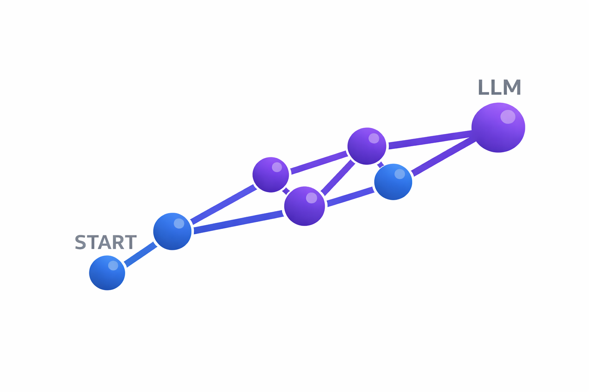

<div align="center">



# AI & Machine Learning Roadmap: From Basics to LLMs

### Learn by doing. Build by understanding. Master by creating.

**Open-source AI education built by a student, for students and learners worldwide.**

Basic to Expert. Zero to Language Models. 60+ lessons. 100% hands-on.

[Quick Start](#quick-start) • [Student Guide](./documentation/MAI_STUDENT_GUIDE.md) • [Exam Prep](./documentation/EXAM_PREPARATION_GUIDE.md) • [LinkedIn](https://www.linkedin.com/in/karthik-arjun-a5b4a258/) • [Support Project](https://buymeacoffee.com/fcc4sbsx5f6)

[](https://www.python.org/)
[](./LICENSE)
[](./Basic/)
[](https://nexageapps.com)
[](https://buymeacoffee.com/fcc4sbsx5f6)

</div>

---

## ⚠️ Important Disclaimer

This is an **independent learning project**, NOT official university material. Use responsibly and follow your institution's academic integrity policies. See [Academic Integrity Policy](./documentation/ACADEMIC_INTEGRITY.md) for details.

---

## What Is This?

A structured, hands-on learning path from basic arithmetic to complete language models. **60+ lessons** with runnable code, visualizations, and practical projects.

**Perfect for:**
- University students learning AI/ML
- Self-learners building AI skills
- Professionals upskilling in deep learning
- Anyone wanting to understand AI from first principles

---

## Quick Start

### 1. Choose Your Path

| Level | Duration | Best For |
|-------|----------|----------|
| **Basic (B01-B15)** | 2-3 weeks | Foundations & core concepts |
| **Intermediate (I01-I15)** | 4-6 weeks | Advanced techniques |
| **Advanced (A01-A15)** | 6-8 weeks | Production systems |
| **Expert (E01-E15)** | 8-10 weeks | Research & innovation |

### 2. Set Up

```bash
# Create virtual environment
python -m venv .venv
source .venv/bin/activate  # macOS/Linux
.venv\Scripts\activate     # Windows

# Install dependencies
pip install tensorflow torch numpy matplotlib jupyter
```

### 3. Start Learning

```bash
jupyter lab
# Open any notebook from Basic/ folder
```

**Or use Google Colab** (no setup needed) - Click "Open in Colab" badge in any notebook.

---

## Repository Structure

```
AI/
├── Basic/              # 15 Lessons (B01-B15) ✅
├── Intermediate/       # 15 Lessons (I01-I15) ✅
├── Advanced/           # 15 Lessons (A01-A15) ✅
├── Expert/             # 15 Lessons (E01-E15) ✅
├── application/        # Live demos & practical implementations
└── documentation/      # Guides & resources
```

**[View Full Learning Path Diagram](./documentation/LEARNING_PATH_DIAGRAM.md)**

---

## Live Demos & Practical Applications

Interactive demonstrations of AI concepts in action:

| Demo | Concept | Course | Link |
|------|---------|--------|------|
| **Wumpus World** | Symbolic Logic & Knowledge Representation | COMPSCI 713 | [Play Online](https://nexageapps.github.io/AI/wumpus) |
| **Mountain Explorer** | Gradient Descent & Optimization | COMPSCI 714 | [Play Online](https://nexageapps.github.io/AI/gradient-descent) | 

**[View All Games](https://nexageapps.github.io/AI/)** • Explore the `application/` folder for source code and deployment guides.

---

## For University Students

### University of Auckland Courses

| Course | Focus | Examples |
|--------|-------|----------|
| **COMPSCI 713** | AI Fundamentals | [Agents, Knowledge, Game AI](./documentation/UNIVERSITY_OF_AUCKLAND_EXTENSIONS.md#compsci-713--ai-fundamentals) |
| **COMPSCI 714** | Neural Networks | [Networks, Gradient Descent, CNNs, Attention](./documentation/COMPSCI_714_EXTENSIONS.md) |
| **COMPSCI 762** | ML Foundations | [Regression, Classification, Tuning](./documentation/UNIVERSITY_OF_AUCKLAND_EXTENSIONS.md#compsci-762--machine-learning-foundations) |
| **COMPSCI 703** | Generalising AI | [Transfer Learning, Domain Adaptation](./documentation/UNIVERSITY_OF_AUCKLAND_EXTENSIONS.md#compsci-703--generalising-ai) |
| **COMPSYS 721** | Deep Learning | [Detection, Time Series, NLP, GANs](./documentation/UNIVERSITY_OF_AUCKLAND_EXTENSIONS.md#compsys-721--deep-learning) |

**[Full University of Auckland Guide](./documentation/UNIVERSITY_OF_AUCKLAND_EXTENSIONS.md)**

### Study Tips

- **Before lectures:** Review relevant Basic lessons
- **During semester:** Build practical projects from examples
- **For assignments:** Use as reference, implement your own
- **For exams:** Review all concepts in relevant lessons

**[Complete Student Guide](./documentation/MAI_STUDENT_GUIDE.md)**

---

## Documentation

| Document | Purpose |
|----------|---------|
| [Student Guide](./documentation/MAI_STUDENT_GUIDE.md) | Course mapping, semester planning, study strategies |
| [Exam Prep Guide](./documentation/EXAM_PREPARATION_GUIDE.md) | Exam strategies, practice problems, concept review |
| [University of Auckland Extensions](./documentation/UNIVERSITY_OF_AUCKLAND_EXTENSIONS.md) | Practical examples for 5 courses |
| [COMPSCI 714 Detailed Examples](./documentation/COMPSCI_714_EXTENSIONS.md) | 4 detailed neural network projects |
| [Learning Path](./documentation/LEARNING_PATH.md) | Full learning path diagram & explanation |
| [Documentation Index](./documentation/DOCUMENTATION_INDEX.md) | Complete guide to all documentation |
| [Academic Integrity](./documentation/ACADEMIC_INTEGRITY.md) | Responsible use guidelines |

---

## What You'll Learn

### Basic Level (B01-B15)
- Tensors & linear algebra
- Linear regression & gradient descent
- Binary & multi-class classification
- Neural networks from scratch
- Data preprocessing & evaluation
- CNNs, RNNs, Transformers
- Tokenization & language models

### Intermediate Level (I01-I15)
- Advanced optimization & regularization
- Transfer learning & domain adaptation
- Object detection & segmentation
- Seq2seq & advanced transformers
- Hyperparameter tuning & AutoML
- Generative models (VAEs, GANs)
- MLOps & deployment

### Advanced Level (A01-A15)
- Fine-tuning LLMs
- Prompt engineering & RAG
- Vision-language models
- Distributed training
- Mixed precision & inference optimization
- ML pipelines & monitoring
- Responsible AI

### Expert Level (E01-E15)
- Reading & implementing research papers
- Neural architecture search
- Meta-learning & few-shot learning
- Deep reinforcement learning
- RLHF & alignment
- Federated learning
- Cutting-edge research

---

## Project Ideas

**Beginner:** Sentiment analysis, image classifier, text generator, spam detector, digit recognition

**Intermediate:** Medical image analysis, chatbot, stock predictor, document summarizer, multi-label classification

**Advanced:** RAG system, domain-specific LLM, multi-modal search, code reviewer, real-time detection

**Research:** Novel architecture, paper reproduction, bias detection, model compression, federated learning

**[Full Project Ideas List](./documentation/PROJECT_IDEAS.md)**

---

## Academic Integrity

✅ **Appropriate Use:**
- Learning concepts and understanding implementations
- Preparing for lectures and exams
- Using as inspiration for original projects
- Understanding different approaches

❌ **Inappropriate Use:**
- Copying code for assignments without understanding
- Submitting repository code as your own work
- Using during closed-book assessments
- Violating your institution's policies

**[Full Academic Integrity Policy](./documentation/ACADEMIC_INTEGRITY.md)**

---

## Contributing

Contributions welcome! See [Contributing Guide](./documentation/CONTRIBUTING.md) for details.

---


## Community & Support

- **Questions?** Check [Documentation Index](./documentation/DOCUMENTATION_INDEX.md)
- **Issues?** Open a GitHub issue
- **Suggestions?** Submit a pull request
- **Connect:** [LinkedIn](https://www.linkedin.com/in/karthik-arjun-a5b4a258/)

---

## Support This Project

<div align="center">

### Buy Me a Book

This repository represents hundreds of hours of work to make AI education accessible to everyone. If you find it helpful, consider supporting its continued development!

[](https://buymeacoffee.com/fcc4sbsx5f6)

*Every contribution, no matter how small, makes a difference!*

</div>

---

## Author

Created by a student pursuing a Master of Artificial Intelligence at the University of Auckland.

**Why this exists:** To make quality AI education accessible to everyone, combining theory with practical implementations.

---

## License

MIT License - See [LICENSE](./LICENSE) for details.

---

<div align="center">

---

### ⭐ If you find this helpful, please star the repository! ⭐
*Made by a student, for students*
**Happy Learning!**

### Ready for the Next Level?
[](https://github.com/nexageapps/llm)

### Support This Project
[](https://buymeacoffee.com/fcc4sbsx5f6)

*Every contribution helps create more free educational content!*

---

</div>
