# AI Learning Path - From Basics to Building Language Models

**A Comprehensive Open-Source Tutorial Series by a Master's Student, for Master's Students**

[](https://colab.research.google.com/)
[](https://nexageapps.com)
[](https://opensource.org/licenses/MIT)
[](http://makeapullrequest.com)
[](https://github.com/nexageapps/AI)

## About This Project

Hi! I'm a **Master of Artificial Intelligence (MAI)** student at the **University of Auckland**, and this is my open-source learning journey. I created this repository to document everything I'm learning and to help fellow students, researchers, and AI enthusiasts learn alongside me.

**Why this repository exists:**
- Learn AI concepts from scratch with a fellow student's perspective
- Build a community of learners who support each other
- Share practical implementations, not just theory
- Make quality AI education accessible to everyone, everywhere
- Learn by doing - every concept comes with runnable code

**This is not just a tutorial - it's a learning companion.** Whether you're a master's student like me, a self-learner, or a professional looking to upskill, you're welcome to learn with me.

## Mission

This repository provides a **structured, hands-on learning path** to deeply understand Artificial Intelligence concepts - from basic arithmetic operations to building complete language models. Each lesson builds progressively on previous concepts with clear explanations, visualizations, and practical implementations that you can run immediately.

## Table of Contents

- [About This Project](#about-this-project)
- [What Makes This Different](#what-makes-this-different)
- [Learning Path Diagram](#learning-path-diagram)
- [Repository Structure](#repository-structure)
- [Getting Started](#getting-started)
- [Project Ideas for Students](#project-ideas-for-students)
- [Contributing](#contributing)
- [Author](#author)
- [Contact](#contact--collaboration)

## What Makes This Different?

This is not just another AI tutorial collection - it's a **carefully designed curriculum** created by a student who understands the challenges of learning AI:

- **Student Perspective**: Written by someone currently learning, not just teaching
- **Builds Progressively**: From fundamentals to advanced concepts, no gaps
- **100% Hands-On**: Every concept comes with runnable code
- **Visual Learning**: Comprehensive visualizations to understand complex concepts
- **Real-World Focus**: Practical applications at each level
- **Academic Rigor**: Meets the standards of a top university program
- **Culminates in Building**: Create your own mini language model (GPT-style)
- **Completely Free**: Quality education shouldn't have a price tag

**Target Audience:** Master's students in AI, undergraduate students, self-learners, bootcamp graduates, and anyone wanting to deeply understand AI/ML concepts.

**Language:** Jupyter Notebooks (100%) - All runnable in Google Colab with zero setup!

## Learning Path Diagram

```mermaid
graph LR
    Start([START YOUR AI JOURNEY]):::startNode
    
    subgraph Basic["BASIC LEVEL - Complete Sequentially"]
        direction LR
        B1["B1: Arithmetic<br/>Tensor Operations"]:::basic
        B2["B2: Linear Regression<br/>Straight Line Patterns"]:::basic
        B3["B3: Binary Classification<br/>Two-Class Problems"]:::basic
        B4["B4: Multi-Class<br/>Multiple Categories"]:::basic
        B5["B5: Neural Networks<br/>Architecture Deep Dive"]:::basic
        B6["B6: Data Preprocessing<br/>Feature Engineering"]:::basic
        B7["B7: Model Evaluation<br/>Performance Metrics"]:::basic
        B9["B9: CNNs<br/>Image Processing"]:::basic
        B10["B10: RNNs<br/>Sequential Data"]:::basic
        B11["B11: Transformers<br/>Attention Mechanism"]:::basic
        B12["B12: Tokenization<br/>Byte Pair Encoding"]:::basic
        B13["B13: Build Mini LLM<br/>GPT-Style Model"]:::basic
        
        B1 --> B2 --> B3 --> B4 --> B5 --> B6 --> B7
        B7 --> B9
        B7 --> B10
        B9 --> B11
        B10 --> B11
        B11 --> B12 --> B13
    end
    
    subgraph Intermediate["INTERMEDIATE LEVEL"]
        direction LR
        I1["Transfer Learning"]:::intermediate
        I2["Advanced Optimization"]:::intermediate
        I3["Advanced Architectures"]:::intermediate
        I4["Hyperparameter Tuning"]:::intermediate
        
        I1 --> I3
        I2 --> I3
        I3 --> I4
    end
    
    subgraph Advanced["ADVANCED LEVEL"]
        direction LR
        A1["Fine-tuning LLMs"]:::advanced
        A2["RAG Systems"]:::advanced
        A3["Multi-Modal AI"]:::advanced
        A4["Production MLOps"]:::advanced
        
        A1 --> A3
        A2 --> A3
        A3 --> A4
    end
    
    subgraph Expert["EXPERT LEVEL"]
        direction LR
        E1["Research & Papers"]:::expert
        E2["Novel Architectures"]:::expert
        E3["Open Source Contribution"]:::expert
        
        E1 --> E3
        E2 --> E3
    end
    
    Start --> B1
    B13 --> I1
    B13 --> I2
    I4 --> A1
    I4 --> A2
    A4 --> E1
    A4 --> E2
    
    classDef startNode fill:#4A90E2,stroke:#2E5C8A,stroke-width:3px,color:#fff
    classDef basic fill:#FFE5B4,stroke:#D4A574,stroke-width:2px,color:#000
    classDef intermediate fill:#B4E5FF,stroke:#74A5D4,stroke-width:2px,color:#000
    classDef advanced fill:#D4B4FF,stroke:#9474D4,stroke-width:2px,color:#000
    classDef expert fill:#FFD700,stroke:#B8860B,stroke-width:3px,color:#000
```



### Learning Path Explanation

**Color Guide:**
- Blue: Your entry point into AI
- Peach: Basic Level - Foundation concepts (B1-B13)
- Light Blue: Intermediate Level - Advanced techniques
- Purple: Advanced Level - Production systems
- Gold: Expert Level - Research and innovation

**Progression Path:**

1. **Basic Level (Start Here)** - Complete all lessons sequentially
   - **Foundation** (B1-B3): Tensors, linear models, binary classification
   - **Core ML** (B4-B7): Multi-class classification, neural networks, data preprocessing, model evaluation
   - **Deep Learning** (B9-B11): CNNs for images, RNNs for sequences, Transformers with attention
   - **NLP Specialization** (B12-B13): Tokenization (BPE), building mini language model

2. **Intermediate Level** - Build on fundamentals
   - Transfer learning and fine-tuning techniques
   - Advanced optimization and regularization
   - Complex architectures and hyperparameter tuning

3. **Advanced Level** - Production-ready systems
   - Fine-tuning large language models
   - RAG systems and multi-modal AI
   - MLOps, deployment, and monitoring

4. **Expert Level** - Contribute to the field
   - Research paper implementation
   - Novel architecture design
   - Open-source contributions

## Repository Structure

This repository is organized into four progressive levels:

```
AI/
├── Basic/           # Foundation lessons (L1-L12)
├── Intermediate/    # Advanced topics (Coming Soon)
├── Advanced/        # Production-ready systems (Coming Soon)
├── Expert/          # Research-oriented topics (Coming Soon)
└── archive/         # Historical documentation
```

### Basic Level (Available Now)

Foundation lessons covering fundamental AI/ML concepts. [View all Basic lessons →](./Basic/)

1. **B1 - Arithmetic** - TensorFlow basics and tensor operations
2. **B2 - Linear Regression** - Linear regression fundamentals
3. **B3 - Binary Classification** - Two-class classification problems
4. **B4 - Multi-Class Classification** - Multiple category classification
5. **B5 - Neural Network Fundamentals** - Deep dive into NN architecture
6. **B6 - Data Preprocessing and Feature Engineering** - Data preparation techniques
7. **B7 - Model Evaluation and Performance Metrics** - Measuring model performance
8. **B9 - Convolutional Neural Networks** - CNNs for image processing
9. **B10 - Recurrent Neural Networks** - RNNs for sequential data
10. **B11 - Attention and Transformers** - Modern attention mechanisms
11. **B12 - Byte Pair Encoding (BPE)** - Tokenization for NLP
12. **B13 - Building a Mini Language Model** - Create your own GPT-style model

### Intermediate Level (Coming Soon)

Advanced topics building on basic concepts:
- Transfer Learning and Fine-tuning
- Advanced Optimization Techniques
- Advanced CNN/RNN Architectures
- Encoder-Decoder Models
- Hyperparameter Tuning

[View Intermediate roadmap →](./Intermediate/)

### Advanced Level (Coming Soon)

Production-ready AI systems:
- Fine-tuning Large Language Models
- Retrieval-Augmented Generation (RAG)
- Multi-Modal AI
- Model Deployment and MLOps
- Ethical AI and Bias Mitigation

[View Advanced roadmap →](./Advanced/)

### Expert Level (Coming Soon)

Research-oriented topics:
- Novel Architecture Design
- Research Paper Implementation
- Neural Architecture Search
- Meta-Learning
- Contributing to Open-Source AI

[View Expert roadmap →](./Expert/)

## Getting Started

These instructions will get you a copy of the project up and running on your local machine for development and learning purposes.

### Requirements

- Python 3.8+ (recommended)
- Jupyter / JupyterLab
- pip or conda

### Create a virtual environment

Using venv:

```bash
python -m venv .venv
source .venv/bin/activate   # macOS / Linux
.venv\Scripts\activate     # Windows
```

Or using conda:

```bash
conda create -n ai-notebooks python=3.10
conda activate ai-notebooks
```

### Install dependencies

The notebooks primarily use TensorFlow and PyTorch. Install the required packages:

```bash
pip install tensorflow torch numpy matplotlib
```

For the BPE notebooks, you'll also need:

```bash
pip install tiktoken
```

Alternatively, run the notebooks directly in Google Colab where most dependencies are pre-installed.

### Run notebooks

**Option 1: Google Colab (Recommended)**
- Click the "Open in Colab" badge at the top of any notebook
- All dependencies are pre-installed in Colab

**Option 2: Local Jupyter**
```bash
jupyter lab
# or
jupyter notebook
```

Open the desired notebook and run the cells sequentially. All notebooks are self-contained and include sample data.

## Usage

These notebooks are designed for learning and experimentation:

- **For Beginners**: Start with Basic/B1 and progress sequentially through all Basic lessons
- **For NLP Enthusiasts**: Complete B1-B11 first, then jump to B12 for tokenization and B13 for language models
- **For Experimentation**: Modify the code, adjust parameters, and observe the results

Each notebook includes:
- Author information and LinkedIn profile
- Creation and update dates
- References to source materials
- Detailed comments explaining the code

## Quick Start

1. Clone the repository
2. Navigate to the `Basic/` folder
3. Open `B1 - Arithmetic.ipynb` in Jupyter or Google Colab
4. Follow the lessons sequentially

## Structure

```
AI/
├── Basic/
│   ├── B1 - Arithmetic.ipynb
│   ├── B2 - Linear Regression.ipynb
│   ├── B3 - Binary Classification.ipynb
│   ├── B4 - Multi-Class Classification.ipynb
│   ├── B5 - Neural Network Fundamentals.ipynb
│   ├── B6 - Data Preprocessing and Feature Engineering.ipynb
│   ├── B7 - Model Evaluation and Performance Metrics.ipynb
│   ├── B9 - Convolutional Neural Networks.ipynb
│   ├── B10 - Recurrent Neural Networks.ipynb
│   ├── B11 - Attention and Transformers.ipynb
│   ├── B12 - Byte Pair Encoding (BPE).ipynb
│   ├── B13 - Building a Mini Language Model.ipynb
│   └── README.md
├── Intermediate/
│   └── README.md (Coming Soon)
├── Advanced/
│   └── README.md (Coming Soon)
├── Expert/
│   └── README.md (Coming Soon)
├── archive/
│   └── PROGRESS_SUMMARY.md
└── README.md
```

All notebooks are designed to run in Google Colab and include Colab badges for easy access.

## Project Ideas for Students

Ready to apply what you've learned? Here are hands-on project ideas perfect for master's students and portfolio building:

### Beginner Projects (After completing Basic Level)
1. **Sentiment Analysis Dashboard** - Build a web app that analyzes Twitter/Reddit sentiment on trending topics
2. **Image Classifier for Your Domain** - Create a CNN to classify images in your field of interest (medical, fashion, wildlife)
3. **Text Generator** - Build a character-level or word-level text generator using RNNs
4. **Spam Email Detector** - Implement a binary classifier with feature engineering
5. **Handwritten Digit Recognition** - Classic MNIST with your own twist (try different architectures)

### Intermediate Projects (After Intermediate Level)
6. **Transfer Learning for Medical Images** - Fine-tune pre-trained models for disease detection
7. **Chatbot with Context** - Build a conversational AI using transformers
8. **Stock Price Predictor** - Time series forecasting with LSTM/GRU networks
9. **Document Summarizer** - Extractive and abstractive summarization using transformers
10. **Multi-label Image Classification** - Detect multiple objects/attributes in images

### Advanced Projects (After Advanced Level)
11. **RAG-based Q&A System** - Build a retrieval-augmented generation system for your university's documentation
12. **Fine-tuned Domain LLM** - Fine-tune an open-source LLM for a specific domain (legal, medical, finance)
13. **Multi-Modal Search Engine** - Search using both text and images
14. **AI Code Review Assistant** - Build a tool that reviews code and suggests improvements
15. **Real-time Object Detection** - Deploy a YOLO-based system for real-time detection

### Research-Level Projects (Expert Level)
16. **Novel Architecture Experiment** - Design and test a new neural network architecture
17. **Reproduce a Recent Paper** - Implement a cutting-edge paper from NeurIPS/ICML/ICLR
18. **Bias Detection in LLMs** - Research and mitigate biases in language models
19. **Efficient Model Compression** - Develop techniques for model pruning and quantization
20. **Federated Learning System** - Build a privacy-preserving distributed learning system

**Pro Tips for Projects:**
- Start small, iterate fast
- Document your process (great for your portfolio!)
- Share your work on GitHub and LinkedIn
- Collaborate with classmates - team projects are more fun
- Present your projects at university seminars or local meetups

## Contributing

Contributions are welcome! To contribute:

1. Fork the repository
2. Create a feature branch: `git checkout -b feature/new-tutorial`
3. Add your notebook to the appropriate level folder (Basic, Intermediate, Advanced, or Expert)
4. Follow the naming convention: `LX - Topic.ipynb`
5. Include:
   - Author information and LinkedIn profile
   - Clear comments and explanations
   - Colab badge for easy access
   - Creation and update dates
6. Clear all outputs before committing (to keep the repo clean)
7. Submit a pull request with a clear description

**Notebook Guidelines:**
- Keep code beginner-friendly with detailed comments
- Include visualization where applicable
- Use self-contained examples (no external data dependencies)
- Follow the existing code style

## Why Star This Repository?

- **Stay Updated**: Get notified when new lessons and projects are added
- **Support a Fellow Student**: Help me reach more learners
- **Bookmark for Later**: Easy access to quality AI learning resources
- **Join the Community**: Be part of a growing learning community
- **Motivation**: Your star motivates me to create more content

## Join the Learning Community

This is a collaborative learning space! Here's how you can participate:

- **Found a bug?** Open an issue
- **Have an idea?** Start a discussion
- **Want to contribute?** Submit a pull request
- **Have questions?** Connect with me on LinkedIn
- **Enjoying the content?** Star the repo and share with friends

**Let's learn together.** The best way to learn is to teach, and the best way to grow is to help others grow.

## License

If you have a preferred license, add a LICENSE file to the repository. If none is present, consider using a permissive license such as MIT.

## Author

**Karthik Arjun**
- Master of Artificial Intelligence (MAI) Student
- University of Auckland, New Zealand
- LinkedIn: [karthik-arjun-a5b4a258](https://www.linkedin.com/in/karthik-arjun-a5b4a258/)
- GitHub: [nexageapps](https://github.com/nexageapps)

*"Learning AI one notebook at a time, and sharing the journey with the world."*

## References & Acknowledgments

This repository builds upon excellent resources from the AI community:

- **Book**: "Build a Large Language Model from Scratch" by Sebastian Raschka
- **OpenAI tiktoken**: https://github.com/openai/tiktoken
- **TensorFlow Documentation**: https://www.tensorflow.org/
- **PyTorch Documentation**: https://pytorch.org/
- **University of Auckland**: For providing an excellent learning environment

Special thanks to all contributors and the open-source AI community!

## Sponsor

This project is proudly sponsored by **[NexAge Apps](https://nexageapps.com)** - Supporting open-source education and innovation in AI.

NexAge Apps is committed to advancing technology education and making quality learning resources accessible to students worldwide.

## Contact & Collaboration

I'm always excited to connect with fellow learners and researchers!

- **Questions?** Open an issue on GitHub
- **Collaboration?** Connect on LinkedIn
- **Research Opportunities?** Reach out via LinkedIn
- **Speaking/Workshop Invitations?** I'd love to share and learn

---

<div align="center">

**If you find this helpful, please star the repository!**

*Made by a student, for students*

**Happy Learning!**

</div>

---

**Note**: All notebooks are designed for educational purposes and include references to source materials where applicable. This is an active learning project - expect regular updates as I progress through my master's program!
