# AI Learning Path - From Basics to Building Language Models

**A Comprehensive Open-Source Tutorial Series by a Master's Student, for Master's Students**

[](https://colab.research.google.com/)
[](https://nexageapps.com)
[](https://opensource.org/licenses/MIT)
[](http://makeapullrequest.com)
[](https://github.com/nexageapps/AI)

## About This Project

Hi! I'm a **Master of Artificial Intelligence (MAI)** student at the **University of Auckland**, and this is my open-source learning journey. I created this repository to document everything I'm learning and to help fellow students, researchers, and AI enthusiasts learn alongside me.

**Why this repository exists:**
- 🎓 Learn AI concepts from scratch with a fellow student's perspective
- 🤝 Build a community of learners who support each other
- 💻 Share practical implementations, not just theory
- 🌍 Make quality AI education accessible to everyone, everywhere
- 🚀 Learn by doing - every concept comes with runnable code
- 📚 Complement your university coursework with hands-on practice

**This is not just a tutorial - it's a learning companion.** Whether you're a master's student like me, a self-learner, or a professional looking to upskill, you're welcome to learn with me.

### 🎯 For University of Auckland MAI Students
This repository is specifically designed to complement your MAI coursework! Check out the **[MAI Student Guide](./MAI_STUDENT_GUIDE.md)** for:
- Direct mapping to UoA courses (COMPSCI 713, 714, 761, 762, 703, COMPSYS 721, etc.)
- Study strategies for each semester
- Assignment preparation tips
- Research project ideas aligned with your dissertation

**Not a UoA student?** No worries! The content is valuable for any AI/ML learner.

## Mission

This repository provides a **structured, hands-on learning path** to deeply understand Artificial Intelligence concepts - from basic arithmetic operations to building complete language models. Each lesson builds progressively on previous concepts with clear explanations, visualizations, and practical implementations that you can run immediately.

## Table of Contents

- [About This Project](#about-this-project)
- [What Makes This Different](#what-makes-this-different)
- [Learning Path Diagram](#learning-path-diagram)
- [Repository Structure](#repository-structure)
- [Getting Started](#getting-started)
- [Usage & Learning Tips](#usage--learning-tips)
- [Project Ideas for Students](#project-ideas-for-students)
- [For MAI Students](#for-mai-students)
- [Contributing](#contributing)
- [Community & Support](#community--support)
- [Author](#author)
- [License](#license)

## What Makes This Different?

This is not just another AI tutorial collection - it's a **carefully designed curriculum** created by a student who understands the challenges of learning AI:

✨ **Key Features:**

- 🎓 **Student Perspective**: Written by someone currently learning, not just teaching - I understand the struggles!
- 📈 **Builds Progressively**: From fundamentals to advanced concepts, no gaps or confusing jumps
- 💻 **100% Hands-On**: Every concept comes with runnable code - learn by doing, not just reading
- 📊 **Visual Learning**: Comprehensive visualizations to understand complex concepts intuitively
- 🌐 **Real-World Focus**: Practical applications at each level, not just toy examples
- 🏆 **Academic Rigor**: Meets the standards of a top university program (University of Auckland MAI)
- 🚀 **Culminates in Building**: Create your own mini language model (GPT-style) from scratch
- 💰 **Completely Free**: Quality education shouldn't have a price tag
- 🔄 **Active Development**: Regular updates as I learn new concepts in my master's program
- 🤝 **Community-Driven**: Open to contributions, feedback, and collaboration

**What You'll Build:**
- Linear regression models from scratch
- Binary and multi-class classifiers
- Deep neural networks with custom architectures
- CNNs for image recognition
- RNNs and LSTMs for sequential data
- Transformer models with attention mechanisms
- Your own tokenizer using BPE
- A mini GPT-style language model
- Portfolio-worthy capstone projects

**Target Audience:** Master's students in AI, undergraduate students, self-learners, bootcamp graduates, career switchers, and anyone wanting to deeply understand AI/ML concepts.

**Language:** Jupyter Notebooks (100%) - All runnable in Google Colab with zero setup!

## Learning Path Diagram

```mermaid
graph TB
    Start([START YOUR AI JOURNEY]):::startNode
    
    subgraph Foundation["FOUNDATION (B01-B03)"]
        B01["B01: Arithmetic Operations<br/>Master tensor operations & TensorFlow basics"]:::basic
        B02["B02: Linear Regression<br/>Learn gradient descent & loss functions"]:::basic
        B03["B03: Binary Classification<br/>Understand decision boundaries & sigmoid"]:::basic
        
        B01 --> B02 --> B03
    end
    
    subgraph CoreML["CORE MACHINE LEARNING (B04-B07)"]
        B04["B04: Multi-Class Classification<br/>Softmax & categorical cross-entropy"]:::basic
        B05["B05: Neural Network Fundamentals<br/>MLPs, activation functions, backpropagation"]:::basic
        B06["B06: Data Preprocessing<br/>Feature engineering, scaling, encoding"]:::basic
        B07["B07: Model Evaluation<br/>Metrics, cross-validation, imbalanced data"]:::basic
        
        B04 --> B05 --> B06 --> B07
    end
    
    subgraph DeepLearning["DEEP LEARNING (B09-B11)"]
        B09["B09: Convolutional Neural Networks<br/>CNNs for computer vision & image processing"]:::basic
        B10["B10: Recurrent Neural Networks<br/>RNNs, LSTMs, GRUs for sequential data"]:::basic
        B11["B11: Attention & Transformers<br/>Self-attention mechanism & modern NLP"]:::basic
        
        B09 --> B11
        B10 --> B11
    end
    
    subgraph NLP["NLP SPECIALIZATION (B12-B13)"]
        B12["B12: Byte Pair Encoding<br/>Tokenization techniques for language models"]:::basic
        B13["B13: Build Mini Language Model<br/>Create your own GPT-style model from scratch"]:::basic
        
        B12 --> B13
    end
    
    subgraph Intermediate["INTERMEDIATE LEVEL"]
        I1["Transfer Learning<br/>& Fine-tuning"]:::intermediate
        I2["Advanced Optimization<br/>& Regularization"]:::intermediate
        I3["Advanced Architectures<br/>ResNet, BERT, etc."]:::intermediate
        I4["Hyperparameter Tuning<br/>& AutoML"]:::intermediate
        
        I1 --> I3
        I2 --> I3
        I3 --> I4
    end
    
    subgraph Advanced["ADVANCED LEVEL"]
        A1["Fine-tuning LLMs<br/>GPT, LLaMA, etc."]:::advanced
        A2["RAG Systems<br/>Retrieval-Augmented Generation"]:::advanced
        A3["Multi-Modal AI<br/>Vision + Language Models"]:::advanced
        A4["Production MLOps<br/>Deployment & Monitoring"]:::advanced
        
        A1 --> A3
        A2 --> A3
        A3 --> A4
    end
    
    subgraph Expert["EXPERT LEVEL"]
        E1["Research Papers<br/>Implementation"]:::expert
        E2["Novel Architectures<br/>Design & Experimentation"]:::expert
        E3["Open Source<br/>Contribution"]:::expert
        
        E1 --> E3
        E2 --> E3
    end
    
    Start --> B01
    B03 --> B04
    B07 --> B09
    B07 --> B10
    B11 --> B12
    B13 --> I1
    B13 --> I2
    I4 --> A1
    I4 --> A2
    A4 --> E1
    A4 --> E2
    
    classDef startNode fill:#4A90E2,stroke:#2E5C8A,stroke-width:4px,color:#fff,font-size:16px
    classDef basic fill:#FFE5B4,stroke:#D4A574,stroke-width:3px,color:#000,font-size:14px
    classDef intermediate fill:#B4E5FF,stroke:#74A5D4,stroke-width:3px,color:#000,font-size:14px
    classDef advanced fill:#D4B4FF,stroke:#9474D4,stroke-width:3px,color:#000,font-size:14px
    classDef expert fill:#FFD700,stroke:#B8860B,stroke-width:4px,color:#000,font-size:14px
```



### Learning Path Explanation

**How to Navigate:**

The diagram flows from top to bottom, organized into clear stages. Each stage builds upon the previous one, ensuring you have the necessary foundation before advancing.

**Stage Breakdown:**

**1. Foundation (B01-B03)** - Start Here
- Master the absolute basics: tensors, linear models, and binary classification
- Duration: ~2-3 hours
- Prerequisites: Basic Python knowledge

**2. Core Machine Learning (B04-B07)** - Essential Skills
- Build strong ML fundamentals with multi-class problems, neural networks, data preprocessing, and evaluation
- Duration: ~6-8 hours
- Prerequisites: Complete Foundation stage

**3. Deep Learning (B09-B11)** - Advanced Neural Networks
- Dive into CNNs for images, RNNs for sequences, and Transformers for modern AI
- Note: B09 and B10 can be learned in parallel, both converge at B11
- Duration: ~8-10 hours
- Prerequisites: Complete Core ML stage

**4. NLP Specialization (B12-B13)** - Build Language Models
- Learn tokenization techniques and build your own GPT-style language model
- Duration: ~4-6 hours
- Prerequisites: Complete Deep Learning stage

**5. Practice & Portfolio (B14-B15)** - Apply Your Skills
- Complete practical assignments and build capstone projects
- Create portfolio-worthy projects for job applications
- Duration: ~2-6 weeks (depending on project scope)
- Prerequisites: Complete all previous stages

**5. Intermediate Level** - Advanced Techniques (Coming Soon)
- Transfer learning, advanced optimization, complex architectures, hyperparameter tuning
- Prerequisites: Complete all Basic level lessons

**6. Advanced Level** - Production Systems (Coming Soon)
- Fine-tune LLMs, build RAG systems, multi-modal AI, MLOps deployment
- Prerequisites: Complete Intermediate level

**7. Expert Level** - Research & Innovation (Coming Soon)
- Implement research papers, design novel architectures, contribute to open-source
- Prerequisites: Complete Advanced level

**Color Guide:**
- Blue: Your starting point
- Peach: Basic Level - Foundation concepts (B01-B13)
- Light Blue: Intermediate Level - Advanced techniques
- Purple: Advanced Level - Production systems
- Gold: Expert Level - Research and innovation

## Repository Structure

This repository is organized into four progressive levels, with the Basic level fully available now:

```
AI/
├── Basic/              # ✅ 15 Complete Lessons (B01-B15)
├── Intermediate/       # 🔜 Coming Soon
├── Advanced/           # 🔜 Coming Soon  
├── Expert/             # 🔜 Coming Soon
├── MAI_STUDENT_GUIDE.md # 🎓 Guide for UoA MAI Students
└── archive/            # 📚 Historical documentation
```

### 📚 Basic Level (Available Now - 15 Lessons)

Foundation lessons covering fundamental AI/ML concepts. **[View all Basic lessons →](./Basic/)**

**Foundation (B01-B03)** - Start Here 🚀
1. **B01 - Arithmetic** - TensorFlow basics and tensor operations
2. **B02 - Linear Regression** - Linear regression fundamentals  
3. **B03 - Binary Classification** - Two-class classification problems

**Core Machine Learning (B04-B07)** - Essential Skills 💪
4. **B04 - Multi-Class Classification** - Multiple category classification
5. **B05 - Neural Network Fundamentals** - Deep dive into NN architecture
6. **B06 - Data Preprocessing and Feature Engineering** - Data preparation techniques
7. **B07 - Model Evaluation and Performance Metrics** - Measuring model performance

**Deep Learning (B09-B11)** - Advanced Neural Networks 🧠
9. **B09 - Convolutional Neural Networks** - CNNs for image processing
10. **B10 - Recurrent Neural Networks** - RNNs for sequential data
11. **B11 - Attention and Transformers** - Modern attention mechanisms

**NLP Specialization (B12-B13)** - Build Language Models 🤖
12. **B12 - Byte Pair Encoding (BPE)** - Tokenization for NLP
13. **B13 - Building a Mini Language Model** - Create your own GPT-style model

**Practice & Portfolio (B14-B15)** - Apply Your Skills 🎯
14. **B14 - Practical Projects and Assignments** - 10 hands-on assignments to reinforce learning
15. **B15 - Capstone Projects and Portfolio Building** - 5 portfolio-worthy projects

**Total Learning Time:** ~40-60 hours for complete mastery

### 🔜 Intermediate Level (Coming Soon)

Advanced topics building on basic concepts:
- Transfer Learning and Fine-tuning
- Advanced Optimization Techniques (Adam, RMSprop, Learning Rate Scheduling)
- Advanced CNN/RNN Architectures (ResNet, DenseNet, Bidirectional RNNs)
- Encoder-Decoder Models and Seq2Seq
- Hyperparameter Tuning and AutoML
- Ensemble Methods and Model Stacking

**[View Intermediate roadmap →](./Intermediate/)**

### 🔜 Advanced Level (Coming Soon)

Production-ready AI systems:
- Fine-tuning Large Language Models (GPT, LLaMA, Mistral)
- Retrieval-Augmented Generation (RAG) Systems
- Multi-Modal AI (CLIP, Vision-Language Models)
- Model Deployment and MLOps (Docker, Kubernetes, FastAPI)
- Ethical AI and Bias Mitigation
- Model Monitoring and A/B Testing

**[View Advanced roadmap →](./Advanced/)**

### 🔜 Expert Level (Coming Soon)

Research-oriented topics:
- Novel Architecture Design and Experimentation
- Research Paper Implementation (NeurIPS, ICML, ICLR)
- Neural Architecture Search (NAS)
- Meta-Learning and Few-Shot Learning
- Contributing to Open-Source AI Projects
- Publishing Research Papers

**[View Expert roadmap →](./Expert/)**

## Getting Started

These instructions will get you a copy of the project up and running on your local machine for development and learning purposes.

### Requirements

- Python 3.8+ (recommended)
- Jupyter / JupyterLab
- pip or conda

### Create a virtual environment

Using venv:

```bash
python -m venv .venv
source .venv/bin/activate   # macOS / Linux
.venv\Scripts\activate     # Windows
```

Or using conda:

```bash
conda create -n ai-notebooks python=3.10
conda activate ai-notebooks
```

### Install dependencies

The notebooks primarily use TensorFlow and PyTorch. Install the required packages:

```bash
pip install tensorflow torch numpy matplotlib
```

For the BPE notebooks, you'll also need:

```bash
pip install tiktoken
```

Alternatively, run the notebooks directly in Google Colab where most dependencies are pre-installed.

### Run notebooks

**Option 1: Google Colab (Recommended)**
- Click the "Open in Colab" badge at the top of any notebook
- All dependencies are pre-installed in Colab

**Option 2: Local Jupyter**
```bash
jupyter lab
# or
jupyter notebook
```

Open the desired notebook and run the cells sequentially. All notebooks are self-contained and include sample data.

## Usage & Learning Tips

These notebooks are designed for learning and experimentation. Here's how to get the most out of them:

### 📚 Learning Paths

**For Complete Beginners:**
1. Start with Basic/B01 and progress sequentially
2. Don't skip lessons - each builds on previous concepts
3. Complete the assignments in B14 after every 3-4 lessons
4. Aim for 2-3 lessons per week (3-5 hours/week)
5. Join study groups or find an accountability partner

**For Students with ML Background:**
1. Skim B01-B04 for review
2. Focus on B05-B13 for deep learning concepts
3. Jump straight to B14-B15 for projects
4. Use as reference material for coursework

**For NLP Enthusiasts:**
1. Complete B01-B07 for foundations (can go faster)
2. Study B10-B13 in depth (RNNs, Transformers, LLMs)
3. Build the language model projects in B15
4. Extend with your own NLP applications

**For Computer Vision Enthusiasts:**
1. Complete B01-B07 for foundations
2. Deep dive into B09 (CNNs)
3. Explore B11 for Vision Transformers
4. Build image recognition projects from B15

### 💡 Study Tips

**Before Starting a Lesson:**
- Read the lesson overview
- Check prerequisites
- Set aside 1-2 hours of focused time
- Have a notebook ready for notes

**While Learning:**
- Run every code cell and observe outputs
- Modify parameters and see what changes
- Add your own comments to explain concepts
- Try to predict outputs before running cells
- Don't just copy-paste - type the code yourself

**After Completing a Lesson:**
- Summarize key concepts in your own words
- Complete related assignments from B14
- Explain the concept to someone else
- Connect it to real-world applications
- Review after 1 day, 1 week, 1 month (spaced repetition)

### 🎯 Best Practices

- **Consistency > Intensity**: 1 hour daily beats 7 hours on Sunday
- **Active Learning**: Implement variations, don't just run code
- **Document Everything**: Keep a learning journal
- **Build Projects**: Apply concepts to personal projects
- **Join Communities**: Discuss with other learners
- **Teach Others**: Best way to solidify understanding

### 📝 Each Notebook Includes

- Clear learning objectives
- Author information and LinkedIn profile
- Creation and update dates
- Step-by-step explanations
- Visualizations and plots
- References to source materials
- Detailed code comments
- Practice exercises (in B14)

### 🚀 Progression Tracking

Track your progress:
- [ ] B01-B03: Foundation (Week 1)
- [ ] B04-B07: Core ML (Week 2-3)
- [ ] B09-B11: Deep Learning (Week 4-6)
- [ ] B12-B13: NLP & LLMs (Week 7-8)
- [ ] B14: Complete 5 assignments (Week 9-10)
- [ ] B15: Build 1 capstone project (Week 11-16)

## For MAI Students

### 🎓 University of Auckland Integration

This repository is specifically designed to complement your MAI coursework at the University of Auckland!

**📖 [Complete MAI Student Guide](./MAI_STUDENT_GUIDE.md)** - Your essential companion for success

**What's Inside the Guide:**
- 📚 Direct course mappings (COMPSCI 713, 714, 761, 762, 703, COMPSYS 721)
- 📅 Semester-by-semester study strategies
- 📝 Assignment preparation tips and templates
- 🔬 Research project ideas for your dissertation
- 🎯 Exam preparation strategies
- 🤝 Study group formation tips
- 💼 Career preparation advice

**Quick Course Alignment:**

| Your Course | Relevant Lessons | Focus Area |
|-------------|-----------------|------------|
| COMPSCI 713 | B01-B05 | AI Fundamentals |
| COMPSCI 714 | B09-B15 | AI Architecture & Design |
| COMPSCI 761 | B06, B12, B14 | Advanced AI Topics |
| COMPSCI 762 | B02-B07 | ML Foundations |
| COMPSCI 703 | B11-B13, B15 | Generalising AI |
| COMPSYS 721 | B09-B13 | Deep Learning |

**Success Stories from MAI Students:**

> "This repo helped me ace COMPSCI 762. I used the notebooks to prepare for lectures and completed all B14 assignments. When exam time came, I had already implemented everything from scratch multiple times." - MAI Student, 2025

> "My capstone project from B15 got published! I started with the Multi-Modal AI project, extended it for my dissertation, and we submitted to a conference." - MAI Graduate, 2025

**Study Schedule Recommendation:**
- **Before Semester 1**: Complete B01-B07
- **During Semester 1**: B09-B13 + Course assignments
- **Semester Break**: B14 practice assignments
- **Semester 2**: B15 capstone + Dissertation work

**Not a UoA student?** The content is still valuable for any AI/ML program!

## Structure

```
AI/
├── Basic/
│   ├── B01 - Arithmetic.ipynb
│   ├── B02 - Linear Regression.ipynb
│   ├── B03 - Binary Classification.ipynb
│   ├── B04 - Multi-Class Classification.ipynb
│   ├── B05 - Neural Network Fundamentals.ipynb
│   ├── B06 - Data Preprocessing and Feature Engineering.ipynb
│   ├── B07 - Model Evaluation and Performance Metrics.ipynb
│   ├── B09 - Convolutional Neural Networks.ipynb
│   ├── B10 - Recurrent Neural Networks.ipynb
│   ├── B11 - Attention and Transformers.ipynb
│   ├── B12 - Byte Pair Encoding (BPE).ipynb
│   ├── B13 - Building a Mini Language Model.ipynb
│   ├── B14 - Practical Projects and Assignments.ipynb
│   ├── B15 - Capstone Projects and Portfolio Building.ipynb
│   └── README.md
├── Intermediate/
│   └── README.md (Coming Soon)
├── Advanced/
│   └── README.md (Coming Soon)
├── Expert/
│   └── README.md (Coming Soon)
├── archive/
│   └── PROGRESS_SUMMARY.md
└── README.md
```

All notebooks are designed to run in Google Colab and include Colab badges for easy access.

## Project Ideas for Students

Ready to apply what you've learned? Here are hands-on project ideas perfect for master's students and portfolio building:

### Beginner Projects (After completing Basic Level)
1. **Sentiment Analysis Dashboard** - Build a web app that analyzes Twitter/Reddit sentiment on trending topics
2. **Image Classifier for Your Domain** - Create a CNN to classify images in your field of interest (medical, fashion, wildlife)
3. **Text Generator** - Build a character-level or word-level text generator using RNNs
4. **Spam Email Detector** - Implement a binary classifier with feature engineering
5. **Handwritten Digit Recognition** - Classic MNIST with your own twist (try different architectures)

### Intermediate Projects (After Intermediate Level)
6. **Transfer Learning for Medical Images** - Fine-tune pre-trained models for disease detection
7. **Chatbot with Context** - Build a conversational AI using transformers
8. **Stock Price Predictor** - Time series forecasting with LSTM/GRU networks
9. **Document Summarizer** - Extractive and abstractive summarization using transformers
10. **Multi-label Image Classification** - Detect multiple objects/attributes in images

### Advanced Projects (After Advanced Level)
11. **RAG-based Q&A System** - Build a retrieval-augmented generation system for your university's documentation
12. **Fine-tuned Domain LLM** - Fine-tune an open-source LLM for a specific domain (legal, medical, finance)
13. **Multi-Modal Search Engine** - Search using both text and images
14. **AI Code Review Assistant** - Build a tool that reviews code and suggests improvements
15. **Real-time Object Detection** - Deploy a YOLO-based system for real-time detection

### Research-Level Projects (Expert Level)
16. **Novel Architecture Experiment** - Design and test a new neural network architecture
17. **Reproduce a Recent Paper** - Implement a cutting-edge paper from NeurIPS/ICML/ICLR
18. **Bias Detection in LLMs** - Research and mitigate biases in language models
19. **Efficient Model Compression** - Develop techniques for model pruning and quantization
20. **Federated Learning System** - Build a privacy-preserving distributed learning system

**Pro Tips for Projects:**
- Start small, iterate fast
- Document your process (great for your portfolio!)
- Share your work on GitHub and LinkedIn
- Collaborate with classmates - team projects are more fun
- Present your projects at university seminars or local meetups

## Contributing

Contributions are welcome! To contribute:

1. Fork the repository
2. Create a feature branch: `git checkout -b feature/new-tutorial`
3. Add your notebook to the appropriate level folder (Basic, Intermediate, Advanced, or Expert)
4. Follow the naming convention: `BXX - Topic.ipynb` (for Basic level, use zero-padded numbers like B01, B02)
5. Include:
   - Author information and LinkedIn profile
   - Clear comments and explanations
   - Colab badge for easy access
   - Creation and update dates
6. Clear all outputs before committing (to keep the repo clean)
7. Submit a pull request with a clear description

**Notebook Guidelines:**
- Keep code beginner-friendly with detailed comments
- Include visualization where applicable
- Use self-contained examples (no external data dependencies)
- Follow the existing code style

## Why Star This Repository?

- **Stay Updated**: Get notified when new lessons and projects are added
- **Support a Fellow Student**: Help me reach more learners
- **Bookmark for Later**: Easy access to quality AI learning resources
- **Join the Community**: Be part of a growing learning community
- **Motivation**: Your star motivates me to create more content

## Community & Support

### 🤝 Join the Learning Community

This is a collaborative learning space! Here's how you can participate:

**Get Help:**
- 🐛 **Found a bug?** [Open an issue](https://github.com/nexageapps/AI/issues)
- 💡 **Have an idea?** [Start a discussion](https://github.com/nexageapps/AI/discussions)
- ❓ **Have questions?** Connect with me on [LinkedIn](https://www.linkedin.com/in/karthik-arjun-a5b4a258/)
- 📧 **Email**: For collaboration inquiries

**Contribute:**
- 🔧 **Want to contribute?** Submit a pull request
- 📝 **Improve documentation**: Fix typos, add examples
- 🎨 **Add visualizations**: Make concepts clearer
- 🚀 **Share projects**: Add your capstone projects

**Share:**
- ⭐ **Enjoying the content?** Star the repo
- 🔗 **Share on LinkedIn**: Tag me in your posts
- 🐦 **Tweet about it**: Use #AILearningPath
- 👥 **Tell your classmates**: Learn together

### 📊 Repository Stats

- 📚 15 comprehensive lessons (B01-B15)
- 💻 100% hands-on with runnable code
- 🎓 Aligned with top university curriculum
- 🌍 Used by students worldwide
- 🔄 Actively maintained and updated

### 🌟 Why Star This Repository?

- **Stay Updated**: Get notified when new lessons and projects are added
- **Support a Fellow Student**: Help me reach more learners
- **Bookmark for Later**: Easy access to quality AI learning resources
- **Join the Community**: Be part of a growing learning community
- **Motivation**: Your star motivates me to create more content
- **Show Appreciation**: Free way to say "thank you"

### 💬 Connect & Collaborate

**Let's learn together.** The best way to learn is to teach, and the best way to grow is to help others grow.

- **Study Groups**: Form groups with fellow learners
- **Code Reviews**: Help each other improve
- **Project Collaboration**: Work on B15 projects together
- **Research Partnerships**: Collaborate on papers
- **Mentorship**: I'm happy to help where I can

---

## License

This project is licensed under the MIT License - see the [LICENSE](LICENSE) file for details.

You are free to:
- Use this project for personal or commercial purposes
- Modify and distribute the code
- Use it in your own projects

Attribution is appreciated but not required.

## Author

**Karthik Arjun**
- Master of Artificial Intelligence (MAI) Student
- University of Auckland, New Zealand
- LinkedIn: [karthik-arjun-a5b4a258](https://www.linkedin.com/in/karthik-arjun-a5b4a258/)
- GitHub: [nexageapps](https://github.com/nexageapps)

*"Learning AI one notebook at a time, and sharing the journey with the world."*

## References & Acknowledgments

This repository builds upon excellent resources from the AI community:

- **Book**: "Build a Large Language Model from Scratch" by Sebastian Raschka
- **OpenAI tiktoken**: https://github.com/openai/tiktoken
- **TensorFlow Documentation**: https://www.tensorflow.org/
- **PyTorch Documentation**: https://pytorch.org/
- **University of Auckland**: For providing an excellent learning environment

Special thanks to all contributors and the open-source AI community!

## Sponsor

This project is proudly sponsored by **[nexageapps](https://nexageapps.com)** - Supporting open-source education and innovation in AI.

nexageapps is committed to advancing technology education and making quality learning resources accessible to students worldwide.

## Contact & Collaboration

I'm always excited to connect with fellow learners and researchers!

- **Questions?** Open an issue on GitHub
- **Collaboration?** Connect on LinkedIn
- **Research Opportunities?** Reach out via LinkedIn
- **Speaking/Workshop Invitations?** I'd love to share and learn

---

<div align="center">

**If you find this helpful, please star the repository!**

*Made by a student, for students*

**Happy Learning!**

</div>

---

**Note**: All notebooks are designed for educational purposes and include references to source materials where applicable. This is an active learning project - expect regular updates as I progress through my master's program!
