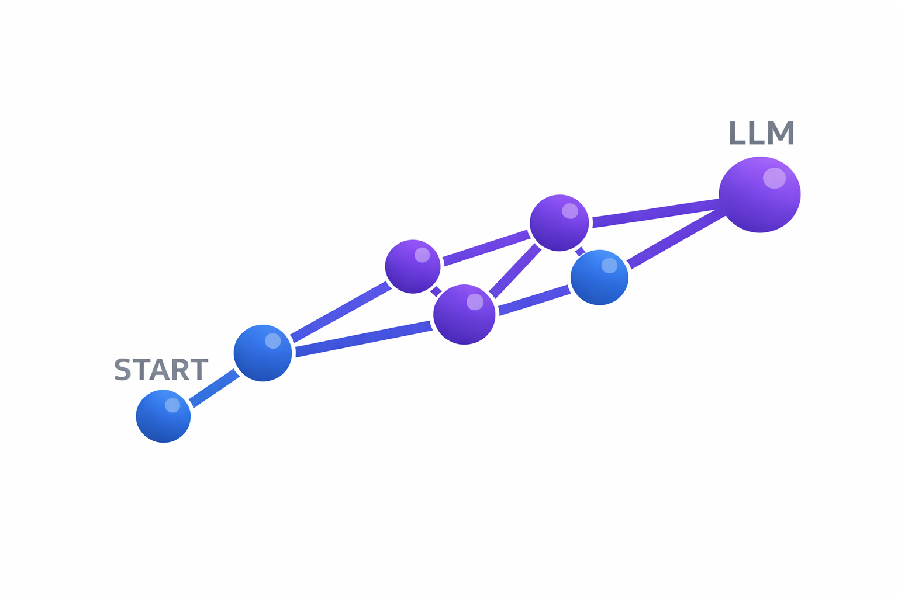
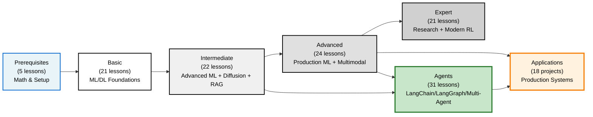
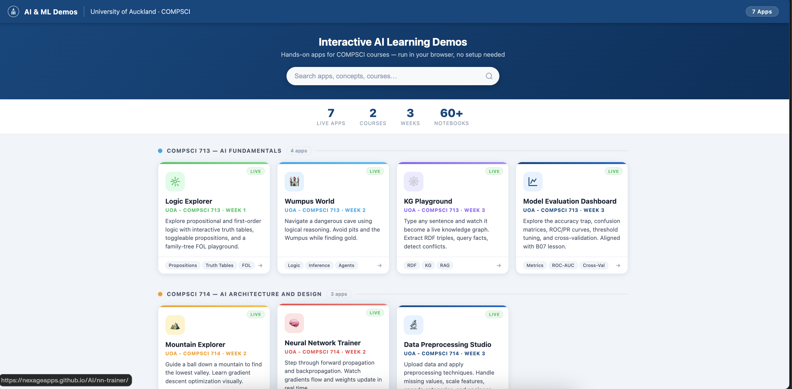

<div align="center">



# AI & Machine Learning Roadmap: From Basics to LLMs

### Learn by doing. Build by understanding. Master by creating.

**Open-source AI education built by a student, for students and learners worldwide.**

Prerequisites to Expert. Foundations to Production AI to Agentic Systems. 142 lessons. Stanford-level quality.

[Quick Start](#quick-start) • [Student Guide](./documentation/MAI_STUDENT_GUIDE.md) • [Exam Prep](./documentation/EXAM_PREPARATION_GUIDE.md) • [LinkedIn](https://www.linkedin.com/in/karthik-arjun-a5b4a258/) • [Support Project](https://buymeacoffee.com/fcc4sbsx5f6)

[](https://www.python.org/)
[](./LICENSE)
[](./01-Basic/)
[](./STANFORD_LEVEL_2026_UPDATE.md)
[](https://nexageapps.com)
[](https://buymeacoffee.com/fcc4sbsx5f6)

</div>

---

## ⚠️ Important Disclaimer

This is an **independent learning project**, NOT official University of Auckland, material. Use responsibly and follow your institution's academic integrity policies. See [Academic Integrity Policy](./documentation/ACADEMIC_INTEGRITY.md) for details.

---

## What Is This?

A **Stanford graduate-level** structured learning path from mathematical foundations to production AI systems, multimodal models, and agentic applications. **142 lessons** with production-ready code, visualizations, and real-world projects.

**Aligned with Stanford courses:** CS229, CS230, CS231n, CS224n, CS25, CS224V

**Perfect for:**
- Graduate students pursuing AI/ML mastery
- Self-learners building production AI skills
- Engineers deploying LLM applications and agents
- Researchers working on multimodal and agentic systems
- Anyone wanting Stanford-level AI education

---

## NEW: Comprehensive 2026 Update - Stanford-Level Curriculum

We've completely restructured the learning journey to **Stanford graduate standards** with **142 lessons** (up from 82)!

**🎓 What's New:**
- **Prerequisites**: 5 lessons covering math, Python, and setup (P01-P05)
- **Diffusion Models**: 4 comprehensive lessons (Stable Diffusion, DALL-E, video generation)
- **Vector Databases**: 3 lessons (Pinecone, Weaviate, Chroma + RAG systems)
- **Modern RL for LLMs**: PPO, DPO, GRPO, test-time compute
- **Multimodal AI**: 8 lessons (vision-language, video, audio, cross-modal reasoning)
- **Agents Expansion**: 31 lessons (was 18) with LangChain, LangGraph, CrewAI
- **Computer-Use Agents**: Claude, OpenAI Operator, desktop automation
- **Observability**: LangSmith, Weights & Biases, production monitoring
- **18 Production Applications**: Complete real-world projects
- **Stanford Alignment**: Explicit mapping to CS229, CS230, CS231n, CS224n, CS25, CS224V

**📚 New Structure:**
```
00-Prerequisites/  →  5 lessons (Math, Python, Setup)
01-Basic/          →  21 lessons (organized by topic)
02-Intermediate/   →  22 lessons (+ diffusion, vector DBs)
03-Advanced/       →  24 lessons (+ multimodal, observability)
04-Agents/         →  31 lessons (complete agentic stack)
05-Expert/         →  21 lessons (+ modern RL, MoE, neuro-symbolic)
06-Applications/   →  18 production projects (NEW)
```

**[View Complete Update Plan](./STANFORD_LEVEL_2026_UPDATE.md)** | **[Stanford Course Alignment](./documentation/stanford-alignment/)**

---

## Quick Start

### 1. Choose Your Path

| Level | Lessons | Duration | Best For |
|-------|---------|----------|----------|
| **Prerequisites (P01-P05)** | 5 | 1-2 weeks | Math & Python foundations |
| **Basic (B01-B21)** | 21 | 3-4 weeks | Core ML/DL concepts (CS229/CS230) |
| **Intermediate (I01-I22)** | 22 | 6-8 weeks | Advanced techniques + diffusion + RAG (CS231n/CS224n/CS236) |
| **Advanced (A01-A24)** | 24 | 8-10 weeks | Production ML + multimodal + observability |
| **Agents (AG01-AG31)** | 31 | 10-14 weeks | LangChain, LangGraph, multi-agent systems (CS224V) |
| **Expert (E01-E21)** | 21 | 10-12 weeks | Research, modern RL, frontier techniques |
| **Applications (APP01-APP18)** | 18 | 6-8 weeks | Production projects & deployments |

**Total: 142 lessons** | **12-18 months for complete mastery**

### 2. Set Up

```bash
# Clone the repository
git clone https://github.com/nexageapps/AI.git
cd AI

# Create virtual environment
python -m venv .venv
source .venv/bin/activate  # macOS/Linux
.venv\Scripts\activate     # Windows

# Install dependencies
pip install -r requirements.txt
# OR install core packages:
pip install tensorflow torch numpy matplotlib jupyter langchain langgraph openai anthropic pinecone-client
```

**Note:** See [Prerequisites (P05)](./00-Prerequisites/P05%20-%20Development%20Environment%20Setup.ipynb) for detailed setup.

### 3. Start Learning

```bash
jupyter lab
# Start with Prerequisites if you're new to ML
# Open 00-Prerequisites/P01 - Linear Algebra for ML.ipynb
# Or jump to 01-Basic/ if you have the foundations
```

**Or use Google Colab** (no setup needed) - Click "Open in Colab" badge in any notebook.

**🎯 Recommended Starting Points:**
- **Complete beginner?** Start with [Prerequisites P01](./00-Prerequisites/P01%20-%20Linear%20Algebra%20for%20ML.ipynb)
- **Have ML basics?** Start with [Basic B01](./01-Basic/B01%20-%20Symbolic%20Logic%20Fundamentals.ipynb)
- **Want to build agents?** Complete Basic B01-B13, then jump to [Agents AG01](./04-Agents/AG01%20-%20Introduction%20to%20AI%20Agents.ipynb)
- **Want diffusion models?** Complete Basic, then [Intermediate I07b](./02-Intermediate/I07b%20-%20Diffusion%20Models%20and%20Image%20Generation.ipynb)

---

## Learning Sequence & Prerequisites

**New to the repository?** Follow our structured learning path:

**[View Complete Learning Sequence](./LEARNING_SEQUENCE.md)** - Detailed week-by-week progression from Basic to Expert

### Quick Start Paths

1. **Full Stack AI Engineer (9-12 months):** Basic to Intermediate to Advanced (LLMs) to Agents to Advanced (Production)
2. **Agent Specialist (6-8 months):** Basic (Core) to Advanced (LLMs) to Agents to Advanced (Production)
3. **ML Research Scientist (10-14 months):** Basic to Intermediate to Advanced to Expert
4. **Computer Vision Engineer (8-10 months):** Basic (CV focus) to Intermediate (CV) to Advanced (Multi-modal) to Expert (CV research)
5. **NLP Engineer (8-10 months):** Basic (NLP focus) to Intermediate (NLP) to Advanced (LLMs) to Agents/Expert

**Critical Prerequisites:**
- **Intermediate Level:** Requires Basic (B01-B15) complete
- **Advanced Level:** Requires Intermediate (I01-I15) complete
- **Agents Level:** Requires Basic (B01-B13), Advanced (A01-A03) recommended
- **Expert Level:** Requires Advanced (A01-A15) complete

---

## Complete Learning Journey (Updated 2026)


```mermaid
graph LR
    P["Prerequisites<br/>(5 lessons)<br/>Math & Setup"] --> A["Basic<br/>(21 lessons)<br/>ML/DL Foundations"]
    A --> B["Intermediate<br/>(22 lessons)<br/>Advanced ML + Diffusion + RAG"]
    B --> C["Advanced<br/>(24 lessons)<br/>Production ML + Multimodal"]
    C --> D["Expert<br/>(21 lessons)<br/>Research + Modern RL"]
    
    B --> E["Agents<br/>(31 lessons)<br/>LangChain/LangGraph/Multi-Agent"]
    C --> E
    
    E --> F["Applications<br/>(18 projects)<br/>Production Systems"]
    C --> F
    
    style P fill:#e8f4f8,stroke:#0066cc,stroke-width:2px,color:#000000
    style A fill:#ffffff,stroke:#000000,stroke-width:2px,color:#000000
    style B fill:#f0f0f0,stroke:#000000,stroke-width:2px,color:#000000
    style C fill:#e0e0e0,stroke:#000000,stroke-width:2px,color:#000000
    style D fill:#d0d0d0,stroke:#000000,stroke-width:2px,color:#000000
    style E fill:#c8e6c9,stroke:#2e7d32,stroke-width:3px,color:#000000
    style F fill:#fff3e0,stroke:#f57c00,stroke-width:3px,color:#000000
```

**Learning Paths:**
1. **Stanford Graduate Path:** Prerequisites → Basic → Intermediate → Advanced → Expert (18 months)
2. **Production AI Engineer:** Prerequisites → Basic → Intermediate → Advanced → Agents → Applications (12 months)
3. **Agentic AI Specialist:** Prerequisites → Basic (B11-B13) → Intermediate (I16-I18) → Advanced (A01-A03) → Agents (10 months)
4. **Multimodal AI Specialist:** Prerequisites → Basic → Intermediate (Diffusion) → Advanced (Multimodal) → Applications (10 months)
5. **AI Research Scientist:** Prerequisites → Basic → Intermediate → Advanced → Expert (16 months)

**[See detailed week-by-week sequence and all learning paths](./LEARNING_SEQUENCE.md)**

---

## Repository Structure (Updated 2026)

```
AI/
├── 00-Prerequisites/   # 5 Lessons (P01-P05) [NEW] - Math, Python, Setup
├── 01-Basic/           # 21 Lessons (B01-B21) - ML/DL Foundations (CS229/CS230)
│   ├── Foundations/         # B01-B04: Logic, Regression, Classification
│   ├── Neural-Networks/     # B05-B05d: Networks, Training, Optimization
│   ├── Data-Engineering/    # B06-B08: Preprocessing, Evaluation, Regularization
│   ├── Computer-Vision/     # B09-B09b: CNNs, Transfer Learning, GNNs
│   ├── Sequence-Models/     # B10-B10a: RNNs, LSTMs
│   ├── Transformers/        # B11-B13: Attention, BPE, Mini-LM
│   └── Generative-Intro/    # B14: Intro to Generative Models
│
├── 02-Intermediate/    # 22 Lessons (I01-I22) - Advanced ML (CS231n/CS224n/CS236)
│   ├── Optimization/        # I01-I03: Advanced optimization, regularization
│   ├── Computer-Vision/     # I04-I06: CNN architectures, detection, segmentation
│   ├── Generative-Models/   # I07-I07d: GANs, VAEs, Diffusion, Stable Diffusion [NEW]
│   ├── NLP/                 # I08-I11: Seq2seq, BERT, NER, sentiment
│   ├── Production-ML/       # I12-I15: AutoML, compression, MLOps
│   └── RAG-Infrastructure/  # I16-I18: Vector DBs, embeddings, RAG [NEW]
│
├── 03-Advanced/        # 24 Lessons (A01-A24) - Production + Multimodal
│   ├── LLM-Mastery/         # A01-A03: Fine-tuning, prompting, RAG
│   ├── Multimodal-AI/       # A04-A06b: Vision-language, audio, video [EXPANDED]
│   ├── Scale-Optimization/  # A07-A09: Distributed training, inference
│   ├── Production-Deployment/ # A10-A13: Pipelines, Docker, monitoring, CI/CD
│   ├── Responsible-AI/      # A14-A15: Governance, case studies
│   └── AI-Observability/    # A16-A18: LangSmith, W&B, debugging [NEW]
│
├── 04-Agents/          # 31 Lessons (AG01-AG31) - Agentic Systems (CS224V)
│   ├── Foundations/         # AG01-AG03: Agents, LangChain, memory
│   ├── Tools-Functions/     # AG04-AG06: Function calling, first agent [NEW]
│   ├── RAG-Agents/          # AG07-AG09: RAG agents, testing [NEW]
│   ├── LangGraph/           # AG10-AG13: State machines, workflows [NEW]
│   ├── Multi-Agent/         # AG14-AG17: HITL, multi-agent, CrewAI [NEW]
│   ├── Specialized-Agents/  # AG18-AG21: Code, data, research, multimodal [NEW]
│   ├── Computer-Use/        # AG22-AG24: Claude, Operator, automation [NEW]
│   ├── Production-Agents/   # AG25-AG28: APIs, UIs, deployment [NEW]
│   ├── Monitoring-Eval/     # AG29-AG30: Observability, monitoring [NEW]
│   └── Capstone/            # AG31: 5 Capstone projects
│
├── 05-Expert/          # 21 Lessons (E01-E21) - Research & Innovation
│   ├── Research-Skills/     # E01-E03: Papers, experiments, writing
│   ├── Architecture-Search/ # E04-E06: NAS, custom layers, attention
│   ├── Learning-Paradigms/  # E07-E09: Meta-learning, continual, SSL
│   ├── Reinforcement-Learning/ # E10-E11: Deep RL, modern RLHF/DPO/GRPO [UPDATED]
│   ├── Privacy-Federation/  # E12-E12a: Federated learning, DP [NEW]
│   ├── Foundation-Models/   # E13-E14: Multimodal foundation, efficient AI
│   ├── Emerging-Topics/     # E16-E18: Test-time compute, MoE, neuro-symbolic [NEW]
│   └── Capstone/            # E15: Research project
│
├── 06-Applications/    # 18 Production Projects [NEW]
│   ├── RAG-Systems/         # APP01-APP03: Enterprise RAG, multi-doc QA
│   ├── Multi-Agent-Apps/    # APP04-APP06: Support systems, research assistants
│   ├── Multimodal-Apps/     # APP07-APP09: Document analysis, video understanding
│   ├── Computer-Use-Apps/   # APP10-APP12: Web scraping, browser automation
│   ├── Production-Systems/  # APP13-APP15: Full-stack AI, AWS deployment
│   └── Diffusion-Apps/      # APP16-APP18: Image generation, video generation
│
├── application/        # Live demos & practical implementations
│   ├── compsci713/     # COMPSCI 713 weekly apps
│   └── compsci714/     # COMPSCI 714 weekly apps
│
├── documentation/      # Comprehensive guides
│   ├── stanford-alignment/  # NEW: CS229/230/231n/224n/CS25/CS224V mapping
│   ├── frameworks/          # NEW: LangChain vs LlamaIndex, vector DB comparison
│   ├── learning-paths/      # NEW: Detailed path guides
│   └── courses/             # University course guides
│
└── landingpage/        # Landing page assets
```

### What Each Level Teaches

| Level | Focus | You'll Learn | Stanford Equivalent |
|-------|-------|--------------|---------------------|
| **Prerequisites** | Foundations | Linear algebra, calculus, probability, Python for ML | CS229 prerequisites |
| **Basic** | Core ML/DL | Neural networks, CNNs, RNNs, Transformers from scratch | CS229, CS230 |
| **Intermediate** | Advanced Techniques | Transfer learning, diffusion models, vector DBs, RAG systems | CS231n, CS224n, CS236 |
| **Advanced** | Production ML | Fine-tuning LLMs, multimodal AI, deployment, monitoring | Production ML + CS25 |
| **Agents** | Agentic Systems | LangChain, LangGraph, multi-agent, computer-use agents | CS224V |
| **Expert** | Research | Implementing papers, modern RL (DPO/GRPO), test-time compute | Research-level |
| **Applications** | Real-World Projects | Production RAG, multi-agent apps, diffusion systems | Capstone projects |

---

## Live Demos & Practical Applications

Interactive demonstrations of AI concepts in action:

<div align="center">
  <a href="https://nexageapps.github.io/AI/">
    
  </a>
  <p><em>Interactive AI demos — playable in your browser</em></p>
</div>

| Demo | Concept | Course | Course Page | Notebook | Link |
|------|---------|--------|-------------|----------|------|
| **Wumpus World** | Symbolic Logic & Knowledge Representation | UoA-COMPSCI 713 | [COMPSCI 713 – AI Fundamentals](#compsci-713) | — | [Play Online](https://nexageapps.github.io/AI/wumpus) |
| **Mountain Explorer** | Gradient Descent & Optimization | UoA-COMPSCI 714 | [COMPSCI 714 – Neural Networks](./documentation/courses/COMPSCI_714_COMPLETE_GUIDE.md) | [B02 - Linear Regression](https://github.com/nexageapps/AI/blob/main/Basic/B02%20-%20Linear%20Regression.ipynb) · [B05b - Training & Optimization](https://github.com/nexageapps/AI/blob/main/Basic/B05b%20-%20Training%20and%20Optimization%20(COMPSCI%20714).ipynb) | [Play Online](https://nexageapps.github.io/AI/gradient-descent) |
| **Blindfold Hill** | Gradient Descent, Learning Rate & Convergence | UoA-COMPSCI 714 | [COMPSCI 714 – Neural Networks](./documentation/courses/COMPSCI_714_COMPLETE_GUIDE.md) | [B02 - Linear Regression](https://github.com/nexageapps/AI/blob/main/Basic/B02%20-%20Linear%20Regression.ipynb) · [B05b - Training & Optimization](https://github.com/nexageapps/AI/blob/main/Basic/B05b%20-%20Training%20and%20Optimization%20(COMPSCI%20714).ipynb) | [Play Online](https://nexageapps.github.io/AI/compsci714/week2/blindfold-hill) |
| **Neural Network Trainer** | Forward Propagation, Backpropagation & Gradient Descent | UoA-COMPSCI 714 | [COMPSCI 714 – Neural Networks](./documentation/courses/COMPSCI_714_COMPLETE_GUIDE.md) | [B05 - Neural Network Fundamentals](https://github.com/nexageapps/AI/blob/main/Basic/B05%20-%20Neural%20Network%20Fundamentals.ipynb) · [B05a - Neural Networks Theory](https://github.com/nexageapps/AI/blob/main/Basic/B05a%20-%20Neural%20Networks%20Theory%20(COMPSCI%20714).ipynb) | [Play Online](https://nexageapps.github.io/AI/nn-trainer/) |
| **Data Preprocessing Studio** | Missing Values, Feature Scaling, Encoding & Feature Engineering | UoA-COMPSCI 714 | [COMPSCI 714 – Neural Networks](./documentation/courses/COMPSCI_714_COMPLETE_GUIDE.md) | [B06 - Data Preprocessing and Feature Engineering](https://github.com/nexageapps/AI/blob/main/Basic/B06%20-%20Data%20Preprocessing%20and%20Feature%20Engineering.ipynb) | [Play Online](https://nexageapps.github.io/AI/compsci714/week3/data-preprocessing-studio) |
| **PyTorch Assignment Practice** | Tabular MLP, BCEWithLogitsLoss, Optuna, FashionMNIST CNN, Saliency Maps | UoA-COMPSCI 714 | [COMPSCI 714 – Neural Networks](./documentation/courses/COMPSCI_714_COMPLETE_GUIDE.md) | [B05c - MLP on Tabular Data with PyTorch](https://github.com/nexageapps/AI/blob/main/Basic/B05c%20-%20MLP%20on%20Tabular%20Data%20with%20PyTorch%20(COMPSCI%20714).ipynb) | — |
| **Model Evaluation Dashboard** | Confusion Matrix, ROC/AUC, Precision-Recall & Cross-Validation | UoA-COMPSCI 713 | [COMPSCI 713 – AI Fundamentals](#compsci-713) | [B07 - Model Evaluation](https://github.com/nexageapps/AI/blob/main/Basic/B07%20-%20Model%20Evaluation%20and%20Performance%20Metrics.ipynb) | — |
| **KG Playground** | RDF Triples, Knowledge Graphs, RAG & Conflict Detection | UoA-COMPSCI 713 | [COMPSCI 713 – AI Fundamentals](#compsci-713) | [A03 - Retrieval-Augmented Generation](https://github.com/nexageapps/AI/blob/main/Advanced/A03%20-%20Retrieval-Augmented%20Generation%20(RAG).ipynb) | [Play Online](https://nexageapps.github.io/AI/compsci713/week3/kg-playground/) |
| **RNN Explorer** | RNN/LSTM/GRU Architecture, Gates & Sequence Modelling | UoA-COMPSCI 713 | [COMPSCI 713 – AI Fundamentals](#compsci-713) | [B10 - RNNs](https://github.com/nexageapps/AI/blob/main/Basic/B10%20-%20Recurrent%20Neural%20Networks.ipynb) · [B10a - RNNs (714)](https://github.com/nexageapps/AI/blob/main/Basic/B10a%20-%20Recurrent%20Neural%20Networks%20(COMPSCI%20714).ipynb) | [Play Online](https://nexageapps.github.io/AI/compsci713/week4/rnn-explorer/) |
| **CNN Explorer** | Convolution, Pooling, Feature Maps, Architecture & Playground | UoA-COMPSCI 714 | [COMPSCI 714 – Neural Networks](./documentation/courses/COMPSCI_714_COMPLETE_GUIDE.md) | [B09 - CNNs](https://github.com/nexageapps/AI/blob/main/Basic/B09%20-%20Convolutional%20Neural%20Networks.ipynb) | [Play Online](https://nexageapps.github.io/AI/compsci714/week3/cnn-explorer/) |
| **NEAT Explainer** | NeuroEvolution, Topology Mutation, Speciation & Crossover | UoA-COMPSCI 713 | [COMPSCI 713 – AI Fundamentals](#compsci-713) | — | — |
| **Transformer Explorer** | Self-Attention, Multi-Head Attention, Q/K/V & Architecture | UoA-COMPSCI 714 | [COMPSCI 714 – Neural Networks](./documentation/courses/COMPSCI_714_COMPLETE_GUIDE.md) | [B11 - Attention & Transformers](https://github.com/nexageapps/AI/blob/main/Basic/B11%20-%20Attention%20and%20Transformers.ipynb) | [Play Online](https://nexageapps.github.io/AI/compsci714/week4/transformer-explorer/) |
| **BPE Explorer** | Byte Pair Encoding, Tokenization, Subwords & Vocabulary | UoA-COMPSCI 714 | [COMPSCI 714 – Neural Networks](./documentation/courses/COMPSCI_714_COMPLETE_GUIDE.md) | [B12 - BPE](https://github.com/nexageapps/AI/blob/main/Basic/B12%20-%20Byte%20Pair%20Encoding%20(BPE).ipynb) | [Play Online](https://nexageapps.github.io/AI/compsci714/week4/bpe-explorer/) |
| **Q-Learning Grid World** | Reinforcement Learning, Q-Tables, Exploration vs Exploitation | UoA-COMPSCI 713 | [COMPSCI 713 – AI Fundamentals](#compsci-713) | — | — |

**[View All Games](https://nexageapps.github.io/AI/)** • Explore the `application/` folder for source code and deployment guides.

---

## For University Students

### University of Auckland Courses

| Course | Focus | Examples |
|--------|-------|----------|
| **COMPSCI 713** | AI Fundamentals | [Symbolic Logic, Knowledge Representation, Search, RL, Neuroevolution, Sustainability](./documentation/courses/COMPSCI_713_COMPLETE_GUIDE.md) |
| **COMPSCI 714** | Neural Networks | [Networks, Gradient Descent, CNNs, Attention](./documentation/courses/COMPSCI_714_COMPLETE_GUIDE.md) |
| **COMPSCI 769** | Natural Language Processing | [Semantic Representation, LLMs, RAG, Question Answering, Knowledge Graphs](./documentation/courses/COMPSCI_769_COMPLETE_GUIDE.md) |
| **COMPSCI 762** | ML Foundations | Regression, Classification, Tuning |
| **COMPSCI 703** | Generalising AI | Transfer Learning, Domain Adaptation |
| **COMPSYS 721** | Deep Learning | Detection, Time Series, NLP, GANs |

**[COMPSCI 713 Complete Guide](./documentation/courses/COMPSCI_713_COMPLETE_GUIDE.md)** · **[COMPSCI 714 Complete Guide](./documentation/courses/COMPSCI_714_COMPLETE_GUIDE.md)** · **[COMPSCI 769 Complete Guide](./documentation/courses/COMPSCI_769_COMPLETE_GUIDE.md)**

### Study Tips

- **Before lectures:** Review relevant Basic lessons
- **During semester:** Build practical projects from examples
- **For assignments:** Use as reference, implement your own
- **For exams:** Review all concepts in relevant lessons

**[Complete Student Guide](./documentation/MAI_STUDENT_GUIDE.md)**

---

## Documentation

| Document | Purpose |
|----------|---------|
| **[Stanford-Level Update Plan](./STANFORD_LEVEL_2026_UPDATE.md)** | **Complete 2026 update with 142 lessons** [NEW] |
| **[Learning Sequence Guide](./LEARNING_SEQUENCE.md)** | **Week-by-week progression and all learning paths** |
| [Student Guide](./documentation/MAI_STUDENT_GUIDE.md) | Course mapping, semester planning, study strategies |
| [Exam Prep Guide](./documentation/EXAM_PREPARATION_GUIDE.md) | Exam strategies, practice problems, concept review |
| **[Stanford Course Alignment](./documentation/stanford-alignment/)** | **CS229/230/231n/224n/CS25/CS224V mapping** [NEW] |
| **[Framework Comparisons](./documentation/frameworks/)** | **LangChain vs LlamaIndex, vector DBs, observability** [NEW] |
| [COMPSCI 713 Complete Guide](./documentation/courses/COMPSCI_713_COMPLETE_GUIDE.md) | AI Fundamentals course guide |
| [COMPSCI 714 Complete Guide](./documentation/courses/COMPSCI_714_COMPLETE_GUIDE.md) | Neural network course guide |
| [Documentation Index](./documentation/DOCUMENTATION_INDEX.md) | Complete guide to all documentation |
| [Academic Integrity](./documentation/ACADEMIC_INTEGRITY.md) | Responsible use guidelines |

---

## What You'll Learn

### Prerequisites (P01-P05) [NEW]
- Linear algebra for ML (vectors, matrices, eigenvalues)
- Calculus and optimization theory
- Probability and statistics
- Python for ML (NumPy, Pandas, PyTorch)
- Development environment setup

### Basic Level (B01-B21)
- Symbolic logic & first-order logic
- Tensors & linear algebra
- Linear regression & gradient descent
- Binary & multi-class classification
- Neural networks from scratch
- Training & optimization theory (CS230)
- Data preprocessing & evaluation
- Regularization & overfitting
- CNNs, RNNs, Transformers (CS231n, CS224n)
- Tokenization & language models
- Introduction to generative models

### Intermediate Level (I01-I22)
- Advanced optimization & regularization
- Transfer learning & domain adaptation
- Object detection & segmentation (CS231n)
- **Diffusion models** (Stable Diffusion, DALL-E, FLUX) [NEW]
- **Latent diffusion & image generation** [NEW]
- GANs & VAEs (CS236)
- Seq2seq & advanced transformers (CS224n)
- Hyperparameter tuning & AutoML
- **Vector databases** (Pinecone, Weaviate, Chroma) [NEW]
- **Embeddings & semantic search** [NEW]
- **Building RAG systems** [NEW]
- MLOps & deployment

### Advanced Level (A01-A24)
- Fine-tuning LLMs
- Prompt engineering & in-context learning
- Retrieval-Augmented Generation (RAG)
- **Vision-language models** (CLIP, GPT-4V) [UPDATED]
- **Multimodal understanding** (CS224V-inspired) [NEW]
- Audio & speech processing
- **Video understanding models** [NEW]
- **Video/audio diffusion** (Sora-style) [NEW]
- Multi-modal fusion
- Distributed training & mixed precision
- Model serving & inference optimization
- ML pipelines, containerization (Docker/K8s)
- **LangSmith & agent tracing** [NEW]
- **Weights & Biases for monitoring** [NEW]
- **Production AI debugging** [NEW]
- CI/CD for ML
- Responsible AI & governance

### Agents Level (AG01-AG31) [MASSIVELY EXPANDED]
- AI agent fundamentals & ReAct pattern
- LangChain basics: chains, prompts, parsers
- Memory systems (buffer, summary, vector)
- **Tools and function calling** [NEW]
- **Building your first agent** [NEW]
- **Custom tools development** [NEW]
- **RAG agents with LangChain** [NEW]
- **Document loaders & text splitters** [NEW]
- **Agent evaluation and testing** [NEW]
- **LangGraph state machines** [NEW]
- **Multi-step agent workflows** [NEW]
- **Conditional edges & routing** [NEW]
- **Persistence & checkpointing** [NEW]
- **Human-in-the-loop patterns** [NEW]
- **Multi-agent systems with LangGraph** [NEW]
- **CrewAI for role-based teams** [NEW]
- **Agent orchestration patterns** [NEW]
- **Code generation & analysis agents** [NEW]
- **Data analysis & SQL agents** [NEW]
- **Research & content creation agents** [NEW]
- **Multimodal agents (vision + text)** [NEW]
- **Claude computer-use agents** [NEW]
- **OpenAI Operator & browser automation** [NEW]
- **Desktop automation with agents** [NEW]
- **Agent APIs with FastAPI** [NEW]
- **Agent UIs with Streamlit/Gradio** [NEW]
- **WebSockets for real-time agents** [NEW]
- **Agent deployment on cloud** [NEW]
- **Agent observability & monitoring** [NEW]
- **Production agent monitoring** [NEW]
- 5 Capstone agent projects

### Expert Level (E01-E21)
- Reading & implementing research papers
- Experimental design & ablation studies
- Writing & publishing research
- Neural architecture search (NAS)
- Custom layer & operation design
- Attention mechanism innovations
- Meta-learning & few-shot learning (CS330)
- Continual & lifelong learning
- Self-supervised & contrastive learning
- Deep reinforcement learning (updated 2026 stack)
- **Modern RL for LLM alignment** (PPO, DPO, GRPO) [UPDATED]
- Federated & privacy-preserving learning
- **Differential privacy in practice** [NEW]
- Multimodal foundation models (GPT-5, Gemini)
- Efficient & green AI
- **Test-time compute & reasoning models** (o1, R1) [NEW]
- **Mixture-of-Experts architectures** [NEW]
- **Neuro-symbolic AI** [NEW]
- Research project & contribution

### Applications (APP01-APP18) [NEW]
- **RAG Systems**: Enterprise RAG, multi-document QA, hybrid search
- **Multi-Agent Apps**: Customer support, research assistants, code review
- **Multimodal Apps**: Document analysis, video understanding, visual QA
- **Computer-Use Apps**: Web scraping, browser automation, desktop testing
- **Production Systems**: Full-stack AI, AWS deployment, monitoring dashboards
- **Diffusion Apps**: Image generation, image editing, video generation

**Current Status:** 142 lessons complete | Production-ready code

**[View Complete Update Plan](./STANFORD_LEVEL_2026_UPDATE.md)**

### Practical Applications
- Q-Learning & reinforcement learning (grid world)
- NeuroEvolution (NEAT) for topology search
- Interactive model evaluation dashboards
- RNN/LSTM/GRU sequence modelling
- CNN feature map visualization
- Transformer attention visualization
- BPE tokenization exploration

---

## Project Ideas

### Beginner (Basic/Intermediate)
- Sentiment analysis, image classifier, text generator
- Spam detector, digit recognition (MNIST)
- **Diffusion-based image generator** [NEW]
- **Simple vector search engine** [NEW]
- Transfer learning for custom dataset

### Intermediate (Advanced)
- Medical image analysis, chatbot with memory
- **RAG system with Pinecone** [NEW]
- **Multi-document QA system** [NEW]
- **Fine-tuned domain-specific LLM** [NEW]
- Multi-modal search, code reviewer
- Real-time object detection

### Advanced (Agents & Applications)
- **Personal research assistant** (web search + summarization)
- **Automated code review agent** (GitHub integration)
- **Customer support multi-agent system** (triage → specialist → escalation)
- **Data analysis agent** (SQL + pandas + visualization)
- **Content creation pipeline** (research → write → edit agents)
- **Multimodal document analyzer** (PDF + images + tables)
- **Computer-use agent for web scraping** [NEW]
- **Browser automation with OpenAI Operator** [NEW]

### Research (Expert)
- Novel architecture, paper reproduction
- **Test-time compute for reasoning** [NEW]
- **Mixture-of-Experts implementation** [NEW]
- Bias detection, model compression
- Federated learning systems

<details>
<summary><b>Detailed Agent Project Examples (Click to Expand)</b></summary>

### 🔍 Research Assistant Agent
- Searches web for relevant papers
- Summarizes findings
- Cites sources automatically
- Answers follow-up questions
- **Teaches:** RAG, web tools, memory

### 💻 Code Review Agent
- Analyzes code for bugs
- Suggests improvements
- Generates tests
- Explains complex code
- **Teaches:** Multi-step workflows, code tools

### 💬 Customer Support System
- Multi-agent: triage to specialist to escalation
- Accesses knowledge base
- Creates support tickets
- Human-in-the-loop for complex issues
- **Teaches:** Multi-agent systems, databases

### 📊 Data Analysis Agent
- Queries databases (SQL)
- Analyzes with pandas
- Generates visualizations
- Creates reports
- **Teaches:** Tool integration, structured output

### ✍️ Content Creation Pipeline
- Research agent to Writer agent to Editor agent
- SEO optimization
- Fact checking
- Citation management
- **Teaches:** Agent collaboration, quality control

**[See AG31 for complete project guides](./04-Agents/AG31%20-%20Capstone%20Agent%20Projects.ipynb)** | **[View all Application projects](./06-Applications/)**

**Research:** Novel architecture, paper reproduction, bias detection, model compression, federated learning

---

## Academic Integrity

**Appropriate Use:**
- Learning concepts and understanding implementations
- Preparing for lectures and exams
- Using as inspiration for original projects
- Understanding different approaches

❌ **Inappropriate Use:**
- Copying code for assignments without understanding
- Submitting repository code as your own work
- Using during closed-book assessments
- Violating your institution's policies

**[Full Academic Integrity Policy](./documentation/ACADEMIC_INTEGRITY.md)**

---

## Contributing

Contributions welcome! See [Contributing Guide](./documentation/CONTRIBUTING.md) for details.

---


## Community & Support

- **Questions?** Check [Documentation Index](./documentation/DOCUMENTATION_INDEX.md)
- **Issues?** Open a GitHub issue
- **Suggestions?** Submit a pull request
- **Connect:** [LinkedIn](https://www.linkedin.com/in/karthik-arjun-a5b4a258/)
- **Discord:** [Join the discussion](https://discord.com/channels/1482175575488598109/1482175576168206590)

---

## Support This Project

<div align="center">

### Buy Me a Book

This repository represents hundreds of hours of work to make AI education accessible to everyone. If you find it helpful, consider supporting its continued development!

[](https://buymeacoffee.com/fcc4sbsx5f6)

*Every contribution, no matter how small, makes a difference!*

</div>

---

## Author

Created by a student pursuing a Master of Artificial Intelligence at the University of Auckland.

**Why this exists:** To make quality AI education accessible to everyone, combining theory with practical implementations.

---

## License

MIT License - See [LICENSE](./LICENSE) for details.

---

<div align="center">

---

### If you find this helpful, please star the repository!
*Made by a student, for students*
**Happy Learning!**

### Ready for the Next Level?
[](https://github.com/nexageapps/llm)

### Support This Project
[](https://buymeacoffee.com/fcc4sbsx5f6)

*Every contribution helps create more free educational content!*

---

</div>
