# Learning Path Diagram

## Complete AI/ML Learning Journey

```mermaid
graph TB
    Start([🚀 Start Your AI Journey]) --> Foundation
    
    subgraph Basic["📘 BASIC LEVEL (B01-B15)"]
        Foundation[Foundation<br/>B01-B03]
        CoreML[Core ML<br/>B04-B08]
        DeepLearning[Deep Learning<br/>B09-B11]
        NLP[NLP Specialization<br/>B12-B13]
        Portfolio[Practice & Portfolio<br/>B14-B15]
        
        Foundation --> CoreML
        CoreML --> DeepLearning
        DeepLearning --> NLP
        NLP --> Portfolio
    end
    
    Portfolio --> IntermediateEntry
    
    subgraph Intermediate["🔷 INTERMEDIATE LEVEL (I01-I15)"]
        IntermediateEntry[Advanced Techniques<br/>I01-I03]
        Vision[Computer Vision<br/>I04-I06]
        Sequence[Sequence Models<br/>I07-I09]
        Production[Production ML<br/>I10-I15]
        
        IntermediateEntry --> Vision
        IntermediateEntry --> Sequence
        Vision --> Production
        Sequence --> Production
    end
    
    Production --> AdvancedEntry
    
    subgraph Advanced["🟣 ADVANCED LEVEL (A01-A15)"]
        AdvancedEntry[LLMs & Prompting<br/>A01-A03]
        MultiModal[Multi-Modal AI<br/>A04-A06]
        Distributed[Distributed Training<br/>A07-A09]
        MLPipeline[ML Pipelines<br/>A10-A13]
        Responsible[Responsible AI<br/>A14-A15]
        
        AdvancedEntry --> MultiModal
        AdvancedEntry --> Distributed
        MultiModal --> MLPipeline
        Distributed --> MLPipeline
        MLPipeline --> Responsible
    end
    
    Responsible --> ExpertEntry
    
    subgraph Expert["🌟 EXPERT LEVEL (E01-E15)"]
        ExpertEntry[Research Methods<br/>E01-E03]
        Architecture[Architecture Design<br/>E04-E06]
        MetaLearning[Meta & Few-Shot<br/>E07-E09]
        RL[Deep RL & RLHF<br/>E10-E11]
        Federated[Federated Learning<br/>E12]
        Cutting[Cutting-Edge<br/>E13-E15]
        
        ExpertEntry --> Architecture
        ExpertEntry --> MetaLearning
        Architecture --> RL
        MetaLearning --> RL
        RL --> Federated
        Federated --> Cutting
    end
    
    Cutting --> NextLevel[🎯 Next Level:<br/>Production LLMs]
    NextLevel --> LLMRepo[🚀 LLM Repository<br/>github.com/nexageapps/llm]
    
    style Start fill:#4A90E2,stroke:#2E5C8A,stroke-width:3px,color:#ffffff
    style Foundation fill:#FFE5B4,stroke:#D4A574,stroke-width:2px,color:#000000
    style CoreML fill:#FFE5B4,stroke:#D4A574,stroke-width:2px,color:#000000
    style DeepLearning fill:#FFE5B4,stroke:#D4A574,stroke-width:2px,color:#000000
    style NLP fill:#FFE5B4,stroke:#D4A574,stroke-width:2px,color:#000000
    style Portfolio fill:#FFE5B4,stroke:#D4A574,stroke-width:2px,color:#000000
    style IntermediateEntry fill:#B4E5FF,stroke:#74A5D4,stroke-width:2px,color:#000000
    style Vision fill:#B4E5FF,stroke:#74A5D4,stroke-width:2px,color:#000000
    style Sequence fill:#B4E5FF,stroke:#74A5D4,stroke-width:2px,color:#000000
    style Production fill:#B4E5FF,stroke:#74A5D4,stroke-width:2px,color:#000000
    style AdvancedEntry fill:#E5B4FF,stroke:#A574D4,stroke-width:2px,color:#000000
    style MultiModal fill:#E5B4FF,stroke:#A574D4,stroke-width:2px,color:#000000
    style Distributed fill:#E5B4FF,stroke:#A574D4,stroke-width:2px,color:#000000
    style MLPipeline fill:#E5B4FF,stroke:#A574D4,stroke-width:2px,color:#000000
    style Responsible fill:#E5B4FF,stroke:#A574D4,stroke-width:2px,color:#000000
    style ExpertEntry fill:#FFD700,stroke:#DAA520,stroke-width:2px,color:#000000
    style Architecture fill:#FFD700,stroke:#DAA520,stroke-width:2px,color:#000000
    style MetaLearning fill:#FFD700,stroke:#DAA520,stroke-width:2px,color:#000000
    style RL fill:#FFD700,stroke:#DAA520,stroke-width:2px,color:#000000
    style Federated fill:#FFD700,stroke:#DAA520,stroke-width:2px,color:#000000
    style Cutting fill:#FFD700,stroke:#DAA520,stroke-width:2px,color:#000000
    style NextLevel fill:#FF6B6B,stroke:#CC5555,stroke-width:3px,color:#ffffff
    style LLMRepo fill:#2ECC71,stroke:#27AE60,stroke-width:3px,color:#ffffff
    
    click LLMRepo "https://github.com/nexageapps/llm" "Go to Production LLM Repository"
```

---

## Stage Breakdown

### Foundation (B01-B03)
Duration: 2-3 hours
Prerequisites: Basic Python knowledge
Topics: Tensors, linear models, binary classification

### Core Machine Learning (B04-B08)
Duration: 8-10 hours
Prerequisites: Complete Foundation
Topics: Multi-class, neural networks, data prep, evaluation, regularization

### Deep Learning (B09-B11)
Duration: 8-10 hours
Prerequisites: Complete Core ML
Topics: CNNs, RNNs, Transformers, attention mechanisms

### NLP Specialization (B12-B13)
Duration: 4-6 hours
Prerequisites: Complete Deep Learning
Topics: Tokenization, language models, text generation

### Practice & Portfolio (B14-B15)
Duration: 2-6 weeks
Prerequisites: Complete all Basic levels
Topics: Real projects, portfolio building, capstone

### Intermediate Level (I01-I15)
Duration: 60-80 hours
Prerequisites: Complete all Basic levels
Topics: Advanced optimization, transfer learning, generative models, MLOps

### Advanced Level (A01-A15)
Duration: 80-100 hours
Prerequisites: Complete Intermediate level
Topics: LLMs, multi-modal, distributed training, production systems

### Expert Level (E01-E15)
Duration: 100-120 hours
Prerequisites: Complete Advanced level
Topics: Research, novel architectures, cutting-edge techniques

---

## Learning Paths by Interest

### Path 1: Computer Vision
Foundation -> Core ML -> Deep Learning (B09) -> Intermediate (I04-I06) -> Advanced (A04-A06) -> Expert (E04-E06)

### Path 2: Natural Language Processing
Foundation -> Core ML -> Deep Learning (B10-B13) -> Intermediate (I07-I09) -> Advanced (A01-A03) -> Expert (E01-E03)

### Path 3: Production ML
Foundation -> Core ML -> Deep Learning -> Intermediate (I10-I15) -> Advanced (A10-A15) -> Expert (E01-E03)

### Path 4: Research
Foundation -> Core ML -> Deep Learning -> Intermediate -> Advanced -> Expert (E01-E15)

### Path 5: Complete Journey
All lessons in order (B01-B15, I01-I15, A01-A15, E01-E15)

---

## Time Estimates

| Level | Duration | Pace |
|-------|----------|------|
| Basic | 2-3 weeks | 10-15 hrs/week |
| Intermediate | 4-6 weeks | 15-20 hrs/week |
| Advanced | 6-8 weeks | 15-20 hrs/week |
| Expert | 8-10 weeks | 15-20 hrs/week |
| Total | 6-9 months | 10-20 hrs/week |

---

## Prerequisites by Level

Basic: Python fundamentals
Intermediate: Complete all Basic lessons
Advanced: Complete all Intermediate lessons
Expert: Complete all Advanced lessons

---

## Next Steps After Expert Level

After completing the Expert level, explore:

1. **Production LLMs** - See [LLM Repository](https://github.com/nexageapps/LLM)
   - Fine-tuning at scale
   - Production deployment
   - Real-world systems

2. **Research Contributions**
   - Publish papers
   - Contribute to open source
   - Build novel systems

3. **Industry Applications**
   - Build production systems
   - Lead ML teams
   - Solve real-world problems

---

## Color Guide

- Blue: Starting point
- Peach: Basic Level (B01-B15)
- Green: Course-aligned lessons
- Light Blue: Intermediate Level (I01-I15)
- Purple: Advanced Level (A01-A15)
- Gold: Expert Level (E01-E15)

---

## Tips for Success

1. **Don't skip lessons** - Each builds on previous concepts
2. **Code along** - Type code yourself, don't copy-paste
3. **Experiment** - Modify examples and see what happens
4. **Build projects** - Apply concepts to real problems
5. **Take breaks** - Learning is a marathon, not a sprint
6. **Join communities** - Connect with other learners
7. **Share your work** - Document and showcase projects

---

## Getting Started

1. Choose your path above
2. Start with Foundation (B01-B03)
3. Follow the learning path
4. Build projects along the way
5. Share your progress

See [Quick Start Guide](../README.md#quick-start) for setup instructions.
